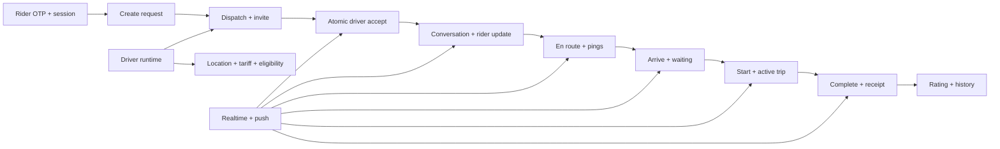

# HeyCaby Full Platform Stabilization Audit

**Audit date:** 10 July 2026  
**Audited environment:** Supabase staging (`fdavszxncggswuiwggcp`)  
**Production environment:** `fvrprxguoternoxnyhoj` (security bundle promoted 10 July 2026)  
**Release status:** **YELLOW - production schema hardened; physical-device certification still required**

## Executive Decision

The rider app, driver app, shared Flutter packages, and staging Supabase contract are statically healthy after this pass. The main application analyzers have no errors or warnings, application/backend boundary guards pass, the rider test suite passes, and the complete non-visual driver suite passes.

This is not yet a production release approval. Production deployment remains blocked by:

1. A controlled two-device staging lifecycle smoke.
2. Taxi Terug positive and negative device smokes.
3. Cold-start push and Live Activity verification on real iPhones.
4. Human review and regeneration of redesigned driver golden baselines.
5. A controlled Platform Balance/Mollie smoke if billing code or configuration differs from the previously certified version.

The reviewed security migrations were promoted to production after explicit owner approval. No smoke data or staging-only configuration was copied.

## Audit Scope

The pass covered:

- Rider identity, OTP login, session binding, RLS, booking recovery, active ride state, notifications, favorites, trip sharing, rating, and receipts.
- Driver runtime/readiness, status transitions, location, tariff requirement, ride acceptance, lifecycle actions, pings, chat, cancellation, ride swap, waiting charges, and Taxi Terug.
- Supabase tables, views, RPC privileges, trigger-function privileges, Realtime publication membership, and security-advisor output.
- Flutter localization integrity, analyzer health, focused behavior tests, full non-visual test suites, and architecture boundary guards.
- Visual regression failures as evidence requiring review, not baselines to overwrite automatically.

## Stabilization Flow

Every arrow above must succeed on staging devices before the production gate opens.

## Repairs Applied

### Rider Authentication and Ownership

- Removed the existing-email direct-login bypass from the rider email flow. Non-review users now continue through OTP.
- Hardened rider identity and rider-session ownership so a session cannot be claimed or reused outside its authenticated owner contract.
- Removed backend OTP bypass behavior from the stabilized session contract.
- Tightened RLS on rider identities, sessions, rides, conversations, messages, favorites, shares, and ratings.
- Preserved review-account behavior only where explicitly supported by the existing product contract.

### Rider Data Safety

- Replaced direct trip-share row creation with a server-issued share-token RPC and validated the returned token.
- Added secure favorite wrappers instead of relying on permissive direct table access.
- Changed sensitive platform views to `security_invoker` so caller RLS applies.
- Added rider-session access to the relevant ride audit history without exposing unrelated rides.

### Driver and Ride Lifecycle

- Driver lifecycle/status RPCs no longer retain anonymous execution access.
- Lifecycle audit and notification helpers are server-only.
- Driver invite acceptance presents a safe user message and logs diagnostic detail without exposing raw backend exceptions.
- Driver localization compile failures were repaired across locale-aware screens and widgets.
- The driver locale fallback contract is aligned with the current product rule: explicit supported locale first, device language when supported, Dutch for missing/unsupported locale.
- The driver community notification sheet was made responsive at narrow widths. The focused visual test confirms no overflow remains.

### Trigger and Realtime Lockdown

- Every public-schema function currently attached to a non-internal database trigger was revoked from `PUBLIC`, `anon`, and `authenticated`, then granted to `service_role`.
- Staging readback found 56 trigger functions: zero callable by anonymous users, zero callable by authenticated users, and all 56 callable by `service_role`.
- `ride_audit_log` was added to the Supabase Realtime publication.
- Staging Realtime now includes the core lifecycle streams: `driver_locations`, `messages`, `notifications`, `ride_audit_log`, `ride_bids`, `ride_request_invites`, `ride_requests`, and `ride_swaps`.

## Stabilization Migrations

The following migrations were applied to staging, verified, and then promoted to production after explicit approval:

- `20260710110000_full_platform_stabilization_auth_rls_lockdown.sql`
- `20260710111000_full_platform_trigger_lockdown_and_audit_realtime.sql`
- `20260710112000_full_platform_driver_rating_view_security_invoker.sql`

The third migration was added after the production security advisor exposed a production-only `driver_my_rating` security-definer finding. It was applied to staging first, verified as authenticated-only with `security_invoker=true`, and then promoted unchanged.

### Production Promotion Readback

- Three production migration-history rows are present.
- 56 public trigger functions exist; anonymous and authenticated direct execution counts are both zero.
- `driver_platform_balance`, `ride_events`, and `driver_my_rating` use caller security.
- Secure favorite/share wrappers are authenticated-only.
- All eight lifecycle tables are present in the Realtime publication.
- The production advisor no longer reports `driver_my_rating`; the remaining error-level finding is the known PostGIS-owned `spatial_ref_sys` item.
- Existing production Edge Functions were preserved. No older staging function bundle replaced a newer production deployment.

## Verification Evidence

| Verification | Result | Evidence |
|---|---:|---|
| Rider analyzer | PASS | Exit 0; one info-level const suggestion only |
| Driver analyzer | PASS | Exit 0; ten style-level infos only; no errors/warnings |
| Boundary guard | PASS | All six app/backend ownership checks pass |
| Rider full test suite | PASS | 58 tests |
| Driver focused lifecycle/status/Taxi Terug suite | PASS | 25 tests |
| Driver complete non-visual suite | PASS | 65 tests |
| Trigger ACL readback | PASS | 56/56 service-only trigger functions |
| Sensitive view readback | PASS | Hardened views use caller security |
| Audit Realtime membership | PASS | `ride_audit_log` is published |
| Driver community responsive layout | PASS | No overflow/assertion in focused run |
| Driver visual goldens | REVIEW REQUIRED | Redesigned output differs from stored baselines |
| Physical two-device lifecycle | NOT RUN | Required user/device smoke |
| Production schema promotion | PASS | Three reviewed migrations applied and read back |
| Production device smoke | NOT RUN | Still required before release certification |

## Visual Regression Decision

The driver visual suite reports broad pixel differences because the product surfaces have been redesigned. The community-focused run reports only golden mismatches (for example, 53.98% for the notification surface) and no layout overflow after the responsive fix.

The baseline images were not bulk-updated. A human must inspect the rendered failure images, approve each redesigned surface, and then regenerate accepted goldens in one dedicated visual-baseline commit. This prevents real clipping or state regressions from being hidden by an automatic update.

## Taxi Terug Status

Taxi Terug V1 is implemented on staging and its RPC lockdown has been verified. Both match-score overloads and the wider Taxi Terug helper set have no `PUBLIC` execution path.

The remaining Taxi Terug release proof is behavioral:

1. Eligible driver is online with fresh GPS, active tariff, valid runtime, and Return Mode active.
2. Rider creates a Taxi Terug request in the correct direction.
3. Qualified driver receives the invite and can accept it once.
4. Rider transitions from searching to driver-found without refresh.
5. Chat, pings, arrival, waiting, start, completion, rating, and receipt follow the same lifecycle contract.
6. Feature disabled, Return Mode disabled, stale GPS, wrong direction, busy driver, and billing lock all reject cleanly.
7. No standard marketplace or normal-booking regression occurs.

Known V1 limitations remain documented in `docs/TAXI_TERUG_BLUEPRINT.md`: empty-kilometer reporting uses the current proxy, and direct candidate booking without the marketplace bid path remains post-V1.

## Required Two-Device Smoke

### Authentication and Restore

1. Rider signs in with a six-digit OTP; no magic-link or email-confirmation detour.
2. Driver signs in with a six-digit OTP.
3. Kill and reopen both apps; authenticated state and active ride restore correctly.
4. Tap a notification from a cold start; it opens the correct ride surface.

### Driver Readiness

1. Location off blocks online status with an exact explanation.
2. Missing tariff opens the existing initial tariff flow.
3. Missing driver/vehicle photo blocks online status with exact actions.
4. Complete driver goes online and uploads a fresh location.
5. Break/offline removes the driver from available supply.

### Normal Ride Lifecycle

1. Rider creates a request.
2. One driver receives one invite and one push.
3. Driver acceptance creates/returns the conversation atomically.
4. Rider changes to driver-found automatically.
5. Driver sends each quick ping; rider receives Realtime UI and push promptly, without duplicates.
6. Chat works in both directions.
7. Driver arrives within the proximity rule.
8. Two-minute grace period and waiting charge display consistently on both devices.
9. Driver waives waiting; rider is notified and the fee becomes zero.
10. Driver starts, completes, and confirms the final fare.
11. Rider receives receipt, rating prompt, and restored ride history.

### Alternate and Failure Paths

1. Rider cancellation removes pending invites and notifies driver.
2. Driver cancellation notifies rider and returns both apps to a valid state.
3. Ride swap transfers the scheduled accepted ride once, updates the conversation, and notifies all affected parties.
4. Disconnect/reconnect does not lose or duplicate bids, invites, pings, chat, or lifecycle state.
5. Platform Balance lock blocks new work but leaves account, history, support, and settlement available.
6. Successful controlled Mollie settlement clears the lock through the webhook.

### Live Activity

Verify on a real supported iPhone:

- searching
- driver found
- driver en route
- driver arrived/waiting
- active trip
- completed/dismissed

The app card, push payload, Lock Screen, and Dynamic Island must show the same lifecycle state.

## Remaining Supabase Advisor Work

The stabilization pass removed the security-definer view errors it targeted. The advisor still reports legacy debt that needs a separately scoped security migration:

1. Mutable `search_path` on older functions.
2. Older authenticated `SECURITY DEFINER` RPCs requiring ownership-by-ownership review.
3. Permissive analytics, waitlist, and market-signal policies.
4. PostGIS objects in `public`, including extension-owned `spatial_ref_sys`; move through a planned extension migration, not ad hoc table edits.
5. Supabase leaked-password protection is disabled and should be enabled in Auth settings.

These findings should not be “fixed” in bulk without checking every caller. The next security pass must inventory signatures, owners, grants, and app usage first.

Supabase remediation references:

- [Mutable function search path](https://supabase.com/docs/guides/database/database-linter?lint=0011_function_search_path_mutable)
- [RLS disabled in public schema](https://supabase.com/docs/guides/database/database-linter?lint=0013_rls_disabled_in_public)
- [Password strength and leaked-password protection](https://supabase.com/docs/guides/auth/password-security#password-strength-and-leaked-password-protection)

## Release Certification Gate

Promote only when all of the following are true:

- Two-device lifecycle smoke passes with raw timestamps and no duplicate/missing events.
- Taxi Terug positive and negative smokes pass.
- Cold-start routing and Live Activities pass on physical iPhones.
- Driver golden changes are inspected and approved.
- No staging regression appears in normal, scheduled, airport, or marketplace booking.
- Staging logs show no unexpected RLS denial, trigger failure, Realtime disconnect loop, or Edge Function error.

The schema promotion is complete. After the remaining gates pass:

1. Deploy only an Edge Function whose reviewed staged code is newer than production and has its required production secrets configured.
2. Run one controlled production ride and one controlled billing settlement.
3. Confirm notifications, audit rows, receipt, and cleanup.
4. Remove all smoke data immediately.

## Final Status

**Code and staging database:** hardened and testable.  
**Production schema:** hardened and verified by readback.  
**Release certification:** pending real-device proof and visual-baseline approval.  
**Correct next action:** run the two-device staging matrix above, then one controlled production smoke; do not add features first.
