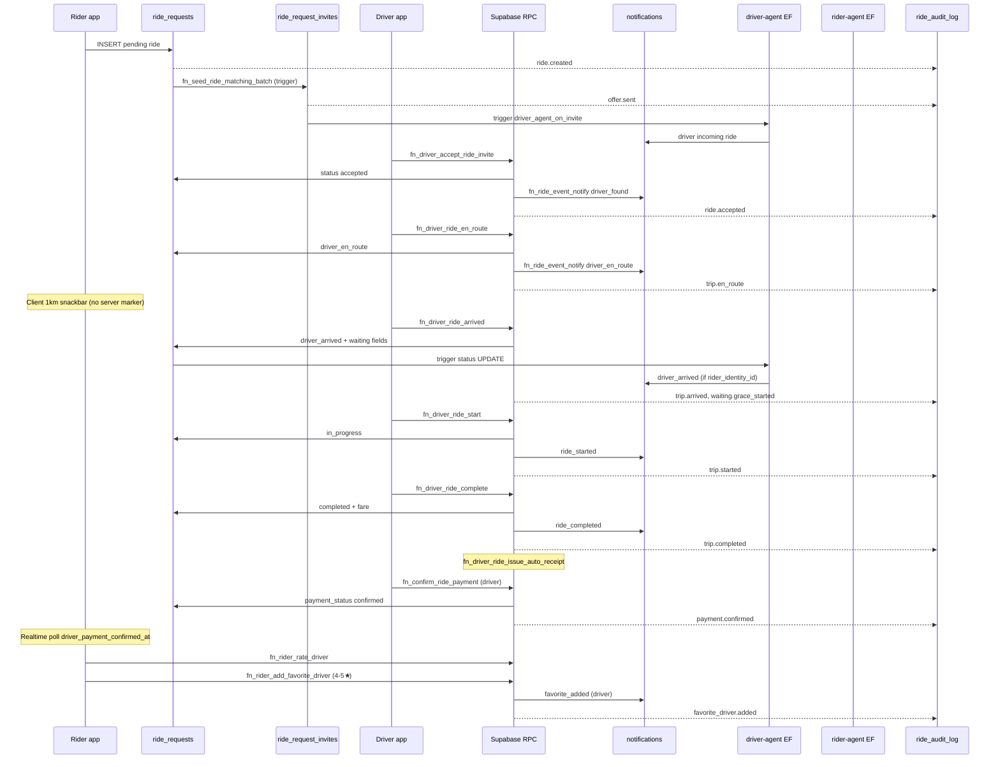

# HeyCaby Supabase Ride Flow Audit

**Environment:** HeyCaby Staging (`fdavszxncggswuiwggcp`)  
**Audit date:** 2026-07-09  
**Method:** Supabase MCP (`execute_sql`, `list_migrations`, `list_edge_functions`) + repo migration / Flutter client trace  
**Production:** Not modified (per CTO rule)

### Sprint 0 deployment log (2026-07-09)

| Item | Status |
|------|--------|
| `ride_flow_notify_fixes` (resolver, arrived notify, payment notify, near-pickup trigger, backfill) | ✅ Applied staging (`20260709093435`) |
| `ride_flow_notify_lifecycle_rpcs` (accept/start/complete/rate notify + audit) | ✅ Applied staging (`20260709093549`, `20260709093617`) |
| `rider-agent` FCM fallback via `rider_sessions` → `push_devices.auth_user_id` | ✅ Deployed |
| `driver-agent` `driver_en_route` notify rule | ✅ Deployed |
| `get-shared-ride` Edge Function | ✅ Deployed |
| Driver GPS upload interval 25s | ✅ Client (`location_service.dart`) |
| Rider notification routing (`driver_near_pickup`, `payment_confirmed` → `/active`) | ✅ Client |

---

## 1. Executive summary

Staging has a **working core ride lifecycle** at the database layer: create → dispatch invite → accept → en route → arrived → start → complete → payment confirm → receipt → rating. `ride_audit_log` on a controlled ride (`e133368e-bfe6-4ef0-806f-dc9018a00e25`, 2026-07-09) shows the full chain through `payment.confirmed`.

However, several **notification and UX links are incomplete or regressed**, especially for **guest riders** (`rider_token` only, `rider_identity_id IS NULL`). That pattern matches recent QA rides after 08:11 UTC: **zero new `notifications` rows** while audit events continued.

### Severity matrix

| ID | Finding | Severity | Layer |
|----|---------|----------|-------|
| P0-1 | ~~`fn_ride_event_notify` targets `rider_identity_id` / `rider_id` only — **not `rider_token`**~~ **FIXED** in `20260709190000` via `fn_resolve_ride_rider_notify_target` + `fn_ride_notify_rider` wrapper | Resolved | RPC / notify |
| P0-2 | Guest riders with `rider_identity_id = null` — resolver now backfills via `rider_sessions` / `push_devices`; **requires `rider_token` to be bound to a session** | P1 | Data + notify |
| P0-3 | ~~`fn_driver_ride_arrived` removed rider notify~~ **FIXED** in `20260709190000` — `fn_ride_notify_rider('ride_arrived', ...)` restored | Resolved | RPC regression |
| P1-1 | ~~No backend `near_pickup_notified_at`~~ **FIXED** in `20260709190000` — column + `fn_maybe_notify_near_pickup_for_driver` + trigger on `driver_locations` | Resolved | Missing feature |
| P1-2 | ~~`fn_confirm_ride_payment` has no notification~~ **FIXED** in `20260709190000` — driver confirm → `fn_ride_notify_rider('payment_confirmed')`; rider_ack → `fn_ride_event_notify('driver', 'payment_rider_claim')` | Resolved | RPC gap |
| P1-3 | `payment_claimed_by_rider_at` column **added** in `20260709190000`; driver notify on `rider_ack` **added**; 10-min override still client-only timer | P2 | Policy + schema |
| P1-4 | `get-shared-ride` Edge Function — repo ready, **verify staging deployment** | P1 | Edge |
| P2-1 | ~~Driver GPS upload every 10s~~ **FIXED** — now 25s (`kDriverLocationUploadInterval` in `location_service.dart`) | Resolved | Client tuning |
| P2-2 | `ride_audit_log` not in Realtime publication — apps cannot subscribe to audit stream | P2 | Realtime |
| P2-3 | ~~`fn_rider_rate_driver` writes no audit row~~ **FIXED** in `20260709190100` — `fn_ride_audit_append('trip.rated_by_rider', ...)` added | Resolved | Audit gap |
| ~~NEW~~ | ~~`rider_favorite_drivers` RLS overly permissive~~ **FIXED** in `20260709200000` — `auth.uid()` ownership check added to SELECT/INSERT/DELETE | Resolved | RLS |
| ~~NEW~~ | ~~`ride_shares` direct insert from rider app~~ **FIXED** in `20260709200000` — `fn_rider_create_share_token` RPC + RLS enabled on `ride_shares` | Resolved | RLS / share |
| **NEW** | **`fn_ride_event_notify` lockdown** — revoked from PUBLIC/anon/authenticated in `20260705054951`; only callable via SECURITY DEFINER wrappers | Info | Security |

### CTO chain verdict

| Step | DB update | Realtime | Push/notify | Rider UI | Driver UI | Audit |
|------|-----------|----------|-------------|----------|-----------|-------|
| 1 Create | ✅ | ✅ | ⚠️ dispatch only | ✅ | ✅ invite | ✅ |
| 2 Invite | ✅ | ✅ | ✅ driver | — | ✅ | ✅ |
| 3 Accept | ✅ | ✅ | ✅ resolver | ✅ | ✅ | ✅ |
| 4 On the way | ✅ | ✅ | ✅ resolver | ✅ | ✅ | ✅ |
| 5 Location | ✅ | ✅ | — | ✅ poll 3s | ✅ upload 25s | — |
| 6 1 km nearby | ✅ server | ✅ trigger | ✅ `driver_near_pickup` | ✅ push + snackbar | ⚠️ driver assist | ✅ |
| 7 Arrived | ✅ | ✅ | ✅ restored | ✅ | ✅ | ✅ |
| 8 Waiting | ✅ | ✅ | ⚠️ waiver only | ✅ | ✅ | ✅ grace |
| 9 Start | ✅ | ✅ | ✅ resolver | ✅ widgets | ✅ | ✅ |
| 10 Share | ⚠️ direct insert | — | — | ✅ token | — | — |
| 11 Complete | ✅ | ✅ | ✅ resolver | ✅ | ✅ pay sheet | ✅ |
| 12 Payment | ✅ | ✅ | ✅ `payment_confirmed` | ✅ poll + push | ✅ | ✅ |
| 13 Rider 10m override | ✅ `rider_ack` + `payment_claimed_by_rider_at` | ✅ | ✅ driver notify | ✅ client | ✅ | ⚠️ |
| 14 Receipt | ✅ | — | — | ✅ RPC | ✅ | — |
| 15 Rating | ✅ | — | ❌ | ✅ | optional | ⚠️ partial |
| 16 Favorite | ✅ | — | ✅ driver | ✅ | ✅ | ✅ |

---

## 2. Full ride lifecycle diagram



---

## 3. Table-by-table audit

### `ride_requests` (primary state machine)

| Concern | Staging status |
|---------|----------------|
| Coordinates | `pickup_lat/lng`, `destination_lat/lng`, `pickup_coords` |
| Fare | `estimated_fare`, `quoted_fare`, `offered_fare`, `marketplace_offered_fare`, `final_fare` |
| Payment prefs | `payment_methods[]`, `payment_method`, `payment_method_settled` |
| Vehicle | `vehicle_category`, `vehicle_categories[]`, filters |
| Status constraint | Includes `driver_en_route` (migration `20260709081330`) |
| Timestamps | `accepted_at`, `driver_arrived_at`, `started_at`, `completed_at`, `expires_at` |
| Waiting | `waiting_grace_seconds` (default 120), `waiting_started_at`, `waiting_fee_cents`, waiver fields |
| Payment v2 | `payment_status` (`pending` \| `rider_ack` \| `confirmed`), `*_payment_confirmed_at` |
| Share | `share_token`, `share_enabled` + `ride_shares` table |
| **Missing** | `near_pickup_notified_at`, `driver_en_route_at`, `payment_claimed_by_rider_at` |

**RLS:** Drivers see assigned rides; riders via `rider_identity_id` or `rider_token`; pending visible to drivers.

### `ride_request_invites`

| Field | Purpose |
|-------|---------|
| `status` | pending → accepted / superseded / expired / declined |
| `expires_at` | Wave timeout (e.g. 30s in sample ride) |
| `batch_no` | Dispatch wave |
| `composite_score`, `distance_km`, `eta_minutes` | Matching metadata |

**Trigger:** `driver_agent_on_ride_request_invites` → push to driver.  
**Audit:** `trg_ride_audit_invites` on insert/update status.

### `ride_audit_log`

| Column | Notes |
|--------|-------|
| `ride_id`, `event`, `occurred_at`, `metadata` | Canonical history |
| `actor_type`, `actor_id`, `source` | Driver/system attribution |

**RLS:** Rider (identity), driver, admin — **not Realtime-published**.

### `notifications`

| Column | Notes |
|--------|-------|
| `user_type`, `user_id` | Rider uses **identity UUID as string** |
| `category`, `title`, `body`, `data` | App routing |
| `agent` | `rider_agent` / `driver_agent` |
| `push_sent_at` | FCM delivery marker |

**Trigger:** `rider_agent_on_notifications` AFTER INSERT → rider-agent EF.

**Staging sample:** 31 total rows; latest `2026-07-09 08:11` — none for post-08:11 guest-token rides.

### `driver_locations`

Realtime-published. RLS: driver owns row. Stale cleanup via `cleanup_stale_driver_locations`.

### `conversations` / `messages`

Created on accept (`fn_driver_accept_ride_invite`). `messages` in Realtime. RLS supports rider token (migration `20260707103308`).

### `receipts`

Auto-created on complete (`fn_driver_ride_issue_auto_receipt`). Sample ride: `D899D3D53789`, €192.57, `delivery_status=delivered`.

### `ride_ratings`

Row created on complete (trigger `trg_create_rating_on_complete`). Rating via `fn_rider_rate_driver`. Duplicate blocked by upsert on `ride_request_id`.

### `rider_favorite_drivers`

Max 10 enforced in `fn_rider_add_favorite_driver`. Requires completed ride + rating ≥ 4 (migration `20260708131141`).

---

## 4. RPC-by-RPC audit

| RPC | Status transition | Notify | Audit | Notes |
|-----|-------------------|--------|-------|-------|
| `trg_ride_request_after_insert_matching` | — | — | — | Calls `fn_seed_ride_matching_batch` on `pending` insert |
| `fn_driver_accept_ride_invite` | `pending` → `accepted` | `driver_found` | `ride.accepted` / reject codes | Atomic lock, invite validation, conversation upsert |
| `fn_driver_ride_en_route` | → `driver_en_route` | `driver_en_route` | `trip.en_route` | Notify restored in `20260709170000` |
| `fn_driver_ride_arrived` | → `driver_arrived` | ✅ `ride_arrived` (restored `20260709190000`) | `trip.arrived`, `waiting.grace_started` | Uses `fn_ride_notify_rider` with resolver; priority `critical` |
| `fn_driver_ride_start` | → `in_progress` | `ride_started` | `trip.started` | Proximity guard ~200m |
| `fn_driver_ride_complete` | → `completed` | `ride_completed` | `trip.completed` | Receipt + release driver |
| `fn_confirm_ride_payment` | payment fields only | ✅ `payment_confirmed` (driver) / `payment_rider_claim` (rider_ack → driver) | `payment.confirmed` | Driver confirm → `confirmed` + auto-receipt + rider notify; rider → `rider_ack` + driver notify |
| `fn_rider_rate_driver` | — | None | **None** ⚠️ | Session/token bind; no audit append (unlike driver-side) |
| `fn_rider_add_favorite_driver` | — | `favorite_added` + webhook | `favorite_driver.added` | 4★ threshold, limit 10 |
| `fn_ride_ping_timeline` | read-only | — | — | Reads `driver.ping_*` audit events |
| `fn_rider_cancel_open_ride` | → `cancelled` | via triggers | yes | Atomic invite revoke |

### Accept error codes (instrumented)

`fn_accept_invite_diagnostic` / `20260706190000` — failures return specific codes (`invite_expired`, `ride_not_pending`, `payment_incompatible`, etc.) not generic expired.

---

## 5. Trigger audit

| Trigger | Table | Event | Function |
|---------|-------|-------|----------|
| `ride_request_start_matching` | `ride_requests` | INSERT | `trg_ride_request_after_insert_matching` |
| `driver_agent_on_ride_requests` | `ride_requests` | INSERT/UPDATE | `notify_driver_agent_trigger` |
| `rider_agent_on_notifications` | `notifications` | INSERT | `notify_rider_agent_trigger` |
| `driver_agent_on_ride_request_invites` | `ride_request_invites` | INSERT | `notify_driver_agent_trigger` |
| `trg_ride_audit_ride_requests` | `ride_requests` | INSERT, UPDATE status | audit append |
| `trg_ride_audit_invites` | `ride_request_invites` | INSERT, UPDATE status | audit append |
| `trg_create_rating_on_complete` | `ride_requests` | UPDATE | rating row shell |
| `deactivate_shares_on_complete` | `ride_requests` | UPDATE status | share teardown |
| `trg_record_trip_history` | `ride_requests` | UPDATE status | trip history |
| **`trg_driver_location_near_pickup_notify`** | `driver_locations` | AFTER INSERT/UPDATE | `fn_maybe_notify_near_pickup_for_driver` |
| **`trg_ride_requests_backfill_rider_identity`** | `ride_requests` | AFTER INSERT | `fn_ensure_ride_rider_identity_for_notify` |
| **`trg_ride_shares_sync_to_ride_requests`** | `ride_shares` | AFTER INSERT/UPDATE | `sync_ride_request_share_from_ride_shares` |

---

## 6. Edge Function audit

| Function | Staging | Role in ride flow |
|----------|---------|-------------------|
| `driver-agent` v10 | ✅ ACTIVE | Invite push, `driver_ping`, ride status fan-out via DB webhook |
| `rider-agent` v1 | ✅ ACTIVE | Delivers `notifications` → FCM (`push_devices.rider_identity_id`) |
| `rider-lifecycle-dispatch` | ❌ not listed | Repo only — lifecycle jobs |
| `get-shared-ride` | ❌ **not deployed** | Share-trip viewer API in repo |

### `driver-agent` notify rules (`notify_rules.ts`)

Handles `ride_requests` UPDATE:

- `accepted` → `driver_found`
- `driver_arrived` → `driver_ping_arrived`
- `in_progress` → `trip_started`

**Requires `rider_identity_id` on the row.**

### Driver ping path (Step 4 alternate)

`sendDriverRiderPing` → `driver-agent` with `event: driver_ping` → audit `driver.ping_*` + notification. Distinct from `fn_driver_ride_en_route`.

---

## 7. Notification matrix

| Lifecycle event | DB notify path | Category | Rider push | Guest token rider |
|-----------------|----------------|----------|------------|-------------------|
| Ride created | — | — | — | — |
| Driver invite | invite trigger → driver-agent | incoming_ride | ✅ driver | — |
| Driver accepted | RPC `fn_ride_notify_rider` | `driver_found` | ✅ | ⚠️ if session bound |
| Driver en route | RPC `fn_ride_notify_rider` | `driver_en_route` | ✅ | ⚠️ if session bound |
| Driver ping on way | driver-agent | `driver_ping_on_my_way` | ⚠️ | ❌ |
| 1 km nearby | trigger on `driver_locations` | `driver_near_pickup` | ✅ | ⚠️ if session bound |
| Driver arrived | RPC `fn_ride_notify_rider` | `ride_arrived` | ✅ | ⚠️ if session bound |
| Waiting fee waived | RPC `fn_ride_event_notify` | `waiting_fee_waived` | ⚠️ | ❌ |
| Trip started | RPC `fn_ride_notify_rider` | `ride_started` | ✅ | ⚠️ if session bound |
| Trip completed | RPC `fn_ride_notify_rider` | `ride_completed` | ✅ | ⚠️ if session bound |
| Payment confirmed | RPC `fn_ride_notify_rider` | `payment_confirmed` | ✅ | ⚠️ if session bound |
| Rider payment claim | RPC `fn_ride_event_notify` → driver | `payment_rider_claim` | — | ✅ driver |
| Favorite added | RPC insert | `favorite_added` | — | ✅ driver |

⚠️ = works when `rider_identity_id` is set or `rider_token` is bound to a `rider_sessions` row (resolver backfills).

**Note:** `fn_driver_ride_start` and `fn_driver_ride_complete` now use `fn_ride_notify_rider` (fixed in `20260709190100`), benefiting from the resolver. All lifecycle RPCs now use the resolver.

---

## 8. Realtime publication audit

**Published on `supabase_realtime`:**

| Table | Rider use | Driver use |
|-------|-----------|------------|
| `ride_requests` | Status, payment fields | Active ride |
| `ride_request_invites` | — | Incoming offers |
| `driver_locations` | Map tracking | — |
| `notifications` | In-app inbox | In-app inbox |
| `messages` | Chat | Chat |
| `ride_bids` | Marketplace | — |
| `ride_swaps` | Swap | Swap |

**Not published:** `receipts`, `ride_ratings`, `rider_favorite_drivers`, `ride_shares`.

**Migrations aligning realtime:**
- `20260705063519` — `driver_locations` added to `supabase_realtime`
- `20260703151500` — `ride_requests`, `ride_request_invites`, `notifications` added to `supabase_realtime`
- `20260709210000` — `ride_audit_log` added to `supabase_realtime`

**Client patterns:**

- Rider payment sheet: poll 2s + channel `rider_payment:{rideId}`
- Rider driver tracking: poll 3s + `driver_locations` / `fn_rider_driver_location_for_ride`
- Driver payment sheet: poll 2s + `driver_payment:{rideId}`

---

## 9. RLS audit (ride flow)

| Table | Rider access | Driver access | Service role |
|-------|--------------|---------------|--------------|
| `ride_requests` | identity + token | assigned | RPC SECURITY DEFINER |
| `ride_request_invites` | — | own invites | dispatch |
| `notifications` | identity match | auth.uid | insert via RPC/EF |
| `ride_audit_log` | identity / rider_id | assigned driver | admin |
| `ride_ratings` | token / driver | driver | RPC (SECURITY DEFINER bypasses RLS) |
| `rider_favorite_drivers` | ✅ identity-owned (`auth.uid()` check) | see self as favorite | service policy |
| `receipts` | — | own receipts | RPC |
| `driver_locations` | via RPC read | own row | — |

**Gap:** Guest riders depend on `rider_token` in RLS for `ride_requests` UPDATE/SELECT — works for Realtime. Push requires identity linkage (now backfilled via `fn_resolve_ride_rider_notify_target`).

**Fixed:** `rider_favorite_drivers` RLS now requires `auth.uid()` ownership via `rider_identities` subquery (migration `20260709200000`). `ride_shares` RLS enabled with SELECT restricted to ride owners; direct INSERT blocked — riders must use `fn_rider_create_share_token` RPC.

---

## 10. Broken / missing links

### P0 — Guest rider notification blackout (PARTIALLY FIXED)

**Evidence:** Ride `e133368e-bfe6-4ef0-806f-dc9018a00e25` — `rider_identity_id` and `rider_id` null, `rider_token` set. Full audit trail exists; **zero notifications** in window 09:16–09:20.

**Root cause (original):** `fn_ride_event_notify` and `driver-agent` rules used:

```sql
v_rider_target := COALESCE(v_ride.rider_identity_id::text, v_ride.rider_id::text);
```

No fallback to `rider_token` or `rider_sessions` / `push_devices` guest path.

**Fix applied (`20260709190000`):** New `fn_resolve_ride_rider_notify_target(ride_id)` calls `fn_ensure_ride_rider_identity_for_notify` which backfills `rider_identity_id` from `rider_sessions` (by token) then `rider_identities` (by user_id) then `push_devices` (by auth_user_id). New `fn_ride_notify_rider` wrapper uses this resolver before calling `fn_ride_event_notify`. All lifecycle RPCs (`fn_driver_ride_en_route`, `fn_driver_ride_arrived`, `fn_confirm_ride_payment`) now use `fn_ride_notify_rider` instead of `fn_ride_event_notify` directly.

**Remaining gap:** If `rider_token` was never bound to a `rider_sessions` row (pure guest with no session), the resolver returns NULL and no notification is inserted. The rider app creates sessions via `fn_create_rider_session` or `RiderSessionService.bindToken`, but cold-start guest bookings may skip this.

### P0 — Arrived notify regression (FIXED)

Migration `20260709101500` replaced `fn_driver_ride_arrived` and **dropped** `fn_ride_event_notify('ride_arrived', …)` from blueprint `20260705054200`.

**Fix applied (`20260709190000`):** `fn_driver_ride_arrived` restored with `fn_ride_notify_rider('ride_arrived', 'Your driver is outside', ...)` at priority `critical`. Includes waiting grace seconds and rate in payload.

### P1 — Server-side 1 km nearby (FIXED)

**Fix applied (`20260709190000`):**
- `near_pickup_notified_at` column added to `ride_requests`
- `fn_maybe_notify_near_pickup_for_driver(driver_id)` — finds active ride with `near_pickup_notified_at IS NULL`, checks `ST_Distance` from `driver_locations` to `pickup_coords` <= 1000m, sets timestamp, fires `fn_ride_notify_rider('driver_near_pickup', 'Driver is nearby', ...)`
- Trigger `trg_driver_location_near_pickup_notify` on `driver_locations` AFTER INSERT/UPDATE fires the function automatically
- Idempotent: `near_pickup_notified_at` guard prevents duplicate notifications
- Requires fresh driver GPS (<= 5 minutes)

### P1 — Payment notify gap (FIXED)

**Fix applied (`20260709190000`):** `fn_confirm_ride_payment` now:
- On **driver confirm**: calls `fn_ride_notify_rider('payment_confirmed', 'Payment received', ...)` + auto-receipt
- On **rider_ack** (when driver hasn't confirmed): calls `fn_ride_event_notify('driver', driver_id, 'payment_rider_claim', 'Rider says they paid', ...)` at priority `medium`

### P1 — Rider 10-minute payment override (PARTIALLY FIXED)

**Fixed:**
- `payment_claimed_by_rider_at` column added
- Set when rider confirms and `driver_payment_confirmed_at IS NULL`
- Driver notified via `payment_rider_claim` notification

**Still missing:**
- 10-minute timer is client-only (`ride_pay_driver_sheet.dart`); no server-side enforcement
- No explicit `payment_disputed` state

### P1 — `rider_favorite_drivers` RLS overly permissive (NEW)

Migration `20260708130000_fix_rider_favorite_drivers_rls.sql`:

```sql
CREATE POLICY riders_select_favorite_drivers ON public.rider_favorite_drivers
  FOR SELECT USING (true);  -- any authenticated user can read ALL favorites

CREATE POLICY riders_insert_favorite_drivers ON public.rider_favorite_drivers
  FOR INSERT WITH CHECK (rider_identity_id IS NOT NULL);  -- no ownership check

CREATE POLICY riders_delete_favorite_drivers ON public.rider_favorite_drivers
  FOR DELETE USING (rider_identity_id IS NOT NULL);  -- no ownership check
```

**Risk (original):** Any authenticated rider could read, insert, or delete favorites for **any** `rider_identity_id` via direct PostgREST.

**Fix applied (`20260709200000`):** All three policies now require `rider_identity_id IN (SELECT ri.id FROM rider_identities ri WHERE ri.user_id = auth.uid())`. Driver visibility policy preserved separately.

### P1 — `ride_shares` direct insert without ownership verification (FIXED)

Rider app (`active_ride_screen.dart:688-697`) inserts directly into `ride_shares`:

```dart
await HeyCabySupabase.client.from('ride_shares').insert({
  'ride_request_id': rideId,
  'rider_token': identity.riderToken,
  'is_active': true,
}).select('share_token').single();
```

No RPC wrapper, no verification that `rider_token` owns `ride_request_id`.

**Fix applied (`20260709200000`):**
- `fn_rider_create_share_token(ride_request_id, rider_token)` RPC created with triple authorization (identity, token, session)
- RLS enabled on `ride_shares` — SELECT restricted to ride owners, no direct INSERT/UPDATE/DELETE for riders
- Flutter app (`active_ride_screen.dart`) updated to call RPC instead of direct table insert
- RPC returns existing active share if one already exists (idempotent)

### P1 — Share trip Edge Function deployment

`get-shared-ride` in repo at `supabase/functions/get-shared-ride/index.ts`; ready to deploy. Uses `SUPABASE_URL` + `SUPABASE_SERVICE_ROLE_KEY` env vars. Deploy with:
```bash
supabase functions deploy get-shared-ride --project-ref fdavszxncggswuiwggcp
```

### P2 — Rating audit (FIXED)

**Fix applied (`20260709190100`):** `fn_rider_rate_driver` now calls `fn_ride_audit_append(p_ride_request_id, 'trip.rated_by_rider', NULL, jsonb_build_object('rating', p_rating, 'driver_id', v_ride.driver_id), 'rider', 'rpc', p_ride_request_id)`.
---

## 11. Required fixes (prioritized)

### Sprint 0 (blocking QA) — **deployed 2026-07-09**

1. ✅ **Notify resolver** — `fn_resolve_ride_rider_notify_target(ride_id)` → identity | auth user | push_devices by token.
2. ✅ **Restore arrived RPC notify** in `fn_driver_ride_arrived` with resolver.
3. ✅ **Payment notify** on driver confirm + rider_ack driver ping.
4. ⚠️ **Deploy `get-shared-ride`** to staging — verify deployment.

### Sprint 1 (product parity) — **partial**

5. ✅ **`near_pickup_notified_at`** + server notify once at 1 km (trigger on `driver_locations`).
6. ✅ **Payment claim columns** (`payment_claimed_by_rider_at`) + driver notify on `rider_ack`.
7. ✅ **`fn_rider_rate_driver`** → `ride_audit_log` `trip.rated_by_rider` — fixed in `20260709190100`.
8. ✅ Align driver GPS upload to 25s.

### Sprint 1.5 (security) — **deployed in `20260709200000`**

9. ✅ **Tighten `rider_favorite_drivers` RLS** — `auth.uid()` ownership check added to SELECT/INSERT/DELETE policies.
10. ✅ **Wrap `ride_shares` insert in RPC** — `fn_rider_create_share_token` with `rider_token` ownership verification.
11. ✅ `ride_shares` table RLS enabled and restrictive; Flutter app updated to use RPC.

### Sprint 2 (hardening)

12. ✅ Publish `ride_audit_log` to Realtime (read-only) for debugging — `20260709210000`.
13. End-to-end smoke GitHub Action calling RPC chain with fixture driver/rider.
14. Production promotion checklist (below).

---

## 12. Staging smoke checklist

Use two physical devices on staging URL `https://fdavszxncggswuiwggcp.supabase.co`.

### Pre-flight

- [ ] Migrations through `20260709093617` applied (`list_migrations`)
- [ ] `driver-agent` latest, `rider-agent` latest (FCM fallback) active
- [ ] Rider has `rider_identity_id` **or** document guest-token limitations
- [ ] Driver online, tariff saved, GPS fresh, payment methods match

### Controlled ride script

For ride ID `{RIDE_ID}` after each step, run:

```sql
-- Status snapshot
SELECT id, status, payment_status,
       accepted_at, driver_arrived_at, started_at, completed_at,
       driver_payment_confirmed_at, rider_payment_confirmed_at
FROM ride_requests WHERE id = '{RIDE_ID}';

-- Audit trail
SELECT event, occurred_at, metadata
FROM ride_audit_log WHERE ride_id = '{RIDE_ID}' ORDER BY occurred_at;

-- Notifications
SELECT category, title, created_at, push_sent_at
FROM notifications
WHERE data->>'ride_request_id' = '{RIDE_ID}'
   OR data->>'ride_id' = '{RIDE_ID}'
ORDER BY created_at;

-- Invites
SELECT status, invited_at, expires_at FROM ride_request_invites
WHERE ride_request_id = '{RIDE_ID}';

-- Receipt
SELECT receipt_id, amount, delivery_status FROM receipts
WHERE ride_request_id = '{RIDE_ID}';

-- Rating / favorite
SELECT rider_rating_of_driver, rider_rated_at FROM ride_ratings
WHERE ride_request_id = '{RIDE_ID}';

SELECT * FROM rider_favorite_drivers
WHERE source_ride_request_id = '{RIDE_ID}';
```

### Step checklist

| # | Action | Expect DB | Expect notify | Expect UI |
|---|--------|-----------|---------------|-----------|
| 1 | Rider books | `pending`, coords, fare, `ride.created` | — | Searching |
| 2 | Dispatch | `offer.sent`, invite row | Driver incoming | Driver ring |
| 3 | Accept | `accepted`, `ride.accepted` | `driver_found` | Driver found |
| 4 | Head to pickup | `driver_en_route`, `trip.en_route` | `driver_en_route` | Progress + GPS |
| 5 | GPS | `driver_locations` updated | — | Map moves |
| 6 | ~1 km | `near_pickup_notified_at` set | `driver_near_pickup` push | Snackbar + push |
| 7 | Arrived | `driver_arrived`, grace | `driver_arrived` | Outside |
| 8 | Wait 2+ min | `waiting_fee_cents` may rise | — | Timer |
| 9 | Start | `in_progress` | `ride_started` | On your way + widgets |
| 10 | Share | `ride_shares` active | — | Link works |
| 11 | Complete | `completed`, receipt | `ride_completed` | Pay modals |
| 12 | Driver payment | `payment_status=confirmed` | `payment_confirmed` push | Rider thank you → rate |
| 13 | Rider 10m fallback | `rider_ack` + `payment_claimed_by_rider_at` | `payment_rider_claim` → driver | — |
| 14 | Receipt | row exists | — | History |
| 15 | Rate 4–5★ | `ride_ratings` | — | Stars saved |
| 16 | Favorite | `rider_favorite_drivers` | `favorite_added` | Driver notified |

### Reference ride (2026-07-09 staging)

Ride `e133368e-bfe6-4ef0-806f-dc9018a00e25` — audit events recorded:

`ride.created` → `offer.sent` → `ride.accepted` → `trip.en_route` → `waiting.grace_started` / `trip.arrived` → `trip.started` → `trip.completed` → `payment.confirmed` → `trip.rated`

Payment: driver-only confirm (€192.57 PIN). No notifications (guest token).

---

## 13. Production rollout checklist

**Do not promote until staging smoke passes with identified rider identity.**

1. [ ] Apply migrations in order; verify `ride_requests_status_check` includes `driver_en_route`
2. [ ] Deploy Edge Functions: `driver-agent`, `rider-agent`, `get-shared-ride`
3. [ ] Verify `app_config` webhook URLs (staging-only rows must not copy verbatim)
4. [ ] Run `fn_dispatch_config` / tariff smoke on prod drivers
5. [ ] Confirm FCM credentials for prod `push_devices`
6. [ ] Execute one internal prod ride with logging enabled
7. [ ] Monitor `ride_audit_log` error rates (`dispatch.accept_rejected`, `trip.arrived_blocked_distance`)
8. [ ] Rollback plan: revert EF versions; DB migrations are forward-only — prepare hotfix SQL

---

## Appendix A — Flutter client mapping

| Step | Rider | Driver |
|------|-------|--------|
| Create | `ride_request_provider` insert | — |
| Accept | Realtime / FCM `driver_found` | `fn_driver_accept_ride_invite` |
| En route | `driver_en_route` in router, progress | `fn_driver_ride_en_route` + GPS |
| 1 km | Client snackbar | `DriverRideProximityAssist.nearPickup` |
| Arrived | Status `driver_arrived` | `fn_driver_ride_arrived` |
| Start | Widgets + live activity | `fn_driver_ride_start` |
| Complete | `_onRideCompleted` → pay sheet | `fn_driver_ride_complete` → collect sheet |
| Payment | Poll `driver_payment_confirmed_at` | `fn_confirm_ride_payment` |
| Thank you + rate | `showPostPaymentThankYouThenRate` | — |
| Favorite | `maybeShowSaveDriverFavoritePrompt` (≥4★) | push `favorite_added` |

---

## Appendix B — Staging migration tail (ride flow)

| Version | Name |
|---------|------|
| `20260709061415` | rider_cancel_atomic_invite_revoke |
| `20260709062029` | driver_ride_en_route |
| `20260709062046` | driver_ride_arrived_accepts_en_route |
| `20260709063910` | payment_completion_confirm |
| `20260709064826` | rider_rate_driver_session_bind |
| `20260709070125` | accept_reject_rider_cancelled |
| `20260709071307` | ride_ping_timeline_rider_token |
| `20260709081330` | ride_requests_driver_en_route_status |
| `20260709085959` | driver_en_route_rider_notify |

---

*Generated from live staging queries and repo source. Re-run MCP `execute_sql` sections after schema changes.*
