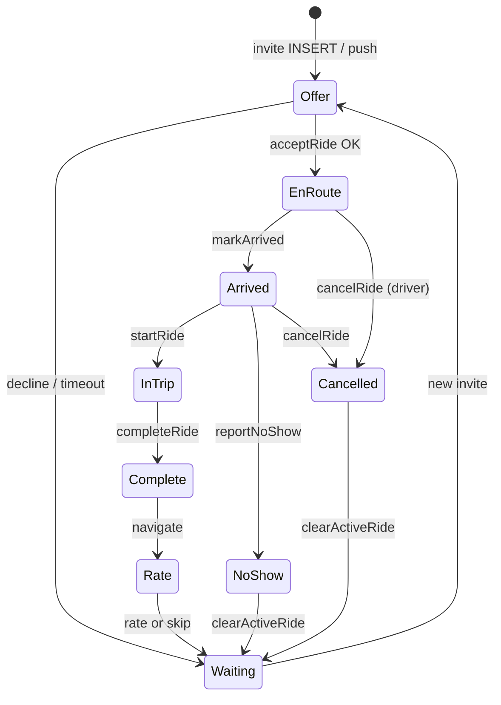

# RIDE_STATE_MACHINE.md

**Status:** Canonical contract — source of truth for Driver ride lifecycle  
**Audience:** Flutter, Supabase, Go API, QA, Product, Design  
**Last updated:** 2026-05-19 (Product Completeness Audit + CTO review)

This document defines every legal state, transition, screen, notification, recovery path, and timeout for the HeyCaby Driver app. **No feature ships without mapping to this contract.**

Related audits:

- Product Completeness Audit (2026-05-19)
- [HEYCABY-LAUNCH-ROADMAP.md](../../docs/HEYCABY-LAUNCH-ROADMAP.md) — Program 3 order + Launch Certification
- [OPERATIONS-PLAYBOOK.md](../../docs/OPERATIONS-PLAYBOOK.md) — support procedures + SQL diagnostics
- `GAP-IMPLEMENTATION.md` (Bolt benchmark gaps)
- `SCREEN_OWNERSHIP.md` (screen purpose names)

---

## 0. Launch priority buckets (CTO)

Do **not** begin full UI redesign until **Level 1** is closed.

### Level 1 — Required before public launch

| # | Capability | Contract section | Current status |
|---|------------|------------------|----------------|
| L1-1 | Continuous GPS while online | §4 Shift & location | **3A wired** — `DriverLocationTrackingListener` + 5s upsert |
| L1-2 | Active ride recovery (app kill) | §8 Recovery | ✅ 3B — server restore on cold start + login |
| L1-3 | Passenger cancel (full UX) | §6.10, §7 | ✅ 3C — modal + FCM/realtime/poll |
| L1-4 | FCM foreground / tap / cold start | §7 Notifications | ✅ 3C — `DriverFcmListener` |
| L1-5 | Waze default nav (Google fallback) | §5 Navigation | ✅ 3D — shared launcher + pref |

### Level 2 — Strongly recommended pre-launch

Auto-arrival (100–300 m), destination proximity, ~~immersive ride mode~~ **✅ 4**, ~~connectivity banner~~ **✅ 3E/4**, ~~offer haptics~~ **✅ L2**, ~~pickup wait restore~~ **✅ L2**, ~~proximity assist~~ **✅ L2** — `DriverRideProximityListener` + banners (manual override), ride queue / next-ride card.

### Level 3 — Post-launch growth

Tips, favorites, surge UI, streaks, badges, voice actions (design for V2 — see §11).

---

## 1. Two layers of state

HeyCaby uses **two coupled state machines**:

| Layer | Storage | Purpose |
|-------|---------|---------|
| **A. Driver availability** | `drivers.status` + client `DriverAppState` (Riverpod) | Can driver receive offers? On break? On a trip? |
| **B. Ride request lifecycle** | `ride_requests.status` | Where is this specific trip in its lifecycle? |

Both must stay in sync. **Server (`ride_requests`, `drivers`) is authoritative.** Client Riverpod is a cache that must be restored on cold start.

### 1A. Driver availability (`drivers.status` → API)

| Server value | Client `DriverAppState` | Meaning |
|--------------|-------------------------|---------|
| `offline` | `offline` | Not matchable |
| `on_break` | `onBreak` | Paused; no new invites |
| `available` | `onlineAvailable` | Matchable; waiting for offers |
| *(implicit via active ride)* | `assigned` … `completed` | On a trip; see §3 |

**Transitions (client-initiated):**

| From | To | Trigger | API | Screen |
|------|-----|---------|-----|--------|
| offline | available | Toggle → Online | `setStatusV1(available)` + readiness + billing gates | Home sheet toggle |
| available | on_break | Toggle → Break | `setStatus(on_break)` | Home + break timer sheet |
| on_break | available | Toggle → Online / Hervat | `setStatus(available)` | Home |
| available/on_break | offline | Toggle → Offline | `setStatus(offline)` + optional end-shift confirm | Home |
| offline | — | Login / session restore | — | Should restore **shift** (§8) |

**Client-only enum values (not always persisted):**

`goingOnline`, `reviewingRequest`, `acceptingRide`, `errorRecovery`, `onboardingIncomplete`, `loggedOut`, `completingRide` (enum exists; **not set today** during complete flow — fix in L2).

---

### 1B. Ride request lifecycle (`ride_requests.status`)

Authoritative values used in migrations / RLS (non-exhaustive; verify in DB check constraint):

| Status | Meaning |
|--------|---------|
| `searching` | Rider waiting for driver |
| `accepted` | Driver accepted (post M10C accept RPC) |
| `assigned` | Driver bound (legacy / audit events) |
| `driver_arrived` | Driver at pickup |
| `in_progress` | Passenger onboard |
| `completed` / `closed` | Trip finished |
| `cancelled` | Terminal — cancelled by rider or driver |

**Rule:** Flutter must never write status directly (R1). All transitions via `DriverApi` RPC/HTTP.

---

## 2. Continuous ride timeline (driver view)

One trip is a **single timeline**, not isolated screens:

```
OFFER → ACCEPTED → EN_ROUTE_PICKUP → ARRIVED → WAITING → IN_TRIP → NEAR_DESTINATION → COMPLETED → RATING → WAITING_AGAIN
```

Each node requires: **screen · notification · loading · error · recovery · analytics hook · accessibility label**.

| Timeline node | Route | Screen (purpose name) | Primary API |
|---------------|-------|----------------------|-------------|
| Offer | `/driver/ride/new/:id` | **Opportunity Screen** | (read invite) |
| Accepted / en route | `/driver/ride/active/:id` | **Active Trip** | `acceptRide` already done |
| Arrived / waiting | `/driver/ride/pickup/:id` | **Pickup Arrival** | `markArrived` |
| In trip | `/driver/ride/progress/:id` | **Navigation Focus** | `startRide` |
| Complete | `/driver/ride/complete/:id` | **Reward Screen** | `completeRide` |
| Rate | `/driver/ride/rate/:id` | **Feedback Loop** | `rateRider` |
| Waiting again | `/driver` | **Money Dashboard** | `clearActiveRide` → `onlineAvailable` |

**Chat:** `/driver/chat/:rideId` — allowed only while ride is active (see `driver_chat_screen.dart` guard).

---

## 3. Legal transitions (ride)



### Transition detail

| Transition | Driver action | API | Client state update | Sound | Haptic | Push (driver) |
|------------|---------------|-----|---------------------|-------|--------|-----------------|
| → Offer | (passive) | — | `reviewingRequest` optional | `playRideRequest()` loop | **✅ L2** `heavyTap` (screen + FCM/realtime) | `incoming_ride` (FCM + realtime) |
| Offer → EnRoute | Accept | `fn_driver_accept_ride_invite` | `setActiveRide` → `assigned` | stop + `playRideAccepted()` | success | — |
| Offer → Waiting | Decline / 30s timeout | `declineRide` | stay `onlineAvailable` | stop + cancelled | — | — |
| EnRoute → Arrived | "I've arrived" (manual) | `markArrived` | `arrived` | — | — | rider nudge path |
| Arrived → InTrip | "Start ride" | `startRide` | `inProgress` | — | — | `ride_phase` |
| InTrip → Complete | "Complete" (+ cash dialog) | `completeRide` | `completed` then clear | `playTripComplete()` | — | `ride_phase` |
| Complete → Rate | CTA | — | — | — | — | — |
| Any active → Cancelled (rider) | (passive) | — | **MISSING** `clearActiveRide` | **MISSING** alert | **MISSING** | `ride_phase` title "Rider cancelled" |
| EnRoute → Cancelled (driver) | Cancel + reason | `cancelRide` | `clearActiveRide` | — | — | — |
| Arrived → NoShow | After 300s wait | `reportNoShow` | `clearActiveRide` | — | — | — |

**Timeouts:**

| Event | Duration | Behavior |
|-------|----------|----------|
| Offer countdown | 30 s | Auto `_onExpired` → decline + missed dialog |
| No-show unlock | 300 s wait at pickup | Enable no-show button |
| Notification poll | 30 s | `DriverNotificationsListener` |
| Zone demand poll | 30 s | Home map |
| GPS upsert (when wired) | 5 s | `DriverLocationService.startTracking` |

---

## 4. Shift & location contract

### Shift session (driver workday)

Persisted: `driver_shift_sessions`, `drivers.current_shift_id`, shift counters on `drivers`.

| Event | Service | When |
|-------|---------|------|
| Start shift | `DriverShiftSessionService.ensureShiftSessionStarted` | After successful go-online |
| End shift | `DriverShiftSessionService.endShiftSession` | Toggle offline (after confirm if >30 min online) |
| Stats display | `driverShiftStatsProvider` | Shift timer widget, earnings pill |

### Shift recovery (CTO addition — **GAP**)

On cold start after auth hydrate (`app.dart`), app **must**:

1. Fetch `drivers.status` + `current_shift_id` from server  
2. If shift active → restore `onlineAvailable` or `onBreak` locally  
3. Restore shift timer from `shift_started_at` / session row  
4. Restore earnings counters from server (not zero)  
5. If active `ride_requests` row for driver → restore ride (§8)  
6. Start GPS tracking if available/on_break with active shift  

**Today:** Ride + availability restored via `DriverOperationalRestoreService` (3B). Shift timer/earnings refetch via provider invalidation. Pickup wait timer restored via `DriverPickupWaitService` (prefs + `ride_audit_log` fallback).

### Location contract

| Mode | Behavior | Status |
|------|----------|--------|
| Go-online snapshot | `requestAndGetLocation()` once | ✅ |
| Continuous while online | `DriverLocationService.startTracking()` every 5s → `driver_locations` | ✅ 3A (foreground; background stream M15) |
| During trip | Same + heading optional | ❌ |
| Background / killed | OS + FCM | ❌ |

---

## 5. Navigation contract (Netherlands V1)

**Default:** Waze  
**Fallback:** Google Maps (native URL → web URL)

| Phase | Open nav? | Destination coords | Status |
|-------|-----------|-------------------|--------|
| En route pickup | Yes | `pickupLat/Lng` | ✅ 3D — preferred app |
| In trip | Yes | `destinationLat/Lng` | ✅ 3D — progress screen |
| Hotspots | Yes | Zone center | ✅ shared launcher + chooser |

**Required (L1-5):**

- Shared `DriverNavigationLauncher` (extract from hotspots)  
- Preference key: `nav_app_pref` = `waze` \| `google` (default `waze`)  
- Settings row in `driver_preferences_screen.dart`  
- No copy/paste — deep link with lat/lng only  

Reference implementation: `driver_hotspots_screen.dart` (Waze native + web fallback).

---

## 6. Screens, modals, empty states per phase

### 6.1 Waiting (no active ride)

| Need | Implementation | Gap |
|------|----------------|-----|
| Idle UI | `DriverHomeLiveRidesSection` | ✅ |
| Online timer | `DriverShiftTimerWidget` | ✅ |
| Earnings | Map pill + modal | ✅ |
| Heat map | Home Mapbox + hotspots | ✅ |
| Connection loss | `DriverResilienceBanner` + offline queue (3E) | ✅ |
| Searching animation | Partial | L2 |

### 6.2 Offer

| Need | File | Gap |
|------|------|-----|
| Screen | `new_ride_request_screen.dart` | ✅ |
| Countdown | 30s ring | ✅ |
| Loading/error | Skeleton + empty | ✅ |
| Ride attributes (pets, WC, airport) | — | ❌ display only |
| Full-screen from push | — | ❌ L1-4 |

### 6.3 En route → Complete

See §2 table. Gaps: in-trip map, ETA, cancel on pickup/progress. Nav on progress ✅ 3D. Immersive shell ✅ 4. Proximity assist (200 m banners) ✅ L2.

### 6.4 Modals registry

| Modal | Trigger | File | Status |
|-------|---------|------|--------|
| Go-online blocked | Readiness/billing | `driver_go_online_guidance_sheet.dart` | ✅ |
| End shift confirm | >30 min online → offline | `three_state_toggle.dart` | ✅ |
| Cancel ride + reason | Active trip | `active_ride_screen.dart` | ✅ |
| Cash before complete | In progress | `ride_in_progress_screen.dart` | ✅ |
| Missed offer | Timeout | `new_ride_request_screen.dart` | ✅ |
| **Rider cancelled** | `ride_phase` push / realtime | — | ✅ 3C modal |
| No-show confirm | Before API | `at_pickup_screen.dart` | ✅ L2 |

---

## 7. Notifications contract

### Channels

| Channel | Mechanism | File |
|---------|-----------|------|
| Ride invite (foreground) | Supabase realtime INSERT `ride_request_invites` | `ride_invite_realtime_listener.dart` |
| Generic unread | HTTP poll 30s | `driver_notifications_listener.dart` |
| FCM | Token register | `driver_fcm_scope.dart`, `fcm_registration.dart` |
| FCM handle | `DriverFcmListener` + `DriverFcmHandler` | ✅ 3C |

### Driver push categories (backend)

From `supabase/functions/driver-agent/notify_rules.ts`:

| Category | Trigger | Required client action |
|----------|---------|------------------------|
| `incoming_ride` | ride_requests INSERT with driver_id | Navigate `/driver/ride/new/:id` + sound |
| `ride_phase` | status → cancelled (rider) | **Full-screen modal** + clear ride **L1-3** |
| `chat` | rider message INSERT | Optional: open chat |
| `rating` | rating UPDATE | Optional: open score |

### FCM handler requirements (L1-4)

Implement in `main.dart` or dedicated service:

1. `FirebaseMessaging.onMessage` — foreground: route + sound/haptic by category  
2. `FirebaseMessaging.onMessageOpenedApp` — background tap → deep link  
3. `getInitialMessage()` — terminated tap → deep link  
4. Data payload keys: `ride_request_id`, `screen`, `category`  

---

## 8. Recovery contract

### 8.1 Active ride recovery (L1-2)

**On every cold start after auth:**

```
bootstrapDriverSessionAfterAuth()
  → fetch drivers.status + active ride_requests (status NOT IN terminal)
  → if ride found: setActiveRide(...) + navigate to correct route from status map
  → else if drivers.status == available: set onlineAvailable + startTracking
```

**Status → route map:**

| `ride_requests.status` | Route |
|------------------------|-------|
| `accepted` / `assigned` | `/driver/ride/active/:id` |
| `driver_arrived` | `/driver/ride/pickup/:id` |
| `in_progress` | `/driver/ride/progress/:id` |
| post-complete before rate | `/driver/ride/complete/:id` or `/driver/ride/rate/:id` |

### 8.2 Shift recovery

See §4 — same cold-start bootstrap block.

### 8.3 Passenger cancel recovery (L1-3)

Subscribe to `ride_requests` UPDATE (or handle FCM `ride_phase`) while `activeRideId` set:

```
if status == cancelled → show RiderCancelledModal (non-dismissible)
  → SoundService.alert + HapticService.heavyTap()
  → clearActiveRide()
  → context.go('/driver')
  → invalidate earnings/stats providers
```

### 8.4 Duplicate session

FCM category `session_revoked` → non-dismissible modal → `forceDriverLogout()` (`driver_session_revoked_flow.dart`). Full M14 `driver_sessions` realtime supersede when `connectivity_m14_enabled` is on — future.

---

## 9. API surface (driver ride)

From `packages/heycaby_api/lib/src/driver_api.dart`:

| Method | Endpoint / RPC |
|--------|----------------|
| `acceptRide` | RPC `fn_driver_accept_ride_invite` |
| `declineRide` | HTTP |
| `markArrived` | POST `/api/driver/ride/arrived` |
| `startRide` | POST `/api/driver/ride/start` |
| `completeRide` | POST `/api/driver/ride/complete` |
| `cancelRide` | POST `/api/driver/ride/cancel` (fallback paths) |
| `pingRider` | Edge `driver-agent` → `ride_audit_log` (`driver.ping_*`, `.delivered`, `.opened`) — see [NOTIFICATION_MATRIX.md](./NOTIFICATION_MATRIX.md) |
| `reportNoShow` | HTTP |
| `rateRider` | HTTP |
| `createReceipt` | HTTP |
| `setStatus` / `setStatusV1` | HTTP |
| `updateLocation` | HTTP (also Supabase upsert in location service) |

---

## 10. QA acceptance checklist (per release)

For each timeline node in §2, QA confirms:

- [ ] Screen renders with loading + error + empty  
- [ ] Primary action calls correct API  
- [ ] Success navigates to next node  
- [ ] Failure shows retry/snackbar and state unchanged  
- [ ] Push/realtime triggers correct screen (when L1 closed)  
- [ ] Kill app mid-node → reopen restores node (when L1-2 closed)  
- [ ] Rider cancel during node → modal + home (when L1-3 closed)  
- [ ] VoiceOver/TalkBack reads primary CTA (L2)  

---

## 11. V2 design constraints (voice actions)

Do not block V1. UI must keep **large, unambiguous primary actions** so future voice intents map 1:1:

| Voice intent | Maps to |
|--------------|---------|
| "Accept ride" | Opportunity accept button |
| "Navigate" | Nav launcher |
| "Arrived" | Active trip CTA |
| "Start ride" | Pickup CTA |
| "Complete ride" | Progress CTA |

Avoid multi-step-only gestures for these actions in redesign.

---

## 12. Readiness scores (CTO-adjusted)

| Area | Score | Notes |
|------|-------|-------|
| Backend / RPC / RLS | 95% | Strong governance |
| Architecture | 92% | Monorepo, R1 boundaries |
| Dispatch | 88% | Missing continuous GPS client |
| Billing | 100% | Gates + ledger |
| UI design system | 90% | Phase 2 kit |
| Operational readiness | 65% | L1 gaps |
| Driver experience | 70% | Happy path OK |
| **Production launch** | **72–75%** | Close L1 → ~85%+ |

---

## 13. Change control

Any PR that touches ride flow **must**:

1. Update this document if adding/removing a state or transition  
2. Update golden tests under `apps/driver/test/visual/` if UI changes  
3. Add QA row to §10 checklist  
4. Not merge L1 gaps without explicit waiver from Product + CTO  

---

## 14. File index (implementation map)

| Concern | Primary files |
|---------|---------------|
| Client ride state | `providers/driver_state_provider.dart` |
| Router | `router.dart` |
| Offer | `screens/new_ride_request_screen.dart` |
| Active / pickup / progress / complete / rate | `screens/active_ride_screen.dart`, `at_pickup_screen.dart`, `ride_in_progress_screen.dart`, `ride_complete_screen.dart`, `rate_rider_screen.dart` |
| Invite realtime | `widgets/ride_invite_realtime_listener.dart` |
| Notifications poll | `widgets/driver_notifications_listener.dart` |
| GPS | `services/location_service.dart` |
| Shift | `services/driver_shift_session_service.dart`, `widgets/driver_shift_timer_widget.dart` |
| Go online | `utils/driver_go_online_runtime_action.dart`, `widgets/three_state_toggle.dart` |
| Session hydrate | `app.dart`, `services/driver_session_bootstrap.dart` |
| Backend notify rules | `supabase/functions/driver-agent/notify_rules.ts` |
| Driver API | `packages/heycaby_api/lib/src/driver_api.dart` |

---

*This document is the contract. When in doubt, the server state wins and the driver must always be able to recover their shift and their active ride.*
