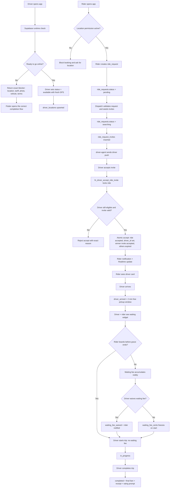

# HeyCaby Backend Flow Blueprint

Source of truth for the rider booking flow, driver readiness flow, dispatch contract, ride lifecycle, ride swap (Ritwissel), pricing, waiting time, notifications, and failure modes.

Status: Backend contract blueprint  
Owner: HeyCaby engineering / product  
Last updated: 2026-07-11

## Purpose

HeyCaby is not a generic ride-hailing clone. The platform connects riders with independent taxi drivers who set their own prices. That means the backend must protect three things at all times:

1. A rider should only be matched with a real eligible driver.
2. A driver should only receive rides when they are operationally ready.
3. Every price shown to a rider must be explainable from the driver's tariff.

This document defines how the backend should behave, why each step exists, and what breaks if it does not happen.

## Product Principles

- Supabase is the source of truth for readiness, dispatch, pricing, status, and ride lifecycle.
- Flutter renders state and calls RPCs. Flutter must not invent business rules locally.
- No location means no ride. Riders cannot book without location; drivers cannot go online without location.
- No tariff means no online driver. HeyCaby cannot show riders a driver without a price.
- No driver photo and vehicle photo means no rider trust. A driver cannot receive rides until the rider can identify who and what is arriving.
- Driver presence and Platform ride eligibility are separate. An overdue driver may remain online while dispatch and acceptance block new HeyCaby rides.
- One ride lifecycle. Every app, function, trigger, notification, and screen must use the same status contract.
- Every critical state change must be atomic, auditable, and recoverable.

## Core Backend Objects

These are the expected backend surfaces. Names must be verified against the active Supabase schema before each migration.

| Area | Backend object |
| --- | --- |
| Driver runtime | `fn_driver_runtime`, `fn_driver_readiness_eval`, `fn_driver_set_status` |
| Driver profile | `drivers` |
| Driver location | `driver_locations` |
| Driver tariffs | `driver_rate_profiles` |
| Rider booking | `ride_requests` |
| Driver invites | `ride_request_invites` |
| Dispatch matching | `fn_seed_ride_matching_batch` |
| Accept ride | `fn_driver_accept_ride_invite` |
| Lifecycle | `fn_driver_ride_arrived`, `fn_driver_ride_start`, `fn_driver_ride_complete`, cancel/no-show RPCs |
| Ride swap (Ritwissel) | `ride_swaps`, `offer_ride_swap`, `claim_ride_swap`, `cancel_ride_swap`, `can_driver_take_swap` |
| Notifications | `notification_events`, `notifications`, `driver-agent` Edge Function |
| Chat / pings | `messages` and/or a dedicated `conversation_id` contract |
| Billing | Platform Balance functions and billing guard RPCs |
| Audit | ride audit, billing audit, status audit tables/functions |

## P0 Contract Hardening Rule

This blueprint is not only a design document. It is the execution contract for the dispatch and ride lifecycle.

Hardening order:

1. Lock the canonical status vocabulary.
2. Enforce driver readiness before online.
3. Make accept atomic.
4. Harden matching eligibility.
5. Harden ride lifecycle RPCs.
6. Prove notifications, ping, chat, cancel, and locked-device behavior.
7. Only then redesign or polish screens.

Do not skip forward because a UI looks ready. A premium UI on top of a broken contract makes the platform less trustworthy.

Each hardening step must follow this gate:

```text
Patch backend / Flutter contract
        ↓
Test against real Supabase staging
        ↓
Confirm database rows and notifications
        ↓
Move to the next step
```

What breaks if this is ignored:

- Driver accepts but rider remains searching.
- Pings fail because no confirmed ride context exists.
- Chat opens without a conversation and crashes.
- Driver cancels but rider is not notified.
- Flutter screens invent state that Supabase does not enforce.

## Canonical Driver Statuses

Driver status records the driver's working presence. It does not by itself grant
access to HeyCaby-dispatched rides.

| Status | Meaning | Can receive ride requests? |
| --- | --- | --- |
| `available` | Driver is online and maintaining location presence | Only when `platform_ride_eligible = true` |
| `on_break` | Driver is paused/breaking | No |
| `offline` | Driver is not working | No |
| Future: `car_wash` | Driver is unavailable for car wash | No |
| Future: `fuel_stop` | Driver is unavailable for fuel | No |
| Future: `lunch` | Driver is unavailable for lunch | No |
| Future: `heading_home` | Driver is using Return Mode | Only return-qualified rides |

Important: older text may say `online`. The database contract should use the actual enum/value used by this repo, currently expected to be `available`.

### Presence vs Platform Ride Eligibility

These states answer different questions and must never be collapsed into one
boolean:

```text
Presence
offline | available | on_break | busy
        ↓
Is the driver working in the app?

Platform ride eligibility
eligible | grace_period | settlement_required
        ↓
May HeyCaby send or assign a new platform ride?
```

The following combination is valid and intentional:

```json
{
  "driver_status": "available",
  "platform_ride_eligible": false,
  "eligibility_reason": "platform_balance_overdue",
  "balance_state": "paused"
}
```

`fn_driver_set_status` owns presence. It must still enforce operational
readiness such as location, tariff, identity, terms, and vehicle requirements,
but it must not reject `available` solely because Platform Balance is overdue.

`fn_driver_can_accept_rides` owns Platform Balance eligibility. Every dispatch
path must call it before creating an invite, and every accept RPC must call it
again while the ride row is locked. An invite created before grace expiry must
therefore fail safely if the driver becomes ineligible before accepting.

An overdue driver remains able to use the map, location presence, profile,
tariffs, vehicle, Driver Hub, history, earnings, Community, support, and
Platform Balance. Existing accepted or active rides continue through arrival,
chat/ping, start, completion, receipt, and payment. Only new Instant,
Scheduled, Marketplace, queued-next, and Taxi Terug platform rides pause.

## Canonical Ride Statuses

Ride status is about the rider request lifecycle.

| Status | Meaning | Owner |
| --- | --- | --- |
| `pending` | Rider request exists, but no active driver search has begun | Rider/dispatch |
| `searching` | Driver invites have been sent and the system is waiting for accept | Dispatch |
| `accepted` | One driver won the ride atomically | Accept RPC |
| `driver_arrived` | Driver is at pickup and waiting for rider | Driver lifecycle RPC |
| `in_progress` | Rider is in vehicle and trip has started | Driver lifecycle RPC |
| `completed` | Trip has ended and final fare/receipt should exist | Complete RPC |
| `cancelled` | Ride was cancelled by rider, driver, system, or support | Cancel RPC |

Implementation note: if production still uses `pending` for both "created" and "searching", do not change one caller at a time. Introduce `searching` only through a coordinated migration that updates creation, matching, accept, listeners, tests, and dashboards together.

### Status Mismatch Audit

Before changing dispatch, search the repo and database functions for every ride status string:

```text
pending
searching
accepted
assigned
driver_arrived
arrived
in_progress
active
completed
cancelled
```

Then normalize Flutter listeners, RPCs, Edge Functions, notification rules, tests, and dashboards to the canonical values above.

Required listener rule:

- Rider "driver found" UI must listen for `ride_requests.status = 'accepted'`.
- Driver active-ride UI must use the same accepted ride row.
- No screen should depend on legacy `assigned` or `active` unless a compatibility migration explicitly maps it.

What breaks if missing:

- Accept succeeds in SQL, but rider stays on searching.
- Driver screen moves forward while rider screen does not.
- Notifications deep-link to a ride state the app no longer understands.

## End-to-End Flow Chart



## Driver Go Online Contract

When a driver tries to go `available`, the backend must check all required readiness conditions.

Required before online:

- Authenticated driver profile exists.
- Driver has accepted required terms/legal documents.
- Taxi plate is present and verified.
- Driver profile photo exists.
- Vehicle photo exists.
- Fresh valid GPS coordinates are provided. The status RPC must reject `available` if the latest location is missing or older than 5 minutes.
- At least one active initial tariff exists.

After recording presence, the same response must expose Platform ride
eligibility separately. An overdue balance does not reverse or reject the
`available` transition.

The backend should return exact blockers, not generic messages.

Example response:

```json
{
  "status": "offline",
  "blocked_reason": "missing_tariff",
  "message": "Set your first tariff before going online",
  "redirect": "/driver/tariffs"
}
```

Why this exists:

- Riders need to know who is coming.
- Riders need to know what car is coming.
- Dispatch needs driver location.
- Pricing needs a driver tariff.
- Billing must pause new dispatch and acceptance when Platform Balance is overdue, without forcing the driver offline.

What breaks if missing:

| Missing guard | What breaks |
| --- | --- |
| Location | Rider cannot find nearby driver; matching uses stale/false supply |
| Tariff | Rider price estimate cannot be calculated |
| Driver photo | Rider trust/safety is weakened |
| Vehicle photo | Rider cannot identify the taxi |
| Billing dispatch/accept check | Overdue driver receives a new platform ride |
| Terms/legal | Driver can operate before accepting required platform rules |

Required go-online tests:

```text
No driver_locations row        -> blocked with location reason
Location older than 5 minutes  -> blocked with stale location reason
Fresh location + all checks    -> can go available
Missing tariff                 -> blocked and opens first tariff setup
Missing driver photo           -> blocked and opens driver photo upload
Missing vehicle photo          -> blocked and opens taxi photo upload
Overdue Platform Balance       -> available, but platform_ride_eligible=false
```

Implementation rule:

- `fn_driver_set_status` must own these checks.
- `fn_driver_can_accept_rides`, dispatch, and accept RPCs must own Platform Balance enforcement.
- Flutter may pre-check for UX, but it must not be the final authority.
- A later migration must not accidentally remove the GPS guard when adding tariff/photo checks.

## Minimum Initial Tariff Contract

HeyCaby drivers set their own prices. The first tariff is mandatory before going online.

Required minimum tariff fields:

- Start price: the base amount charged when the ride starts.
- Price per kilometer: distance component.
- Price per minute: driving-time component.
- Waiting time rate: rider lateness / waiting component.
- Active flag: tariff must be usable by dispatch/pricing.

Current schema reference:

- `driver_rate_profiles.base_fare`
- `driver_rate_profiles.per_km_rate`
- `driver_rate_profiles.per_min_rate`
- `driver_rate_profiles.waiting_rate`
- `driver_rate_profiles.is_active`

Important correction: VAT percentage is not part of the minimum go-online tariff contract. If the current database has `vat_percentage`, it may remain as an accounting/tax field, but it must not replace waiting time as a required taxi pricing field.

### Ride Estimate Formula

```text
estimated_ride_price =
  start_price
  + (estimated_distance_km * price_per_km)
  + (estimated_trip_minutes * price_per_minute)
```

Example:

```text
start_price = EUR 5.00
distance = 20 km
price_per_km = EUR 1.50
estimated_trip_time = 10 minutes
price_per_minute = EUR 0.30

estimated price =
EUR 5.00 + (20 * EUR 1.50) + (10 * EUR 0.30)
= EUR 5.00 + EUR 30.00 + EUR 3.00
= EUR 38.00
```

Why this exists:

- HeyCaby does not set driver prices.
- Riders must see a transparent estimate.
- Drivers must not be invisible just because they do not understand tariff setup.

What breaks if missing:

- Driver goes online but receives no rides.
- Rider sees "taxi nearby" without a real price.
- Marketplace and dispatch cannot compare offers fairly.

## Waiting Time, Widget, And Waiver Contract

Waiting time begins when the driver marks arrival at pickup.

Default rider grace window:

```text
waiting_grace_seconds = 120
```

Charging rule:

```text
chargeable_wait_seconds =
  max(0, trip_started_at - driver_arrived_at - waiting_grace_seconds)
```

Waiting fee:

```text
waiting_fee =
  (chargeable_wait_seconds / 60) * waiting_rate_per_minute
```

If the driver tariff stores waiting as an hourly rate, convert it:

```text
waiting_rate_per_minute = waiting_rate_per_hour / 60
```

Example:

```text
waiting rate = EUR 60/hour = EUR 1/minute
driver waits 5 minutes after arrival
first 2 minutes are free
chargeable waiting = 3 minutes
waiting fee = EUR 3
```

### Required Backend Fields

The ride row must expose a shared waiting state so rider and driver render the same truth:

```text
driver_arrived_at
waiting_grace_seconds
waiting_started_at
waiting_rate_per_minute
chargeable_wait_seconds
waiting_fee_cents
waiting_fee_waived
waiting_fee_waived_at
waiting_fee_waived_by
waiting_fee_waive_reason
```

Why this is stored on `ride_requests`:

- The waiting tariff must be snapshotted when the driver arrives.
- Later tariff edits must not change a ride already in progress.
- Rider and driver realtime screens must read the same values.
- Support must be able to explain exactly why the final fare changed.

### Driver Arrival Widget

When status becomes `driver_arrived`, both apps should show a waiting surface.

Driver sees:

```text
Waiting for rider

Free time remaining: 01:42
Waiting rate after grace: EUR 1/min

[Message rider] [Waive waiting fee]
[Start ride]
```

Rider sees:

```text
Your driver has arrived

Free pickup time remaining: 01:42
Waiting may be added after 2 minutes.
Rate: EUR 1/min
```

After grace ends, both surfaces change to:

```text
Waiting time

03:00
Added so far: EUR 3.00
```

This must be realtime, not a static local timer. Flutter may animate the seconds locally, but the baseline timestamps and fee values come from Supabase.

### Waive Waiting Fee

Drivers may waive waiting charges when justified by the rider situation.

Examples:

- rider has mobility needs
- rider was at the wrong entrance because of bad map pin
- driver chose to wait as a courtesy
- support instructed the driver to waive

Backend RPC:

```text
fn_driver_waive_waiting_fee(ride_request_id, reason)
```

Rules:

- Only the assigned driver can waive.
- Waiver is allowed only before completion (`driver_arrived` or `in_progress`).
- Waiver sets `waiting_fee_waived = true`.
- Waiver sets `waiting_fee_cents = 0`.
- Waiver writes `waiting.fee_waived` to `ride_audit_log`.
- Waiver sends the rider an immediate notification.

Rider notification:

- On arrival: "Your driver has arrived. Waiting time may be added after 2 minutes."
- After grace ends: "Waiting time has started. Your waiting rate is EUR 1/min."
- On waiver: "Your driver waived the waiting fee for this ride."

Driver UI after waiver:

```text
Waiting fee waived

The rider has been notified.
Final fare will not include waiting time.
```

Rider UI after waiver:

```text
Waiting fee waived

Your driver removed the waiting charge.
```

Example:

```text
base trip fare = EUR 30
waiting fee accumulated = EUR 3

without waiver: rider pays EUR 33
with waiver:    rider pays EUR 30
```

Why this exists:

- Drivers should be paid when riders make them wait.
- Riders should get a fair grace period.
- Waiting charges must be transparent before they start.
- Drivers need discretion to remove waiting charges when the delay is justified.

What breaks if missing:

- Driver loses money during rider delays.
- Rider is surprised by the final fare.
- Support disputes increase.
- Driver cannot correct fair edge cases without support.
- Rider sees one price while backend charges another.

## Rider Booking Contract

Rider booking requires:

- Authenticated or known rider identity.
- Location permission synced to backend.
- Pickup coordinates.
- Destination coordinates.
- Vehicle/category/payment choices.
- Clear price estimate or marketplace offer.

The rider app may let a user browse without location, but it must not create a live ride request without location.

Why this exists:

- Matching depends on real pickup coordinates.
- Safety and pickup accuracy depend on current location.
- Dispatch cannot meaningfully search without pickup context.

What breaks if missing:

- Drivers receive requests with bad/no pickup.
- Rider sees "no taxis" while driver is nearby.
- Search card becomes fake progress.

## Dispatch Matching Contract

Dispatch must only invite drivers who are currently eligible.

Driver must satisfy:

- `drivers.status = 'available'`
- Fresh row in `driver_locations`, updated within the matching freshness window. The default matching window is 3 minutes unless changed by config.
- Platform Balance allowed
- Active initial tariff exists
- Driver photo exists
- Vehicle photo exists
- Taxi plate verified
- Vehicle/payment/category compatible
- No active conflicting ride
- Invite cooldown/expiry rules respected

Dispatch should never rely only on distance.

### Payment Compatibility

Matching and accept must use the same payment compatibility rule.

Expected backend helper:

```text
fn_payment_compatible(driver_id uuid, rider_payment_preferences jsonb)
```

The helper should answer:

- Does the driver accept this rider's selected payment method?
- Is invoice/on-account enabled only when the driver has explicitly allowed it?
- Is cash/card/Tikkie compatibility clear?
- Are disabled or unsupported methods excluded from matching?

The same compatibility decision must be used in:

- `fn_seed_ride_matching_batch`
- `fn_driver_accept_ride_invite`

What breaks if missing:

- Rider requests a payment type the driver does not accept.
- Driver receives a ride they must reject manually.
- Accept RPC rejects too late after the rider has already waited.

Why this exists:

- Nearest driver is not always eligible.
- Rider trust depends on real driver/vehicle identity.
- Pricing depends on a valid tariff.

What breaks if missing:

- Driver receives ride they cannot accept.
- Rider waits for a driver who is not actually eligible.
- Accept RPC rejects too late and creates user frustration.

## Invite And Driver Push Contract

When dispatch creates `ride_request_invites`, the backend/Edge Function must notify the driver.

Driver invite notification must:

- Ring on locked device.
- Include ride request id and invite expiry.
- Use high priority / critical style where allowed.
- Open the incoming ride screen.
- Use server `expires_at` for countdown, not only client time.

Minimum push payload contract:

```text
data.type           = incoming_ride
data.invite_id      = ride_request_invites.id
data.ride_request_id = ride_requests.id
data.expires_at     = server invite expiry
```

iOS/APNs requirements:

- `aps.sound` must reference the bundled incoming ride sound, for example `incoming_ride.caf`.
- `aps.interruption-level` should be `time-sensitive` where entitlement/config allows.
- Badge/count should be included where supported.
- The `.caf` file must be included in the iOS Runner target.

Android requirements:

- High-priority FCM.
- High-importance notification channel.
- Incoming ride sound assigned to the channel.

Physical-device proof:

- Driver phone locked.
- Another app open, for example Instagram.
- Screen off.
- Incoming ride still rings and opens the correct ride invite.

Why this exists:

- Taxi dispatch is time-sensitive.
- Silent pushes lose rides.
- Countdown must be fair and server-aligned.

What breaks if missing:

- Driver never sees the request.
- Rider remains stuck searching.
- Accept screen can crash or show stale timer.

## Incoming Ride Screen Data Contract

The incoming ride screen is part of dispatch, not just UI. It must tolerate incomplete data without crashing.

Every field needs a fallback:

| Field | Required behavior |
| --- | --- |
| Rider name | Use rider name, fallback `Rider` |
| Rider rating | Show rating only when available |
| Pickup address | Fallback `Pickup address unavailable` |
| Destination address | Fallback `Destination unavailable` |
| Estimated fare | Show range when available, fallback `Fare calculating...` |
| Distance | Show kilometers when available, fallback `-` |
| Duration | Show minutes when available, fallback `-` |
| Countdown | Use `ride_request_invites.expires_at`; if missing, fallback to the configured invite timeout |

Screen rules:

- No `assert()` or null check operator should be able to crash this screen in production.
- Missing data should degrade gracefully and be logged.
- The accept button must still call the backend accept RPC, which remains the final authority.
- The screen should not invent missing pickup/destination coordinates; lifecycle RPCs must enforce coordinate requirements later.

What breaks if missing:

- A valid ride invite becomes unusable because one optional label is null.
- Driver sees a red Flutter crash screen instead of accepting the ride.
- Rider remains searching even though an eligible driver was available.

## Accept Ride Contract

Accepting a ride must be atomic.

`fn_driver_accept_ride_invite` should:

1. Resolve authenticated driver.
2. Lock the ride row with the equivalent of `FOR UPDATE`.
3. Verify ride is still searchable: `ride_requests.status = 'searching'`.
4. Verify driver has a valid pending invite that has not expired.
5. Re-check driver eligibility.
6. Re-check billing.
7. Re-check active tariff.
8. Re-check fresh GPS within the accept freshness window. The default accept window is 3 minutes unless changed by config.
9. Set `ride_requests.status = 'accepted'`.
10. Set `driver_id`.
11. Set `accepted_at`.
12. Mark winner invite accepted.
13. Expire/supersede other invites.
14. Create or guarantee chat context.
15. Create rider notification event.
16. Write audit event.
17. Return a complete context object to Flutter.

Idempotency rule:

- If the same assigned driver retries accept for the same invite after a network retry, return the accepted context instead of failing destructively.
- If any other driver tries to accept after the ride is accepted, reject with a race-lost reason.

Required post-accept row state:

```text
ride_requests.status          = accepted
ride_requests.driver_id       = accepting driver
ride_requests.accepted_at     = non-null
winner invite status          = accepted
other invite statuses         = expired / superseded
conversation context          = present
notification_events row       = rider driver_found event
audit row                     = ride.accepted
```

Why this exists:

- Two drivers may accept at the same time.
- Driver eligibility can change after invite.
- Rider UI must update immediately.
- Chat/ping needs a valid ride context.

What breaks if missing:

| Missing accept step | What breaks |
| --- | --- |
| Row lock | Two drivers can win the same ride |
| Status update | Rider remains searching |
| Other invite expiry | Multiple drivers keep thinking the ride is open |
| Chat context | Ping/chat screens fail |
| Rider notification | Locked rider phone does not wake |
| Final eligibility check | Ineligible driver wins |

## Active Ride Lifecycle Contract

Only backend RPCs should move a ride through lifecycle statuses.

### Accepted

The rider sees:

- driver name
- driver photo
- vehicle photo
- plate
- color/make/model
- ETA
- ping/chat controls

The driver sees:

- pickup
- destination summary
- rider name
- navigation
- ping rider
- cancel/pause secondary controls

### Driver Arrived

Requirements:

- Ride status is `accepted`.
- Driver is close enough to pickup, or support override is recorded. Default maximum distance is 500 meters.
- Backend sets `driver_arrived_at`.
- Backend sets status `driver_arrived`.
- Rider receives arrival notification.
- Waiting grace timer starts.
- Rider and driver both see the waiting widget/modal.
- Waiting rate is snapshotted from the active driver tariff.

What breaks if missing:

- Waiting time cannot be calculated.
- Rider is not told driver is outside.
- Rider and driver disagree about whether waiting charges apply.

### Start Ride

Requirements:

- Ride status is `driver_arrived`.
- Pickup/destination coordinates exist.
- Driver is near pickup, or override is recorded. Default maximum distance is 200 meters.
- Backend sets `started_at`.
- Backend sets status `in_progress`.
- Backend freezes `chargeable_wait_seconds`.
- Backend freezes `waiting_fee_cents` unless the fee was waived.
- Rider receives trip-start notification.

What breaks if missing:

- Driver can start trip before pickup.
- Fare and route records become unreliable.
- Waiting fees keep changing after the rider boards.

### Complete Ride

Requirements:

- Ride status is `in_progress`.
- Backend sets `completed_at`.
- Backend calculates final fare.
- Backend includes waiting fee if applicable.
- Backend excludes waiting fee if `waiting_fee_waived = true`.
- Backend creates receipt/ledger entries.
- Backend releases driver availability according to current work status.
- Rider receives receipt/rating prompt.

What breaks if missing:

- Driver earnings are wrong.
- Rider receipt is missing.
- Platform Balance/ledger becomes inconsistent.

## Final Fare Contract

The final fare should be explainable as:

```text
final_fare =
  start_price
  + distance_component
  + driving_time_component
  + chargeable_waiting_component
  + approved_adjustments
```

Where:

```text
distance_component = actual_or_billable_distance_km * price_per_km
driving_time_component = actual_or_billable_trip_minutes * price_per_minute
chargeable_waiting_component = chargeable_wait_minutes * waiting_rate_per_minute
```

If `waiting_fee_waived = true`:

```text
chargeable_waiting_component = 0
```

All final fare components should be persisted for receipt/support.

Receipt should show waiting transparently:

```text
Ride fare                         EUR 30.00
Waiting time        3 min          EUR 3.00
Total                             EUR 33.00
```

If waived:

```text
Ride fare                         EUR 30.00
Waiting time        waived         EUR 0.00
Total                             EUR 30.00
```

## Pings And Chat Contract

HeyCaby uses ping/chat, not driver phone calls.

Pings must:

- Be attached to a valid ride.
- Be visible to both sides.
- Create a notification event.
- Have a cooldown where needed.
- Never require a phone number.

Chat must:

- Have a valid ride context.
- Fail gracefully if ride context is missing.
- Never open a crash screen.

Final preferred contract:

```text
messages.conversation_id -> conversations.id
```

If the current app still uses `messages.ride_request_id`, that path must be treated as legacy compatibility only. The destination contract is `conversation_id`, because the chat screen needs one durable conversation shared by rider and driver.

Required chat route fields:

```text
conversation_id
ride_request_id
driver_id
rider_id
```

Route guard:

- If `conversation_id` or required actors are missing, do not crash.
- Show: "Chat will be available once your ride is confirmed."
- Log the missing context for support/debugging.

Ping path:

```text
Driver/Rider sends ping
        ↓
Message row with conversation_id
        ↓
notification_events row
        ↓
Push to other party
        ↓
Active ride card shows last ping
```

What breaks if missing:

- Driver sends ping but rider never receives it.
- Chat opens without context and crashes.
- Support cannot audit communication.

## Cancel Contract

Cancellation must notify both sides.

Required:

- Only valid actor can cancel.
- Reason is captured where required.
- Ride status becomes `cancelled`.
- Other side receives notification.
- Driver/rider UI exits active ride state.
- Audit event records actor, reason, and previous state.

What breaks if missing:

- Driver thinks ride is cancelled, rider still waits.
- Rider cancels but driver continues driving.
- Support cannot resolve dispute.

## Ride Swap / Ritwissel Contract

**CTO direction.** Ride Swap is **Ritwissel** — a marketplace reliability feature that lets one driver hand over an already assigned ride to another eligible driver. This is mainly for **scheduled rides**, not random instant rides.

### What Ride Swap Is

Example:

A driver accepted a scheduled airport ride for tomorrow at 08:00. Later they cannot do it (car problem, family emergency, double booking, too far away, shift changed, wants to stop working). Instead of cancelling the rider, the driver offers the ride to other HeyCaby drivers. Another eligible driver claims it. The rider keeps the booking; only the assigned driver changes.

### Why This Feature Matters

Without Ride Swap:

```text
Driver cannot do ride
        ↓
Driver cancels
        ↓
Rider loses booking
        ↓
Rider loses trust
```

With Ride Swap:

```text
Driver cannot do ride
        ↓
Driver offers ride swap
        ↓
Another driver claims it
        ↓
Rider keeps booking
        ↓
HeyCaby looks reliable
```

This is critical for scheduled rides, airport rides, early morning rides, and high-value bookings.

### Business Benefit

- **Drivers** — independent operators should not feel trapped; they need a professional way to hand over a future ride.
- **HeyCaby** — fewer cancellations.
- **Riders** — booking stays alive.

This is a marketplace reliability feature, not an admin tool.

### Eligibility Rules

Ride Swap is allowed when:

- Ride is already assigned to a driver.
- Ride is scheduled.
- Pickup is not too soon.
- Ride has not started.
- Original driver is still responsible for the ride.
- Backend says swap is allowed.

**Current rule found in code:**

```text
ride status is accepted or driver_arrived
pickup is scheduled
pickup is more than 15 minutes away
```

**Launch-safe rule (CTO decision):**

Be careful with `driver_arrived`. If the driver has already arrived at pickup, swap should normally **not** be allowed unless this is a controlled emergency case.

For launch, safest rule:

```text
scheduled ride
status = accepted
pickup more than 15 minutes away
ride not started
ride not cancelled
ride not completed
```

### Product Surfaces

Ride Swap should be visible in:

| Surface | Placement |
| --- | --- |
| **Driver Hub** | Business tool: "Ride Swap — Hand over or claim scheduled rides" |
| **Scheduled Rides** | Per ride: "Offer for swap" |
| **Home / Work** | Only when relevant, e.g. "You have 1 scheduled ride eligible for swap" — do not clutter Home permanently |

### Existing Code (Reuse, Do Not Rebuild)

The driver app already references:

- `ride_swap_service.dart`
- `ride_swap_feed_content.dart`
- `scheduled_rides_screen.dart`
- `offer_ride_swap_dialog.dart`

Reuse and improve the existing flow. Do not rebuild from scratch or bypass the `ride_swaps` system.

### Supabase Contract (Verify Before UI Polish)

Before polishing UI, confirm production/staging Supabase has:

1. `ride_swaps` table.
2. `offer_ride_swap` RPC.
3. `claim_ride_swap` RPC.
4. `cancel_ride_swap` RPC.
5. `can_driver_take_swap` RPC.
6. RLS enabled and correct.
7. Realtime publication includes `ride_swaps`.
8. Claim operation is atomic.
9. Rider notification exists when swap succeeds.
10. Original driver and new driver both get state updates.

If any of these are missing, fix the backend contract first.

### Atomic Claim (Non-Negotiable)

Only one driver can claim a swap. If 10 drivers see the same swap and 2 tap Claim at the same time, only the first wins.

Backend must lock the swap row and ride row.

```text
Driver A taps Claim first
        ↓
Driver A gets the ride

Driver B taps Claim milliseconds later
        ↓
Driver B sees: This ride was already claimed by another driver.
```

If claim is not atomic, two drivers may think they own the same ride. That cannot happen.

### Rider Trust Rule

If a ride swap succeeds, the rider **must** be notified. This is not optional.

The rider booked one driver/car. If another driver/car is coming, the rider must know who is coming, what car is coming, and what plate to check. Without this, swap becomes a trust and safety problem.

Required rider notification payload:

```text
Your driver has changed.

New driver: Ahmed
Vehicle: Black Tesla Model Y
Plate: TX-22-NL
```

The scheduled ride card must update immediately via Realtime.

### Original Driver Experience

**Offer:**

```text
Offer this ride for swap?

Other eligible drivers can claim it.
You remain responsible until another driver accepts.
```

The original driver remains responsible until the swap is claimed. Do not release them immediately.

**After claimed:**

```text
Ride swapped successfully.

Ahmed is now assigned to this ride.
```

### Claiming Driver Experience

**Feed card:**

```text
Scheduled ride available
Tomorrow 08:00
Rotterdam → Schiphol
Estimated fare: €65
Pickup in 12h
[Claim ride]
```

**Before claim:**

```text
Claim this ride?

You will become responsible for pickup and communication with the rider.
```

**After claim:**

```text
Ride claimed.
It has been added to your scheduled rides.
```

### Backend Flows

**Offer swap:**

```text
Original driver taps Offer Swap
        ↓
offer_ride_swap RPC
        ↓
Verify driver owns ride
        ↓
Verify ride is eligible
        ↓
Insert ride_swaps row (status = open)
        ↓
Realtime publishes swap
        ↓
Other drivers see it in feed
```

**Claim swap:**

```text
New driver taps Claim
        ↓
claim_ride_swap RPC
        ↓
Lock ride_swap row + ride_request row
        ↓
Verify swap still open
        ↓
Verify new driver eligible
        ↓
Assign ride to new driver
        ↓
Mark swap claimed
        ↓
Notify rider (driver + vehicle + plate)
        ↓
Notify original driver
        ↓
Notify claiming driver
        ↓
Realtime updates all clients
```

**Cancel swap:**

```text
Original driver taps Cancel Swap
        ↓
cancel_ride_swap RPC
        ↓
Verify driver owns original ride
        ↓
Mark swap cancelled
        ↓
Realtime removes from feed
```

### RLS Rules

RLS must prevent:

- Random drivers claiming unavailable swaps.
- Drivers claiming their own swap.
- Drivers seeing private rider data unnecessarily.
- Drivers editing swaps directly.
- Clients manually changing assigned driver.

All sensitive changes must happen through RPCs. Flutter must not directly update ride ownership.

### Realtime Requirements

Realtime must update:

- Swap feed when a swap opens, is claimed, or is cancelled.
- Scheduled ride screen when ownership changes.
- Rider active/scheduled ride card when new driver is assigned.

If Realtime does not update, users will act on stale ride data.

### UI Direction

Do not make Ride Swap feel like a technical admin tool. Make it feel like: **"Need to hand this ride over?"** — simple, professional, driver-friendly.

Use: `Offer for swap`, `Claim ride`, `Ride claimed`, `Ride swapped`.

Avoid: `Transfer assignment mutation` or similar internal language.

### What Not To Do

- Rebuild the feature from scratch.
- Bypass the existing `ride_swaps` system.
- Create client-side ownership changes.
- Allow swap after ride has started.
- Hide rider notification.
- Allow two drivers to claim the same ride.
- Release original driver before claim succeeds.

### Launch Acceptance Criteria (Staging)

Ride Swap is ready only when all of the following pass on staging:

1. Driver A has a scheduled ride.
2. Driver A offers ride for swap.
3. Driver B sees it live.
4. Driver B claims it.
5. Driver A sees ride swapped.
6. Driver B sees ride in scheduled rides.
7. Rider sees new driver and vehicle.
8. Driver C cannot claim after Driver B.
9. Swap feed removes claimed ride.
10. Original driver can no longer act as assigned driver.
11. New driver can manage the ride.
12. No direct Flutter table mutation is used.
13. All changes are done through RPC.
14. Audit logs exist.

### CTO Decision Summary

Ride Swap is a valuable, **trust-sensitive** feature. Keep it, polish it, and make it reliable. Audit the Supabase contract before UI polish, then improve screens using the existing feature.

Target experience:

```text
I cannot do this scheduled ride anymore.
        ↓
I offer it for swap.
        ↓
Another trusted HeyCaby driver claims it.
        ↓
The rider is informed.
        ↓
The ride continues without disruption.
```

## Notifications Contract

Notifications are not decorative. They are part of the backend contract.

Required notification events:

- Driver invited to ride.
- Rider: driver accepted.
- Rider: driver arrived.
- Rider: waiting grace ending/ended.
- Rider: trip started.
- Rider: trip completed/receipt.
- Driver/rider: pings and chat messages.
- Driver/rider: cancellation.
- Rider: driver changed after ride swap (name, vehicle, plate).

Every push notification should have:

- event type
- user target
- ride request id
- payload data
- delivery status where possible
- retry/audit trail where possible

### Rider Driver-Found Notification Chain

Accepting a ride must trigger the rider chain:

```text
fn_driver_accept_ride_invite
        ↓
notification_events(type = driver_found)
        ↓
driver-agent / notification worker
        ↓
FCM/APNs sent to rider device token
        ↓
Rider push arrives
        ↓
Deep link opens Active Ride
```

Required proof:

- Rider device locked.
- Driver accepts.
- Rider receives "driver found/on the way" push.
- Tapping the push opens Active Ride, not the home screen.
- If realtime updates while the app is open, the push path still remains valid for cold start.

### Cancel Notification Chain

Cancellation must be symmetrical:

```text
Driver cancels -> rider notified -> rider exits active booking/ride state
Rider cancels  -> driver notified -> driver exits active ride state
System cancels -> both sides notified where appropriate
```

Cancel must never be a local-only Flutter state change.

### Ride Swap Notification Chain

When `claim_ride_swap` succeeds:

```text
claim_ride_swap RPC
        ↓
Assign new driver on ride_requests
        ↓
notification_events(type = driver_changed / ride_swap_claimed)
        ↓
driver-agent / notification worker
        ↓
Rider push: new driver name, vehicle, plate
        ↓
Original driver push: ride swapped
        ↓
Claiming driver push: ride claimed
        ↓
Realtime updates rider scheduled/active card + driver scheduled rides + swap feed
```

Rider safety depends on this chain. Swap without rider notification is a launch blocker.

## Platform Balance Settlement Contract

Platform Balance is an operating balance for access to HeyCaby-dispatched taxi
work. It is not presented as debt, a subscription, a membership, or an in-app
purchase. Drivers keep 100% of the fare they collect from riders.

The existing weekly contract remains authoritative:

- Supabase creates each driver's weekly Platform Balance cycle.
- The configured grace period remains server-controlled.
- Only new ride requests pause after the grace period expires unpaid.
- History, earnings, profile, community, support, and settlement remain usable.
- Ride eligibility is recalculated from the append-only billing ledger; Flutter
  never unlocks a driver locally.
- The driver may remain `available` after grace expires. The backend exposes
  `platform_ride_eligible = false`, dispatch excludes the driver, and atomic
  acceptance rejects stale invites.

The Driver Home warning for an overdue balance is informational, not an app
lock:

```text
Platform rides paused

Your Platform Balance is overdue. You can remain online and use HeyCaby, but
you will not receive new Instant, Scheduled or Taxi Terug rides until the
balance is settled.

View settlement details
```

### Permanent Payment Reference

Every billing account with a verified plate receives one permanent,
server-generated payment reference:

```text
Vehicle plate: X933HH
Payment reference: HC-X933HH
Normalized match key: HCX933HH
```

Rules:

- Uppercase and remove punctuation when matching.
- Enforce a unique normalized index.
- Use a deterministic driver suffix only for a genuine collision.
- Never change or reassign an issued reference, including after a plate change.
- Preserve reference aliases so historical transfers remain traceable.
- Clients may read their reference through `fn_driver_billing_status()` but may
  not create, update, or delete references.

### Driver Settlement Experience

`fn_driver_billing_status()` chooses the settlement method from server config:

```text
Valid enabled bank details + permanent reference
        -> bank_transfer (primary)

Missing or disabled bank configuration
        -> mollie_checkout (safe fallback)
```

Flutter must never hardcode account details or show placeholder banking data.
The settlement experience displays the exact outstanding amount, account
holder, IBAN, bank, BIC, and permanent reference, with copy controls. Closing
the details does not mark a payment as pending or paid.

An online-payment fallback must never be embedded as an internal Flutter
storefront or WebView. The app opens an HTTPS settlement page in the system
browser. The preferred destination is a mobile-responsive HeyCaby-controlled
domain; while that web surface is unavailable, the server-backed bank-transfer
details remain the primary settlement path. Mollie may process a payment behind
the external page, but its checkout must not be presented as an in-app store.

### Bank Reconciliation

Statement ingestion or a bank webhook calls the service-role-only
`fn_driver_billing_reconcile_bank_transaction` contract:

```text
Incoming bank transaction
        ↓
Idempotency key: provider + external_transaction_id
        ↓
Normalize transfer reference
        ↓
Match permanent reference/alias to driver
        ↓
Append one settlement through existing billing ledger function
        ↓
Record bank import status and any unapplied surplus
        ↓
Append billing.bank_transfer_reconciled audit event
        ↓
Notify driver
        ↓
Recalculate fn_driver_can_accept_rides
        ↓
Ride eligibility restores automatically when outstanding reaches zero
```

Security rules:

- `anon` and `authenticated` cannot reconcile a bank transaction.
- Clients cannot append settlement ledger entries or billing audit events.
- Duplicate bank transaction IDs return the original result without a second
  ledger entry.
- Unknown references remain `unmatched` for operations review.
- Currency mismatches and overpayments retain an unapplied amount for manual
  review; money is never silently discarded.
- Import and alias tables have RLS enabled and no client policies.

Production gate:

1. Enter real bank details in server-side `platform_balance_bank_transfer`
   configuration; never commit them into Flutter.
2. Connect an authenticated statement importer or bank webhook to the
   service-role reconciliation function.
3. Run a real staging transfer using the exact permanent reference.
4. Confirm one ledger settlement, one notification, one audit event, and
   automatic ride restoration.
5. Confirm a duplicate import creates no second settlement.
6. Only then enable bank transfer and deploy the migration to production.

## Realtime Contract

Realtime should be used for live UI updates, but not as the only source of truth.

Realtime tables:

- `ride_requests`
- `ride_request_invites`
- `ride_bids`
- `ride_swaps`
- `messages` or chat table
- `driver_locations` where scoped appropriately
- `billing_ledger` scoped to the authenticated driver
- `driver_platform_balance_cycles` scoped to the authenticated driver

Cold start/reconnect rule:

- App must fetch current state from Supabase.
- Then subscribe to realtime.
- Realtime missed events must not permanently break the UI.

## Failure Mode Matrix

| Failure | Backend behavior | User-facing behavior |
| --- | --- | --- |
| Driver missing location | Block `available` | "Turn on location before going online." |
| Rider missing location | Block ride create | "Turn on location to book a ride." |
| Driver missing tariff | Block `available` | Open first tariff setup |
| Driver missing photo | Block `available` | Open driver photo upload |
| Driver missing vehicle photo | Block `available` | Open taxi photo upload |
| Platform Balance overdue | Keep presence online; block new matching/accept | Show non-blocking "Platform rides paused" card |
| Invite expired | Reject accept | "This request has expired." |
| Race lost | Reject accept | "Another driver accepted first." |
| Chat context missing | Do not crash | Show retry/support state |
| Push fails | Log and retry where possible | Realtime still updates on app open |
| Waiting fee starts | Persist event | Notify rider before/when it starts |
| Waiting fee waived | Persist audit, set fee to zero, notify rider | Rider sees "waiting fee waived" |
| Waiver attempted by wrong driver | Reject RPC | "Only the assigned driver can waive this fee." |
| Waiver attempted after completion | Reject RPC | "This ride is already completed." |

## Controlled Two-Device Test Sequence

Run this after contract changes and before production deployment. Use two physical devices where possible: one rider, one driver.

Before each run, capture recent state:

```sql
select id, status, driver_id, accepted_at
from ride_requests
order by created_at desc
limit 5;

select id, ride_request_id, driver_id, status, expires_at
from ride_request_invites
order by created_at desc
limit 10;

select id, type, user_id, ride_request_id, created_at
from notification_events
order by created_at desc
limit 10;

select id
from conversations
order by created_at desc
limit 5;
```

Test sequence:

1. GPS guard:
   - Driver with no recent location cannot go available.
   - Driver with stale location older than 5 minutes cannot go available.
   - Driver with fresh location and complete readiness can go available.

2. Booking and matching:
   - Rider books with pickup/destination/location.
   - `ride_requests.status` becomes `searching`.
   - Matching creates invites only for eligible drivers.

3. Locked-device invite:
   - Driver phone is locked or in another app.
   - Incoming ride rings.
   - Tapping notification opens incoming ride screen with no crash.

4. Accept:
   - Driver accepts.
   - Ride row becomes `accepted`.
   - `driver_id` and `accepted_at` are set.
   - Winning invite is accepted.
   - Other invites are expired/superseded.
   - Conversation context exists.
   - Rider notification event exists.
   - Rider moves from searching to driver-found within 3 seconds.

5. Ping:
   - Driver sends "on my way" ping.
   - Message row has conversation context.
   - Rider receives notification.
   - Rider active ride card shows the ping.

6. Chat:
   - Driver opens chat without crash.
   - Rider opens chat without crash.
   - Messages arrive both directions.

7. Arrival and waiting:
   - Driver farther than the proximity limit cannot mark arrived unless support override exists.
   - Driver near pickup can mark arrived.
   - Rider receives arrival notification.
   - Both apps show the same 2-minute grace countdown.
   - Waiting fee starts only after grace.
   - Driver can waive waiting fee before completion.
   - Rider is notified immediately when waived.

8. Start and complete:
   - Driver cannot start if pickup/destination coordinates are missing.
   - Driver starts ride only from `driver_arrived`.
   - Waiting fee freezes on start.
   - Driver completes ride.
   - Final fare/receipt includes waiting fee only when not waived.
   - Rider receives receipt/rating prompt.

9. Cancel:
   - Driver cancel notifies rider.
   - Rider cancel notifies driver.
   - Both apps exit active ride state.

## Backend Verification Checklist

Before production release, these must pass on staging.

### Driver readiness

- Missing location blocks going online.
- Missing initial tariff opens tariff setup.
- Missing driver photo blocks going online.
- Missing vehicle photo blocks going online.
- Billing locked blocks going online or accept.
- Complete driver can go `available`.

### Rider booking

- Missing rider location blocks booking.
- Valid rider creates `ride_requests`.
- Request status and realtime card update correctly.

### Matching

- Offline driver is not invited.
- Driver without fresh GPS is not invited.
- Driver without tariff is not invited.
- Driver without photos is not invited.
- Compatible available driver is invited.

### Accept

- Invite push rings locked driver phone.
- Accept updates `ride_requests.status = accepted`.
- Rider moves from searching to driver-found.
- Other invites expire/supersede.
- Chat and ping context exists.

### Lifecycle

- Arrived sends rider notification and starts 2-minute grace.
- Driver and rider waiting widgets show the same grace countdown.
- Waiting fee starts only after grace.
- Waiting fee amount matches `waiting_rate_per_minute`.
- Start ride freezes `chargeable_wait_seconds` and `waiting_fee_cents`.
- Driver can waive waiting fee before completion.
- Rider receives immediate waiting-fee-waived notification.
- Waived waiting fee is excluded from final fare/receipt.
- Start ride transitions to `in_progress`.
- Complete ride creates final fare and receipt.
- Rider receives rating/receipt prompt.

### Cancel

- Driver cancel notifies rider.
- Rider cancel notifies driver.
- Both apps leave active ride state.

### Ride swap (Ritwissel)

- Scheduled ride with status `accepted` and pickup > 15 minutes away can be offered.
- `driver_arrived` rides cannot be swapped at launch (except controlled emergency — not in V1).
- `offer_ride_swap` creates open swap; original driver remains assigned until claim.
- Swap feed updates live via Realtime on `ride_swaps`.
- `claim_ride_swap` is atomic; second claimant receives already-claimed error.
- Rider receives push with new driver, vehicle, and plate.
- Original and claiming drivers receive state notifications.
- Rider scheduled/active card updates to new driver without app restart.
- Original driver loses assigned-driver actions after successful claim.
- Claiming driver sees ride in scheduled rides.
- No Flutter direct write to `ride_requests.driver_id` or `ride_swaps` status.
- Audit rows exist for offer, claim, and cancel.

## Production Rule

No backend contract change goes straight to production.

Required rollout:

1. Create migration.
2. Apply to staging.
3. Run SQL readback.
4. Run two-device smoke.
5. Confirm notification delivery.
6. Confirm audit rows.
7. Only then apply to production.

## Immediate Hardening Priorities

1. Ensure the latest `fn_driver_set_status` combines both location-required and tariff-required checks.
2. Replace VAT as a minimum tariff requirement with waiting-time rate.
3. Lock the ride status state machine across Flutter, RPCs, Edge Functions, and migrations.
4. Harden accept RPC with final eligibility checks and rider notification event.
5. Harden lifecycle RPCs with proximity and fare/receipt guarantees.
6. Prove locked-device notifications with two physical devices.

## Non-Negotiable Rule

If a user action changes dispatch, pricing, ride state, billing, or notifications, Supabase must own the rule.

Flutter can make the experience beautiful.

The backend must make it true.
