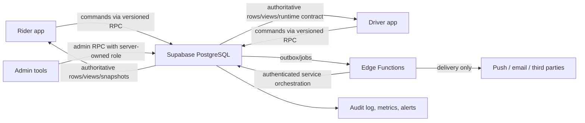

# HeyCaby Domain Source of Truth Audit & Stabilization Plan

**Audit date:** 13 July 2026

**Scope:** Rider Flutter app, Driver Flutter app, shared Dart packages, local Supabase migrations and Edge Functions, documentation, tests, and a read-only inspection of the production Supabase project `fvrprxguoternoxnyhoj`.

**Production changes made:** Safe, forward-only containment and projection migrations were applied after the audit; see the implementation status below.

**Ride verification update — 15 July 2026:** The additive protected-ride
authority, payment-evidence gate, Rider/Driver consumers, and Admin evidence
view are documented in
[`docs/domains/RIDE_VERIFICATION_PROTECTION_LAYER.md`](domains/RIDE_VERIFICATION_PROTECTION_LAYER.md).
All rollout flags remain disabled pending physical Mollie sandbox certification.

**Audit posture:** Preserve working behavior; contain unsafe paths first; consolidate incrementally behind compatible backend contracts.

## Implementation status — 13 July 2026

The safe stabilization scope identified by this audit has been implemented in production and source control:

- `20260713132821_domain_authority_phase0_containment.sql` closes the confirmed P0 command, policy, identity, notification, chat, verification, and server-owned-column bypasses.
- `20260713133200_receipt_single_authority.sql` makes completed ride state the only monetary input to idempotent receipt issuance.
- `20260713133943_rider_ride_snapshot_contract.sql` and `20260713134807_rider_snapshot_booking_mode_projection.sql` expose one Rider lifecycle/payment/booking projection, including backend-owned self-confirm timing.
- `20260713135507_advisor_authority_hardening.sql` binds saved trips to the authenticated rider, routes analytics ingestion through the validated Edge Function, removes public storage enumeration policies, and fixes all 15 mutable function search paths reported by the advisor.
- All 22 deployed production Edge Functions are now present in Git and declared in `supabase/functions/manifest.json`; the privileged functions audited here fail closed and enforce actor/admin/signature checks as appropriate.
- Rider lifecycle, marketplace, receipt, profile, safety, widget, Live Activity, Taxi Terug, and notification consumers now use backend commands/projections instead of reconstructing backend truth.
- `20260714070835_accept_fare_snapshot_authority.sql` moves the accepting Driver tariff calculation and fare snapshot from Flutter into the atomic backend acceptance transition while preserving existing Rider/marketplace quotes and the released tariff formula.
- `docs/domains/registry.yaml`, `docs/domains/INCIDENT_RUNBOOK.md`, `scripts/check_domain_authority.sh`, and `.github/workflows/domain-authority.yml` establish ownership, incident routing, and CI drift gates.

Production contract tests passed for phase-zero containment, receipt authority, Rider snapshot authorization/timing, booking-mode projection, and advisor hardening. Static analysis, Rider tests, non-visual Driver tests, Deno checks, migration/source drift checks, and monorepo boundary checks also pass. Remaining compatibility removals and external operational work are listed in Appendix B; they require product/operations confirmation rather than unilateral code deletion.

## 1. Executive decision

Supabase PostgreSQL is already the practical backend source of truth for HeyCaby, and the strongest parts of the system follow that model: atomic ride acceptance, driver runtime/readiness, ride lifecycle transitions, append-only billing, Taxi Terug matching, and platform-balance eligibility are implemented as database functions, triggers, constraints, and configuration.

The architecture is not yet consistently enforced. Several broad table-update policies, legacy `SECURITY DEFINER` functions, production-only Edge Functions, and Flutter-side state resolvers create competing command paths. The highest-risk issue is therefore not a missing architecture; it is that callers can sometimes bypass the architecture that already exists.

The target state is:



Flutter remains responsible for presentation, local interaction state, formatting, and resilient offline defaults. It must not decide who owns a ride, whether a driver is compliant, whether payment is confirmed, or which notification audience may be contacted.

## 2. Immediate risk summary

The following are confirmed from the production schema or deployed production Edge Function source. They should be treated as containment work, not as a broad rewrite.

| Priority | Confirmed issue | Domain impact | Immediate containment |
|---|---|---|---|
| Fixed P0 | `public.delete_all_auth_users()` was client-executable and destructive. | Auth / all domains | Migration `20260713132821` revoked all public/client/service Data API execution; only direct database-owner break-glass access remains. |
| Fixed P0 | Legacy Ride Swap overloads trusted caller-supplied driver/user IDs. | Ride ownership / swaps | Migration `20260713132821` retained signatures behind auth-bound wrappers and private implementations. |
| Fixed P0 | Authenticated Drivers could update protected readiness, compliance, status, and billing columns directly. | Driver readiness / availability | `trg_guard_driver_authority_columns` blocks client changes to backend-owned columns; command RPCs remain authoritative. |
| Fixed P0 | Ride participants could directly change assignment, lifecycle, fare, and payment authority columns. | Booking / dispatch / lifecycle | The marketplace acceptance RPC and `trg_guard_ride_authority_columns` enforce backend ownership. |
| Fixed P0 | `driver_notify_queue` allowed public insert/read. | Dispatch / notifications / privacy | Public/client table grants and broad policies were removed; service role owns the queue. |
| Fixed P0 | `send-push` accepted broadcast targets without in-function admin authorization. | Notifications | Production v36 requires `authenticatedAdmin`, backed only by server-owned app metadata. |
| Fixed P0 | `veriff-webhook` accepted unsigned payloads when the secret was absent. | Driver verification | Production v36 fails closed with `webhook_not_configured` and verifies HMAC using constant-time comparison. |
| Fixed P0 | `fn_admin_set_manual_verifications` trusted `raw_user_meta_data` and mishandled KVK state. | Admin / readiness | Migration `20260713132821` uses app metadata only, updates every supplied field, and audits denied/changed calls. |
| Fixed P1 | `generate-receipt` accepted caller-supplied financial inputs and competed with SQL receipt creation. | Payments / receipts | Production v36 is a 410 compatibility endpoint; the completed-ride database transaction is the sole writer. |
| Fixed P1 | `messages_update_participant` permitted participants to update entire message rows. | Chat integrity | Migration `20260713132821` replaced it with recipient-only acknowledgement; `20260714072357` added the canonical immutable, idempotent send command. |
| Fixed P1 | `cleanup_stale_driver_locations()` was an anonymously executable bulk-delete function. | Availability / dispatch | Migration `20260713132821` revoked Data API execution; trusted scheduling must use database-owner context. |
| P1 | Production Edge Function source was materially ahead of the repository. | All integrations | **Contained:** all 22 currently deployed functions are source-controlled and checked against a manifest. |
| P1 | Local migration history and production migration history have divergent timestamps/names for Taxi Terug and earnings changes, creating duplicate replay risk. | Schema ownership | Reconcile migration history before the next database push; do not blindly run the three local July 13 migrations. |

The production Supabase security advisor initially reported 605 notices. The
first safe advisor migration reduced that to 586. Caller-safe grant and actor
hardening through production migration `20260714075642` reduced it further to
479. The additive canonical booking command intentionally moves the current
baseline to 480: 218 authenticated and 144 anonymous callable
`SECURITY DEFINER` notices,
101 anonymous-access policy notices, 8 permissive product-ingestion/community
policies, 7 intentionally service-only tables with no client policy, 1
extension-owned PostGIS RLS error, and 1 public-schema PostGIS extension
notice. Counts are triage inputs, not proof that every item is exploitable;
remaining functions still require signature-by-signature caller review.
`spatial_ref_sys` cannot be altered by the project migration owner; moving
PostGIS or changing that table requires a planned platform operation. See the
[Supabase RLS guidance](https://supabase.com/docs/guides/database/postgres/row-level-security).

## 3. Audit method and confidence

### Inspected

- 249 local migration files and 235 production migration records.
- 116 production public tables, 28 views, 73 public triggers, 229 policies, and the public function/grant surface.
- All 23 deployed production Edge Function manifests and selected high-risk deployed sources.
- Rider, Driver, and shared API data-access paths, plus available unit/widget tests and operational documents.
- Production configuration, cron definitions, Realtime publication membership, status constraints, and aggregate row counts. No user-level data was exported.

### Confidence labels

- **Confirmed:** directly demonstrated by current code, production DDL/function source, policy, constraint, or deployed Edge source.
- **Likely:** strongly supported, but a separate admin/web repository or runtime configuration is unavailable.
- **Suspected:** competing names or contracts exist, but caller/runtime evidence is incomplete.

### Scope limitation

The separate admin/Next.js source referenced by older documentation is not present in this repository. This audit verifies its database and production Edge surfaces, but cannot prove every admin client call site. Those consumers must be inventoried before revoking compatibility paths.

## 4. Domain inventory and declared authority

This table is the proposed ownership registry. “Authority” identifies the one place where business decisions must live; tables remain authoritative state even when a command RPC is the only permitted writer.

| Domain | Authoritative state | Authoritative rules / command boundary | Consumers | Current condition | Owner |
|---|---|---|---|---|---|
| Identity & rider sessions | `auth.users`, `rider_identities`, `rider_sessions` | Auth plus token-scoped rider RPCs | Rider, support, receipts | Broad legacy functions need grant audit | Platform Backend |
| Booking | `ride_requests` | `fn_rider_create_ride` owns authenticated, field-limited, idempotent Rider creation; mode-specific backend commands own later changes | Rider, Driver, admin | Current Rider uses the canonical command; legacy direct INSERT policy is retained only for released-app compatibility | Marketplace Backend |
| Dispatch & matching | `ride_request_invites`, dispatch columns on `ride_requests` | `fn_seed_ride_matching_batch` → dispatch-v3/Taxi Terug, wave cron, exact invite accept RPC | Rider, Driver, jobs | Strong core; queue/policy and expiry conflicts remain | Marketplace Backend |
| Marketplace offers | `ride_bids`, accepted fare snapshot on `ride_requests` | `fn_rider_accept_marketplace_offer`, boost/cancel commands, and terminal bid trigger | Rider, Driver | Backend-owned and actor-bound; compatibility signatures remain pending version decisions | Marketplace Backend |
| Scheduled rides | `ride_requests`, invites, scheduled matching jobs | `scheduled_rides_available` security-invoker catalog, `fn_driver_accept_scheduled_ride`, no-driver RPC, and cron | Rider, Driver, operations | Open authenticated marketplace is explicit; acceptance locks once and rechecks future/expiry, shared ride fit, payment, GPS, and overlap | Marketplace Backend |
| Ride lifecycle | `ride_requests` + `ride_audit_log` | Driver lifecycle RPCs, DB transition guards, and `fn_rider_ride_snapshot` | Rider, Driver, widgets, Live Activity, support | Rider UI and Live Activity share one lifecycle engine, Realtime channel, reconnect hydration, and fallback poller | Ride Operations Backend |
| Driver location | `driver_locations` | Location ingestion validation + freshness config | Driver, dispatch, marketplace, safety | Direct telemetry upsert is valid; cleanup function is unsafe | Marketplace Backend |
| Driver readiness | `drivers`, verification/review/event tables, vehicle/tariff state | `fn_driver_readiness_eval`, runtime permission contract | Driver, dispatch, admin | Logic is backend-owned but inputs are client-writable | Trust & Safety Backend |
| Driver availability | `drivers.status`, active ride/shift state | `fn_driver_set_status` | Driver, dispatch, operations | Canonical and healthy; hard-coded freshness differs from dispatch config | Marketplace Backend |
| Vehicle & shift handover | `taxi_vehicles`, `taxi_vehicle_sessions`, handover request/step-up tables | Latest step-up-aware handover RPC | Driver, operations | Two full overload implementations; retire older signature after caller audit | Fleet Operations |
| Driver tariffs | `driver_rate_profiles`, `driver_tariff_events`, ride fare snapshots | Backend validation RPCs plus `accept_fare_snapshot_authority` | Driver, dispatch, billing | Accept-time snapshot is backend-owned; direct profile-write caller inventory remains | Pricing Backend |
| Fare calculation | Fare snapshots on `ride_requests`; config tables | Backend quote, accept-snapshot, final-fare, GPS, and waiting-fee functions | Rider, Driver, receipts | Existing Rider/marketplace quote wins; otherwise the accepting Driver active tariff is frozen by Postgres | Pricing Backend |
| Taxi Terug | Driver return-mode columns, `return_mode_events`, `ride_requests.booking_mode='terug'` | Latest Taxi Terug config, candidate, activation and seed functions | Rider, Driver, dispatch | Strong backend matching; wizard constants duplicated in Flutter; old overloads remain | Marketplace Backend |
| Platform balance | Balance accounts/cycles, `billing_ledger`, audit rows | Platform-balance RPCs and eligibility projection | Driver, dispatch, finance | Presence/eligibility separation is a good canonical design | Finance Backend |
| Driver billing/subscription | Billing tables/ledger and provider IDs | Billing Edge Functions + webhook + DB reconciliation | Driver, finance, admin | Source split is legitimate; webhook/provider invariants need explicit owner | Finance Backend |
| Ride payment confirmation | Payment columns on `ride_requests` | `fn_confirm_ride_payment` | Rider, Driver, receipts, lifecycle | Canonical writer exists; Rider status mapping expects wrong value | Finance Backend |
| Receipts | `receipts`, completed ride fare snapshot | SQL auto-receipt path plus `fn_rider_receipt_for_ride` read contract | Rider, Driver, finance | Production Edge Function is a competing unsafe writer | Finance Backend |
| Notifications | `notifications`, lifecycle jobs, delivery/outbox tables | Backend creates intent; Edge agents deliver; clients acknowledge read state | Rider, Driver, admin | Multiple generations coexist; client inserts/updates and public queue are too broad | Messaging Platform |
| Push devices & Live Activity | `push_devices`, `rider_live_activities` | Registration/rotation RPCs; service delivery | Rider, Driver, Edge agents | Overloads are compatible evolution; prune only after minimum-app-version window | Messaging Platform |
| Chat | `conversations`, `messages` | `fn_send_ride_message`; recipient-only acknowledgement; auth-bound moderation RPCs | Rider, Driver, Driver Agent, support | Backend binds actor/ride/conversation/status/block state; clients recover canonical ordered history after Realtime reconnect | Messaging Platform |
| Support & reports | Support tickets/messages and ride/driver report tables | Auth-bound create/reply/escalate contracts | Rider, Driver, support/admin | Local Edge chat functions exist; table/RPC ownership is fragmented | Trust & Safety |
| Safety | `driver_safety_events` and ride audit events | Auth-bound safety-event command | Rider, Driver, support | Rider writes to nonexistent/obsolete `safety_events` path | Trust & Safety |
| Ratings | `ride_ratings`, rating projections | One submit/update rating RPC with ride/participant checks | Rider, Driver, support | State is centralized; verify direct-write policies before growth | Trust & Safety |
| Favorite drivers | `rider_favorite_drivers` | Auth-bound favorite CRUD; dispatch receives only an audience preference | Rider, matching | Reasonably isolated; prevent favorite status from overriding eligibility | Rider Experience |
| Referrals & founding drivers | Referral/founding tables | Production Edge Functions and DB constraints | Driver, marketing, admin | Several functions are production-only and therefore unowned in Git | Growth Backend |
| Analytics | `app_analytics`, `agent_logs`, audit/event tables | Append-only ingestion with server normalization | Apps, operations, BI | Always-true policies and mixed event stores need retention/PII rules | Data Platform |
| Configuration & feature flags | `app_config`, dispatch/search/Taxi Terug config | Versioned read-only config RPCs | Rider, Driver, backend functions | Dead Go/Redis flags contradict removed architecture | Platform Backend |
| Admin operations | Admin audit/verification/support tables | Explicit admin RPCs using server-owned authorization | Admin tools | User-metadata fallback and unavailable client source are high risk | Internal Tools + Platform |

Ownership names above are role-level proposals. A named engineer and on-call rotation should be assigned in the engineering service catalog.

## 5. What already works and should be preserved

### Atomic dispatch acceptance

The exact-invite acceptance path uses database locking and validates invite state, driver identity, readiness/billing, tariff, GPS freshness, and payment compatibility before atomically updating the ride. This is the correct source-of-truth pattern. All other acceptance modes should converge on equivalent backend commands, not reimplement the checks in Flutter.

The current production contract is implemented by
`20260714084930_driver_accept_runtime_eligibility.sql` and
`20260714084941_driver_accept_runtime_recheck.sql`: the RPC requires the ride
and invite to still be live and rechecks mutable Driver readiness, online
status, compliance, queue reservation, vehicle class, and pet compatibility
inside the locked acceptance transaction.

`20260714090052_driver_accept_ride_fit_eligibility.sql` shares vehicle,
accessibility, readiness, and compliance rules with scheduled acceptance.
`20260714090109_scheduled_accept_authority.sql` preserves scheduled rides as an
open future-work marketplace while adding locked, future, expiry, overlap,
notification, and rejection-audit authority.

### Driver runtime/readiness contract

`apps/driver/lib/services/driver_runtime_service.dart` consumes `fn_driver_runtime`, and `packages/heycaby_api/lib/src/driver_api.dart` uses `fn_driver_set_status` without a legacy Go fallback. `apps/driver/lib/utils/driver_go_online_policy.dart` no longer independently vetoes the backend. Preserve this direction while protecting the server-owned readiness inputs.

### Presence is not eligibility

`20260711140000_platform_balance_presence_dispatch_separation.sql` correctly allows a driver to be present while separately projecting whether they may receive platform rides. This prevents billing policy from corrupting operational presence and is a useful model for other domains.

### Append-only business evidence

`ride_audit_log`, billing ledger/audit structures, driver verification events, and lifecycle events provide durable evidence separate from mutable projections. Preserve append-only guarantees and make these the basis of monitoring and dispute resolution.

### Taxi Terug routing

The three-argument `fn_seed_ride_matching_batch` routes `booking_mode='terug'` to the Taxi Terug engine and all other modes to dispatch v3. The two-argument overload is a compatibility wrapper. This is a good single-entry routing boundary; older full implementations of activation/candidate/score RPCs should be retired after app-version analysis.

## 6. Detailed cross-domain findings

### 6.1 Ride ownership bypass paths are contained

Canonical ownership is `ride_requests.driver_id`, changed only by atomic acceptance, administrative recovery, or an authenticated swap contract. The original audit found:

- `apps/rider/lib/providers/marketplace_offers_provider.dart` directly writes `driver_id`, `status='assigned'`, and fare values.
- `packages/heycaby_api/lib/src/rider_api.dart` explicitly throws from `acceptBid()` and tells the caller to update `ride_requests` directly.
- The participant update policy covers the complete row, while the existing transition guard focuses on a narrower pending-to-accepted transition.
- Legacy ride-swap definers can change ownership based on supplied identifiers.

The required `fn_rider_accept_marketplace_offer` command now locks the ride and bid, binds the rider to `auth.uid()`, checks bid/driver eligibility and fare, snapshots accepted values, updates both rows, emits audit evidence, and returns canonical state. Participant writes to server-owned columns are guarded.

**Resolved 2026-07-14:** Rider acceptance callers now use
`fn_rider_accept_marketplace_offer`; `RiderApi.acceptBid` no longer instructs a
direct row update. Marketplace cancellation now calls only
`fn_rider_cancel_open_ride`; pending bid expiry is owned atomically by
`trg_expire_marketplace_bids_on_terminal_ride`. The Flutter duplicate bid
mutation was removed and is protected by
`marketplace_cancel_authority_test.dart`.

**Resolved booking creation 2026-07-14:** production migration
`20260714082656_rider_create_ride_command_authority.sql` adds
`fn_rider_create_ride(jsonb)`. It binds the Rider session and optional identity
to `auth.uid()`, accepts only booking inputs, creates both geography and scalar
coordinate projections, owns the initial `pending` state and fare snapshot,
and deduplicates retries by Rider token plus request ID. The current Rider app
uses this command and contains no direct `ride_requests` insert. The legacy
insert policy remains unchanged until minimum-version decisions permit its
retirement.

The Driver incoming-offer screen also used to calculate a fare from
`driver_rate_profiles` in Flutter and then directly update three protected
`ride_requests` fare columns after `fn_driver_accept_ride_invite` succeeded.
Production migration `20260714070835` now freezes that same formula inside the
backend `pending` to `accepted` transition. Existing positive quotes retain
priority; otherwise Postgres selects the active profile by canonical
`sort_order`, calculates the same base + distance + duration/minimum formula,
updates the snapshot atomically, and records a success or missing-input audit
event. The post-accept Flutter mutation has been removed.

### 6.2 Lifecycle read truth is reconstructed in Flutter

The database owns raw lifecycle and payment state, but `apps/rider/lib/services/rider_ride_lifecycle_snapshot.dart` synthesizes states including `driver_nearby` and `payment_confirmed`. The backend already exposes `fn_rider_ride_progress_snapshot` from `20260709150000_rider_ride_progress_snapshot.sql`, yet Rider screens, widgets, and Live Activity still read raw rows and resolve them locally.

This has produced a concrete mismatch: production payment confirmation uses `payment_status='confirmed'`, while `resolveEffectiveStatus()` recognizes only `payment_status='paid'`. A confirmed ride can therefore remain visually payment-pending in Rider/Live Activity.

**Decision:** make the progress snapshot the versioned read contract for Rider, widgets, and Live Activity. Keep raw columns for database integrity, but return a backend-computed `effective_status`, `state_version`, timestamps, allowed actions, and payment projection. Flutter may map that value to presentation labels only.

**Resolved 2026-07-14:** `fn_rider_ride_snapshot` now returns the backend
`effective_status`; Rider lifecycle consumers recognize both canonical
`confirmed` and legacy `paid`. Rider Agent version 11 independently recognizes
both database values, so Live Activity completion no longer depends on a
particular notification category. The pure lifecycle regression suite covers
confirmed, legacy paid, and unpaid-completed behavior.

### 6.3 Dispatch timing has conflicting authorities

Production configuration exposes a ten-minute Rider search window, multiple dispatch waves, and three-minute location freshness. The production instant-expiry trigger sets `expires_at` to approximately 30 seconds. The Rider UI uses `kRiderDriverSearchWindow` for ten minutes, while acceptance/readiness paths use a separate five-minute GPS threshold in places.

**Risk:** an instant request can become expired before the UI window and later waves finish, producing confusing search behavior and false no-driver outcomes.

**Decision:** define one server-side dispatch deadline model with separate fields for invite timeout, wave deadline, and final ride expiry. Return those deadlines to clients. Do not use one `expires_at` field for three meanings. Until migrated, align the instant expiry to the configured final search window and regression-test all waves.

### 6.4 Readiness truth is protected at rest

`fn_driver_readiness_eval` and the runtime permission projection are the
decision engines. Migration `20260713132821` added
`trg_guard_driver_authority_columns`, so client-owned profile fields remain
editable while backend trust, billing, derived statistics, and operational
status cannot be overwritten through a broad table update. Production
migration `20260714075308` additionally keeps nine released profile signatures
as authenticated wrappers around retained private implementations.

**Decision:** classify columns explicitly:

- Client-owned profile fields: display name, preferences, optional biography, permitted presentation settings.
- Command-owned operational fields: status, return mode, rate profile selection.
- Server-owned trust fields: compliance status, verification booleans/review state, billing eligibility, risk decisions, ride-derived counters.

Use narrow RPCs for command-owned changes and deny client writes to server-owned fields. Add a temporary protective trigger before policy tightening so older app versions fail safely with a stable error.

### 6.5 Edge Functions are reproducible from Git

All active production Edge Functions are source-controlled and listed in
`supabase/functions/manifest.json` with JWT mode and owner. Production source
inspection confirms the following earlier risks are contained:

Specific risks include:

- `send-push` v36 requires `authenticatedAdmin`.
- `generate-receipt` v36 accepts no financial inputs and returns HTTP 410.
- `verify-chauffeurspas` v36 binds `driver_id` to the authenticated Driver and
  has no production simulation path.
- `create-driver-veriff-session` v36 requires provider secrets.
- `veriff-webhook` v36 fails closed without its secret and verifies HMAC.

**Decision:** Git is the source of truth for Edge source, configuration schema, JWT mode, owner, and deployment. Production secrets remain in Supabase/Vault. Mock modes must be impossible in production, preferably via an explicit `APP_ENV` fail-closed check.

### 6.6 Migration history has split identity

Local files `20260713150000_taxi_terug_wizard_backend_contract.sql` and `20260713160000_driver_earnings_goals_biweekly_monthly.sql` represent concepts already deployed in production under different migration versions (`20260713093521` and `20260713105019`). `20260713170000_driver_earnings_targets_realtime.sql` is not deployed.

**Decision:** compare checksums/DDL, mark equivalent migrations as reconciled using the supported migration-history workflow, and create a new forward-only migration only for real differences. Never rename an already-deployed migration or execute the three local files blindly against production.

### 6.7 Notification generations have explicit boundaries

Database notification intent, FCM/APNs delivery agents, Web Push broadcast,
device registration, and client read-state are separate responsibilities.
`driver_notify_queue` is service-only, `send-push` is an admin-authorized Web
Push command, and production migration `20260714075642` preserves ten
authenticated read/lifecycle commands while making nine owner/cron/Edge
helpers service-only.

**Decision:**

1. Database domain functions emit a normalized notification intent/outbox event.
2. One delivery worker claims intents idempotently and selects FCM/APNs/Web Push channels.
3. Apps may mark their own notification read/dismissed, but may not create or rewrite notification content/audience.
4. Admin broadcast is a separate audited command with explicit authorization and rate limits.
5. Delivery receipts, retries, dead letters, and template versions are observable.

### 6.8 Chat messages are immutable and retry-safe

Migration `20260713132821` removed the broad participant update policy and
limited client updates to recipient acknowledgement. Production migrations
`20260714072357` and `20260714072951` then established
`fn_send_ride_message` as the canonical send command. It binds the authenticated
Rider or Driver to the ride, conversation, lifecycle status, and block state;
deduplicates uncertain retries by sender-scoped key; and writes one
`chat.message_sent` audit event. Released direct inserts remain temporarily
available behind the same participant/block policy until minimum app versions
are approved. Rider, Driver, and Rider pings now use the command, and both chat
screens re-fetch ordered canonical history whenever Realtime subscribes again.

The released moderation signatures remain available, but their bodies no
longer trust caller-supplied participant identity. Anonymous calls fail closed.

### 6.9 Payment and receipt authority is consolidated

`fn_confirm_ride_payment` is the canonical confirmation command. The Rider
snapshot exposes backend-owned self-confirm timing, and the completed-ride SQL
transaction is the single receipt writer. Production `generate-receipt` v36 is
only a 410 compatibility endpoint and cannot accept monetary inputs.

**Decision:** the backend returns `may_rider_self_confirm`, `self_confirm_available_at`, payment status, and receipt availability. Client clocks are display-only. One idempotent backend receipt issuer owns monetary inputs from the final ride snapshot; read RPCs format/return the receipt.

### 6.10 Configuration contains dead architecture

Production flags still advertise Go ride/matching/location and Redis-location paths even though a migration removed the legacy Go REST surface and current Dart API code documents Supabase-only driver commands. These flags are not referenced by current Flutter code.

**Decision:** mark each configuration key with owner, consumer, type, default, introduced version, and retirement version. Remove dead Go/Redis flags in a forward migration after confirming no external admin consumer. Stale configuration is operationally dangerous even when unused because it misleads incident responders.

## 7. Access-path policy

Use the following rule to decide whether Flutter may write a table directly.

| Write type | Allowed path | Examples |
|---|---|---|
| Low-risk owner CRUD with no cross-row invariant | Direct table write under narrow column RLS, or a simple RPC | Saved address label, favorite toggle, user preference |
| High-frequency telemetry | Direct insert/upsert with auth binding, validation, rate limit, retention | Driver location, client analytics |
| Business command changing money, eligibility, ownership, or lifecycle | Versioned auth-bound RPC only | Accept ride, confirm payment, change availability, transfer vehicle, issue receipt |
| External-provider orchestration | Edge Function that authorizes caller and delegates final state to DB RPC | Billing checkout, signed webhook, verification provider |
| Scheduled maintenance | Cron/job role invoking internal function | Expiry, stale-location cleanup, lifecycle delivery |
| Administrative mutation | Admin RPC using server-owned role membership and audit event | Manual verification, account restriction, support intervention |

Every `SECURITY DEFINER` function must have a fixed `search_path`, bind identity using `auth.uid()` or a trusted service context, validate authorization internally, have explicit least-privilege `EXECUTE` grants, and emit an audit event for privileged changes. Gateway JWT verification alone proves authentication, not authorization.

## 8. Database and API contract stabilization

### 8.1 Introduce a command/read split without replacing the schema

- Keep existing tables and compatible RPC names.
- Add versioned command RPCs for marketplace acceptance, swaps, payment actions, notification broadcast, verification, safety events, and tariff changes.
- Add versioned read projections for ride progress, driver runtime, payment/receipt, and support state.
- During migration, old RPCs become thin wrappers around the canonical implementation. They must not retain a second implementation.
- Record deprecated signatures, minimum supported app version, usage count, and removal date.

### 8.2 Protect columns before removing old clients

For `drivers`, `ride_requests`, `messages`, and `notifications`:

1. Inventory writes by app version and admin service.
2. Add server-side guards to the most sensitive columns with stable error codes.
3. Ship client versions using canonical RPCs.
4. Observe adoption and blocked-write metrics.
5. Narrow RLS/grants after the supported-version window.
6. Remove wrappers only after zero usage for an agreed interval.

### 8.3 Normalize error and state contracts

All command RPCs should return a consistent envelope:

```json
{
  "ok": true,
  "code": "ride_assigned",
  "state_version": 123,
  "data": {},
  "retryable": false
}
```

Errors need stable machine codes, safe user-facing categories, a correlation ID, and retry guidance. Avoid relying on English PostgreSQL exception text in Flutter.

## 9. Status vocabulary

The persisted `ride_requests.status` constraint currently allows:

`pending`, `bidding`, `accepted`, `assigned`, `driver_found`, `driver_en_route`, `driver_arrived`, `in_progress`, `declined`, `cancelled`, `completed`, `expired`, `no_driver`.

Payment and presentation milestones are separate state and should remain separate. The backend progress snapshot should expose a documented presentation enum, for example:

`searching`, `driver_assigned`, `driver_en_route`, `driver_nearby`, `driver_arrived`, `in_progress`, `payment_pending`, `completed`, `cancelled`, `expired`, `no_driver`.

Do not add synthetic presentation states to the core ride constraint merely to simplify Flutter. Instead, version the projection and define exactly which raw fields produce each effective state. Map `payment_status='confirmed'` consistently and remove the unsupported `paid` assumption or formally migrate the database enum/value.

## 10. Domain test requirements

The repository contains useful Flutter tests for booking, fare display, ride-state contracts, Live Activity payloads, runtime/readiness, presence/eligibility, accept errors, ratings, and Taxi Terug. Simulation documentation also covers acceptance races and load. There is no visible automated SQL/RLS contract suite covering production invariants.

Add a database test layer (pgTAP or equivalent isolated integration harness) as the primary business-rule suite:

| Domain | Required invariant tests |
|---|---|
| Booking | Only the owning rider may edit permitted pre-dispatch fields; server-owned fields reject direct writes. |
| Dispatch | Concurrent accepts yield one winner; invite expiry/waves/final expiry are deterministic; no late cohort join. |
| Marketplace | Bid and ride update atomically; ineligible/stale/billing-blocked drivers cannot be assigned. |
| Lifecycle | Transition matrix, actor authorization, idempotency, timestamp ordering, audit event per transition. |
| Readiness | Client cannot forge verification/compliance; review overrides and risk thresholds produce expected checklist. |
| Availability | Status change binds to caller, respects active ride/shift, and reports eligibility separately. |
| Taxi Terug | Candidate geometry, destination progress, wait window, discounts, caps, activation cooldown, and standard-routing isolation. |
| Swaps | Caller binding, eligibility, active-ride exclusion, race behavior, legal status constraint, conversation reassignment. |
| Payments | Confirmation actor/timing/idempotency; `confirmed` projection; tips and waiting fees; exactly one receipt. |
| Notifications | Audience authorization, idempotent intent, retry/dead-letter behavior, recipient-only reads. |
| Chat | Sender/participant binding; immutable content; recipient-only acknowledgement. |
| RLS/grants | Anonymous/authenticated/service/admin matrices for every sensitive table and definer function. |
| Migrations | Clean database replay, production-history reconciliation, rollback/forward compatibility checks. |

Flutter tests should then verify presentation of backend contracts, not re-prove SQL rules. Keep explicit tests for minimum/maximum supported payload versions and unknown status fallback.

## 11. Observability and incident ownership

### Required signals

| Domain | Metrics / alerts | Primary evidence |
|---|---|---|
| Dispatch | search-to-assign latency, invitations per ride, wave exhaustion, acceptance conflicts, expiry reason | invites, ride audit, cron/job results |
| Lifecycle | rejected transitions, stalled state duration, duplicate command rate | ride audit and lifecycle events |
| Readiness | blocked-online reason counts, verification override changes, forged-write rejections | readiness events/admin audit |
| Availability/location | online drivers without fresh GPS, upload age, stale cleanup volume | driver locations/runtime snapshots |
| Payments | completed-but-unconfirmed age, double-confirm attempts, receipt mismatch/duplicates | ride payment fields, receipts, billing audit |
| Platform balance | eligible vs present, overdue cycles, ledger reconciliation drift | cycles/accounts/ledger |
| Notifications | intent-to-delivery latency, channel success, retry/dead-letter depth, unauthorized broadcast attempts | lifecycle jobs/delivery logs |
| Chat/support | send failure, unread age, escalation SLA, moderation actions | messages/tickets/audit |
| Taxi Terug | activation, candidate count, conversion, rejection reason, detour/progress distribution | return-mode events, invites, rides |
| Security | denied sensitive-column writes, privileged RPC calls, RLS/grant drift, webhook signature failures | Postgres/Edge/auth logs and advisor diff |

### Operational requirements

- Every privileged command logs actor, domain object, previous/new state, app/service version, correlation ID, and reason without secrets or unnecessary PII.
- Create dashboards and actionable alert thresholds before removing compatibility paths.
- Cron credentials must remain behind a secret manager/Vault reference. Migration `20260714081532_rider_lifecycle_cron_vault_boundary.sql` removed the Rider lifecycle credential from production cron metadata and routes execution through a service-only private function. Rotate any historically exposed value through operations without copying it into documentation or logs.
- Run security and performance advisors after every DDL change and diff results against a reviewed baseline.
- Maintain a domain runbook with owner, canonical table/RPC, common failure codes, rollback/disable switch, dashboard, and escalation contact.

## 12. Documentation and ownership structure

Create one short registry entry per domain under `docs/domains/`:

```text
domain: dispatch
owner: Marketplace Backend
state: ride_requests, ride_request_invites
commands: fn_seed_ride_matching_batch, <canonical accept RPC>
reads: <ride progress / invite projections>
consumers: rider, driver, lifecycle jobs, admin
events: ride_audit_log
tests: <paths>
dashboard: <link>
runbook: <link>
deprecated: <signatures and removal dates>
```

Update `docs/TECHNICAL_DOCUMENTATION.md` after stabilization. It still describes parts of the old Next.js/Go-facing lifecycle architecture and is not a reliable current incident map. Link domain documents from the technical documentation rather than duplicating rule details across product blueprints.

## 13. Safe remediation sequence

### Phase 0 — Contain active authority bypasses (same release train)

1. Revoke execution of `delete_all_auth_users` and unsafe legacy swap/cleanup functions from public roles.
2. Require server-owned admin authorization for manual verification and broadcast push.
3. Make Veriff/ILT mock or unsigned modes fail closed in production.
4. Protect server-owned `drivers` and `ride_requests` columns with audited guards.
5. Restrict `driver_notify_queue`, message updates, notification inserts/updates, and privileged storage listing.
6. **Completed:** move the Rider lifecycle cron credential to Vault and retain only a private service boundary in cron metadata (`20260714081532`). Operations must still rotate any historically exposed value.

**Rollback:** grant only the exact previously required wrapper to a named role; never restore anonymous blanket grants.

**Monitor:** denied calls by function/client version, online/accept failure codes, push broadcast audit, webhook signature failures.

### Phase 1 — Close known contract bugs

1. Fix payment `confirmed` versus Rider `paid` projection.
2. Introduce atomic marketplace acceptance and migrate Rider.
3. Replace the obsolete Rider `safety_events` write with an auth-bound canonical command.
4. Align instant expiry, wave deadlines, and Rider search UI to backend-returned deadlines.
5. Correct `fn_admin_set_manual_verifications` KVK assignment and add field-by-field tests.
6. Make receipt issuance idempotent and single-path.

### Phase 2 — Reconcile deployed source

1. Export all deployed Edge Functions and configuration manifests into Git.
2. Reconcile the July 13 migration identities/checksums before any database push.
3. Remove dead Go/Redis feature flags after external-consumer confirmation.
4. Inventory every RPC/table call from the separate admin repository.
5. Add CI checks: clean migration replay, generated schema/API diff, RLS/grant matrix, Edge source/deployment drift.

### Phase 3 — Consolidate domain contracts

1. Move Rider lifecycle consumers to the backend progress snapshot.
2. Convert old RPC implementations into thin wrappers around one canonical function.
3. Consolidate notification intent/delivery and immutable chat commands.
4. Move tariff, return-mode, self-confirm timing, and eligibility constants into backend configuration projections.
5. Publish the domain registry, dashboards, and runbooks.

### Phase 4 — Remove compatibility debt

After minimum-supported app versions have aged out and telemetry shows zero use:

- Revoke/remove old overloads and deprecated direct-write policies.
- Drop unused flags, queues, and Edge Functions through forward migrations.
- Archive superseded documents with pointers to canonical domain pages.
- Repeat a grant/RLS/function audit and load/race simulations.

## 14. Change gate for every future feature

Every pull request affecting a business rule must answer:

1. Which domain owns the change and who is accountable?
2. Which table is authoritative state?
3. Which single command/function owns the rule?
4. Which Rider, Driver, Edge, Admin, job, and third-party consumers change?
5. Does any caller gain a second way to change ownership, money, eligibility, or lifecycle?
6. What old app version behavior must remain compatible?
7. Which database invariant, RLS/grant, integration, and presentation tests cover it?
8. Which metric, audit event, dashboard, and alert detect failure?
9. What is the safe rollout, feature-disable, and rollback path?
10. Which deprecated path is removed, and on what evidence/date?

## 15. Acceptance criteria for the stabilization program

The program is complete when:

- Every business domain in the inventory has a named owner and one authoritative state/command contract.
- No anonymous caller can execute privileged definer functions or mutate server-owned business state.
- Authenticated callers cannot supply another user/driver identity to gain authority.
- Ride ownership, lifecycle, money, compliance, broadcast audiences, and receipts change only through audited atomic commands.
- Rider, Driver, widgets, Live Activity, Edge Functions, and Admin consume versioned backend projections for business state.
- All deployed migrations and Edge Function sources are reproducible from Git.
- Database/RLS tests cover concurrency and authorization, and run in CI.
- Dashboards and runbooks identify the domain, canonical data, command, owner, and fix location during an incident.

## Appendix A — Evidence map

Key local evidence reviewed:

- Driver command boundary: `packages/heycaby_api/lib/src/driver_api.dart`
- Rider marketplace bypass/incomplete API: `apps/rider/lib/providers/marketplace_offers_provider.dart`, `packages/heycaby_api/lib/src/rider_api.dart`
- Rider lifecycle projection: `apps/rider/lib/services/rider_ride_lifecycle_snapshot.dart`, `apps/rider/lib/services/rider_ride_lifecycle_engine.dart`, `apps/rider/lib/services/rider_ride_state_refresh.dart`
- Driver runtime: `apps/driver/lib/services/driver_runtime_service.dart`, `apps/driver/lib/models/driver_runtime_models.dart`
- Client payment timing: `apps/rider/lib/widgets/ride_pay_driver_sheet.dart`
- Taxi Terug duplicated wizard policy: `apps/driver/lib/utils/taxi_terug_wizard_contract.dart`
- Risk-based readiness: `supabase/migrations/20260711150000_driver_risk_based_readiness.sql`
- Platform balance separation: `supabase/migrations/20260711140000_platform_balance_presence_dispatch_separation.sql`
- Immutable dispatch cohorts: `supabase/migrations/20260711181919_immutable_dispatch_cohorts_no_late_join.sql`
- Accept-time runtime eligibility: `supabase/migrations/20260714084930_driver_accept_runtime_eligibility.sql`, `supabase/migrations/20260714084941_driver_accept_runtime_recheck.sql`
- Shared ride-fit and scheduled acceptance: `supabase/migrations/20260714090052_driver_accept_ride_fit_eligibility.sql`, `supabase/migrations/20260714090109_scheduled_accept_authority.sql`
- Payment confirmation: `supabase/migrations/20260709120000_payment_completion_confirm.sql`
- Rider progress snapshot: `supabase/migrations/20260709150000_rider_ride_progress_snapshot.sql`
- Runtime consolidation: `supabase/migrations/20260619170000_v1_driver_runtime_supabase_consolidation.sql`, `supabase/migrations/20260619180000_v1_driver_runtime_v3_modular_contract.sql`
- Admin manual verification: `supabase/migrations/20260320120000_fn_admin_set_manual_verifications.sql`
- Existing architecture references: `docs/HEYCABY_BACKEND_FLOW_BLUEPRINT.md`, `docs/RIDER_BOOKING_AND_MATCHING_REFERENCE.md`, `docs/TAXI_TERUG_BLUEPRINT.md`, `docs/TECHNICAL_DOCUMENTATION.md`

Additional evidence came from read-only production catalog inspection of functions, grants, policies, triggers, constraints, config, cron jobs, Realtime publications, deployed migrations, and deployed Edge Function source. Production-only definitions must be exported to Git before they can be cited by repository path.

## Appendix B — Decisions requiring explicit product/operations confirmation

These are not blockers for containment, but they must be resolved before deleting compatibility behavior:

1. Minimum supported Rider/Driver app versions and deprecation window.
2. Whether unauthenticated rider-token receipt access remains a product requirement.
3. Whether Web Push is still a supported channel alongside FCM/APNs.
4. Which separate repository owns Admin and whether it still consumes legacy RPCs or Go/Redis flags.
5. Final intended instant-search duration and wave timing under real fleet density.
6. Whether the ten-minute rider self-confirm policy is still intended.
7. Whether old shift-handover and Taxi Terug overloads support released app versions.
8. Whether PostGIS `spatial_ref_sys` public read access is intentionally retained and how its write surface is restricted.

Until these are answered, preserve compatible read behavior, but do not preserve unsafe write authority.
