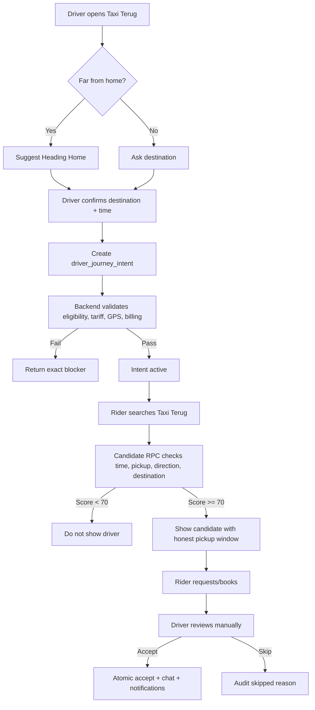

# Taxi Terug V2 - Driver Journey Intent

**Status:** Proposed V2 product/backend blueprint  
**Owner:** Product / CTO  
**Created:** 2026-07-09  
**Depends on:** Taxi Terug V1 staging smoke and production approval  
**Related:** [TAXI_TERUG_BLUEPRINT.md](./TAXI_TERUG_BLUEPRINT.md) | [HEYCABY_BACKEND_FLOW_BLUEPRINT.md](./HEYCABY_BACKEND_FLOW_BLUEPRINT.md)

> This document expands Taxi Terug from a return-home feature into a broader **Driver Journey Intent** system. It must not disrupt Taxi Terug V1. V1 should still be smoked, approved, and deployed on its own contract before V2 implementation begins.

---

## Executive Decision

Taxi Terug should not only mean:

> I dropped someone off and I am going home.

Taxi Terug V2 should mean:

> I am already planning to travel in this direction, and riders can book me if their trip fits my route.

This turns Taxi Terug into an empty-kilometre monetization tool for independent taxi drivers.

---

## Product Definition

Taxi Terug V2 means:

> A rider books a taxi that is already planning to travel in their direction.

This includes two modes:

| Mode | Meaning | Example |
|------|---------|---------|
| Heading Home | Driver finished a ride away from home and wants work back toward home. | Amsterdam to Rotterdam after drop-off |
| Heading Somewhere | Driver is already planning an empty journey to another destination. | Rotterdam to Schiphol at 09:00 |

Internally, this should be thought of as:

> Driver Journey Intent

The driver tells HeyCaby:

> I am going here, around this time.

HeyCaby then finds riders whose trips fit that direction and timing.

---

## Why This Matters

Without Taxi Terug V2:

```text
Driver drives Rotterdam -> Schiphol empty
Income: EUR 0
```

With Taxi Terug V2:

```text
Driver drives Rotterdam -> Schiphol with a rider going that way
Income: EUR 40-80
Driver still arrives for the planned pickup
```

This helps drivers earn from:

- going home
- going to an airport pickup
- going to another city
- going to a depot
- repositioning to a busy zone
- travelling to a planned appointment

---

## Product Principle

**Taxi Terug must only appear when the driver is genuinely going that way.**

No fake badge.  
No global toggle.  
No silent participation.  
No auto-accept in V2 initial release.  
No driver shown unless destination, timing, direction, eligibility, and payment rules match.

---

## User Stories

### Driver Story - Planned Airport Pickup

Ahmed lives in Rotterdam.

He has a planned private pickup at Schiphol at 10:00.

He expects to leave Rotterdam at 09:00.

He opens HeyCaby and sets:

```text
Taxi Terug
From: Rotterdam
To: Schiphol
Leaving: 09:00
Pickup range: 10 km
Available for riders: Yes
```

Now riders travelling toward Amsterdam or Schiphol around that time can book Ahmed.

### Rider Story - Going The Same Way

David wants Rotterdam to Amsterdam.

He opens Taxi Terug and sees:

```text
Taxi heading to Schiphol
Leaves around 09:00
Pickup near Rotterdam
Estimated fare EUR 45-70
Book this taxi
```

David understands that this taxi is already going that direction.

---

## Driver Setup Flow

Driver taps:

```text
Taxi Terug
```

Then configures:

1. Destination type
2. Destination
3. Departure time
4. Pickup range
5. Optional return/planned-direction discount
6. Activate

### Destination Types

```text
Home
Airport
City
Custom destination
```

### Departure Time

```text
Now
In 30 minutes
At a specific time
```

### Pickup Range

```text
5 km
10 km
15 km
```

The first activation should feel simple. Advanced settings can live behind Manage.

---

## Smart Defaults

If driver is far from home:

```text
Default destination = Home
```

If driver is near home:

```text
Ask: Where are you heading?
```

If driver recently completed a long-distance ride:

```text
Suggest Heading Home
```

If driver has an upcoming scheduled/private trip later:

```text
Suggest planned direction only if driver explicitly creates it
```

---

## Backend Model

Do not overload the `drivers` table forever. V1 can keep using existing return mode fields, but V2 should introduce a dedicated intent table.

### Proposed Table: `driver_journey_intents`

```sql
driver_journey_intents
  id uuid primary key
  driver_id uuid not null
  intent_type text not null
  origin_lat double precision
  origin_lng double precision
  origin_label text
  destination_lat double precision not null
  destination_lng double precision not null
  destination_label text not null
  destination_zone_id uuid
  departure_time timestamptz
  available_from timestamptz not null
  available_until timestamptz not null
  pickup_radius_km numeric not null
  destination_radius_km numeric not null
  discount_pct numeric default 0
  auto_accept_enabled boolean default false
  status text not null
  expires_at timestamptz not null
  created_at timestamptz not null default now()
  updated_at timestamptz not null default now()
```

### Intent Types

```text
home
airport
city
custom
post_ride_return
planned_direction
```

### Statuses

```text
draft
active
paused
matched
expired
cancelled
completed
```

---

## Matching Rules

A rider qualifies for a journey intent only when all of these are true:

1. Driver explicitly opted in.
2. Driver is eligible.
3. Driver has fresh GPS.
4. Driver has an active tariff.
5. Driver has no conflicting active ride unless the Taxi Terug queue rules allow it.
6. Rider pickup fits the driver's origin, pickup radius, or route corridor.
7. Rider destination is near the driver's destination or meaningfully along the route.
8. Rider requested time fits the driver's departure window.
9. Ride moves driver in intended direction.
10. Vehicle, payment, and platform balance rules pass.

---

## Timing Rules

Timing is the biggest difference between V1 and V2.

Example:

```text
Driver leaves Rotterdam at 09:00.
Rider pickup requested 08:45-09:15.
Match: yes.
```

But:

```text
Driver leaves Rotterdam at 09:00.
Rider pickup requested 11:30.
Match: no.
```

V2 must not show old or impossible driver intents.

---

## Scoring Model

Use a score instead of a yes/no-only model.

Recommended weights:

| Component | Weight | Meaning |
|-----------|--------|---------|
| Direction fit | 30% | Does the rider trip move driver toward intended destination? |
| Time fit | 25% | Does rider pickup fit departure window? |
| Pickup fit | 20% | Is pickup near origin/current route? |
| Destination fit | 15% | Is rider destination near driver destination/corridor? |
| Empty-km reduction | 10% | Does this reduce unpaid travel? |

Minimum display threshold:

```text
score >= 70
```

Below this, the driver should not appear in Taxi Terug results.

---

## Anti-Abuse Rules

Drivers must not be able to fake destinations to capture more ride requests.

Required:

| Rule | Purpose |
|------|---------|
| Destination change cooldown | Prevent rapid destination flipping |
| Max active intents per day | Prevent spam |
| Max active future window | Prevent stale supply |
| Audit every activation | Ops traceability |
| Expire unused intents | No ghost taxis |
| Flag suspicious patterns | Review repeated manipulation |

Every activation or edit should write an audit event:

```text
journey_intent.created
journey_intent.activated
journey_intent.updated
journey_intent.cancelled
journey_intent.expired
journey_intent.matched
journey_intent.skipped
```

Skipped events should include reason:

```text
wrong_direction
outside_pickup_radius
outside_time_window
driver_busy
driver_offline
missing_tariff
stale_location
billing_locked
payment_incompatible
```

---

## Rider UI

Rider-facing copy:

```text
Ride with taxis already heading your way.
```

Candidate card should show:

```text
Taxi heading to Amsterdam
Leaves around 09:00
Pickup available 08:55-09:10
Black Nissan Ariya
X933HH
Estimated fare EUR 45-70
```

Do not imply instant pickup if the driver has a planned future departure.

---

## Driver UI

Driver-facing copy:

```text
Heading somewhere?
Let HeyCaby find riders going your way.
```

Active card:

```text
Taxi Terug
Heading to Schiphol
Leaving 09:00
Pickup range: 10 km
No matching riders yet
Manage
```

When match appears:

```text
Taxi Terug request
Rotterdam -> Amsterdam
Fits your route to Schiphol
Pickup around 09:05
Review
```

---

## Auto-Accept

Do not enable auto-accept in V2 initial release.

Manual driver acceptance only.

Auto-accept can be reconsidered after:

- direction scoring is proven
- timing is proven
- payment compatibility is proven
- driver trust is proven
- audit events are complete

---

## Backend RPCs

Suggested RPC surface:

```text
fn_driver_journey_intent_create(...)
fn_driver_journey_intent_update(...)
fn_driver_journey_intent_cancel(...)
fn_driver_journey_intent_status()
fn_rider_taxi_terug_intent_candidates(...)
fn_taxi_terug_intent_qualify(...)
fn_taxi_terug_intent_match_score(...)
fn_seed_taxi_terug_intent_matching_batch(...)
```

Security:

- public/internal scoring helpers: `service_role` only
- driver create/update/status: `authenticated`
- rider candidate search: `authenticated` or existing rider-token pattern
- no `PUBLIC` execute on helpers
- RLS enabled on new table

---

## Reuse From V1

Do not rebuild:

- Driver eligibility
- Tariff checks
- Fresh GPS checks
- Billing/platform balance checks
- Vehicle verification
- Payment compatibility
- Realtime invite flow
- Existing Taxi Terug candidate UI foundation
- Existing queued next-ride logic
- Existing notifications/audit patterns

Extend them.

---

## Data Flow



---

## Implementation Phases

### Phase 0 - Protect V1

- Finish Taxi Terug V1 staging smoke.
- Do not change V1 production gate.
- Do not mix planned-direction logic into V1 smoke.

### Phase 1 - Blueprint + Schema

- Add `driver_journey_intents`.
- Add audit events.
- Add RLS and grants.
- Keep feature flag off by default.

### Phase 2 - Driver Create/Manage Intent

- Driver can create planned destination.
- Driver can set departure time.
- Driver can cancel intent.
- No dispatch yet.

### Phase 3 - Rider Candidate Search

- Candidate RPC includes active journey intents.
- Show planned direction drivers only when timing and direction fit.
- Add honest pickup window.

### Phase 4 - Dispatch/Invite

- Reuse existing Taxi Terug matching.
- Manual accept only.
- Atomic accept, chat, rider notification.

### Phase 5 - Anti-Abuse + Ops

- Destination cooldown.
- Daily cap.
- Suspicious pattern audit.
- Expiry cleanup.

### Phase 6 - Smoke + Production Gate

Smoke cases:

1. Driver sets Rotterdam -> Schiphol at 09:00.
2. Rider Rotterdam -> Amsterdam around 09:00 sees driver.
3. Rider pickup at 11:30 does not see driver.
4. Wrong-direction rider does not see driver.
5. Driver stale GPS does not qualify.
6. Driver missing tariff does not qualify.
7. Driver cancels intent; rider no longer sees candidate.
8. Driver accepts; rider active booking updates.

---

## Production Gate

Do not deploy V2 to production until:

- V1 smoke has passed.
- V2 staging feature flag is enabled only for test users.
- All positive and negative staging smoke cases pass.
- ACL scan shows no helper function with default/PUBLIC execute.
- Rider and driver UI clearly distinguish planned direction from normal rides.
- No auto-accept is active.

---

## Open Questions

1. Should public branding remain **Taxi Terug** for both modes?
2. Should driver journey intent support future scheduled rides immediately, or only same-day?
3. What is the max allowed future departure window: 2 hours, 6 hours, same day?
4. Should destinations include saved favorites: home, airport, depot, city?
5. Should planned direction trips allow a discount, or use normal tariff only?
6. Should riders be allowed to book directly, or should it stay marketplace-style in V2 initial release?
7. Should destination cooldown be 4 hours, 12 hours, or 24 hours?

---

## Final Rule

Taxi Terug V2 is not nearest-driver dispatch.

It is not pooling.

It is not a fake discount label.

It is:

> Driver intent + rider direction fit + honest timing.

That is the feature.
