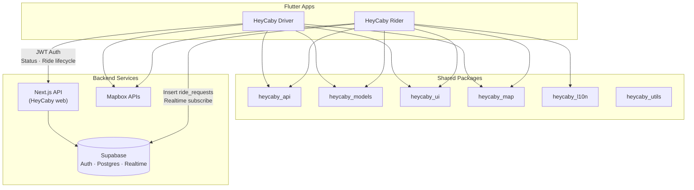
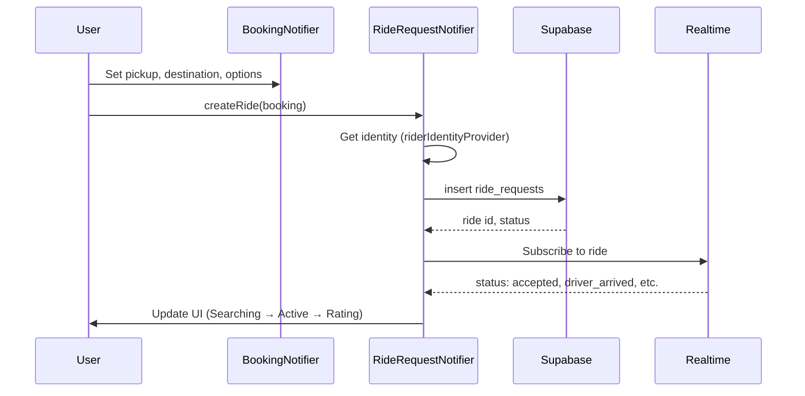

# HeyCaby Flutter — Technical Documentation

**Living technical reference for the HeyCaby mobile monorepo** (shared Dart packages: `heycaby_*`).  
*Last updated: April 2026* (scan: codebase + recent `main` history)

---

## Table of Contents

1. [Architectural & Stack Overview](#1-architectural--stack-overview)
2. [Feature-by-Feature Analysis](#2-feature-by-feature-analysis)
3. [Development & Version History](#3-development--version-history)
4. [Testing & Quality Assurance](#4-testing--quality-assurance)
5. [Setup & Onboarding Guide](#5-setup--onboarding-guide)
6. [Governance & Contribution Guidelines](#6-governance--contribution-guidelines)
7. [Appendices & Resources](#7-appendices--resources)

---

## 1. Architectural & Stack Overview

### 1.1 System Architecture Summary

HeyCaby is a **ride-hailing taxi platform** serving the Netherlands, comprising:

| Component | Technology | Purpose |
|-----------|------------|---------|
| **Rider App** | Flutter (Dart 3.3+) | Consumer booking, maps, ride tracking |
| **Driver App** | Flutter (Dart 3.3+) | Chauffeur registration, ride acceptance, earnings |
| **Backend API** | Next.js (external repo) | Driver status, ride lifecycle, auction/bidding |
| **Database & Auth** | Supabase (Postgres) | Auth, Realtime, RLS, ride data |
| **Maps** | Mapbox | Geocoding, directions, map display |

The Flutter monorepo contains both apps and shared packages. The **HeyCaby web** backend (Next.js, separate repository) is **not** modified by Flutter work.

### 1.2 Monorepo Structure

```
HEYCABY-FLUTTER/
├── apps/
│   ├── rider/              # HeyCaby — consumer app
│   └── driver/             # HeyCaby Driver app
├── packages/
│   ├── heycaby_api/        # HTTP client, Supabase, secure storage, identity
│   ├── heycaby_models/     # RideRequest, AddressResult, etc.
│   ├── heycaby_ui/         # Design tokens, HeyCaby themes, typography, glass panels
│   ├── heycaby_l10n/       # ARB translations (en, nl, ar RTL)
│   ├── heycaby_map/        # Mapbox service wrappers (geocoding, routing)
│   └── heycaby_utils/      # Validators, formatters
├── supabase/               # Migrations, scripts (RLS, RPC, views)
├── integrations/           # Static HTML (terms, support) for HeyCaby web
├── simulation/             # Python scripts for ride/driver simulation
├── docs/                   # Technical docs, specs
├── scripts/                # Sync scripts, utilities
└── heycaby-flutter-doc/     # Spec documents (reference only)
```

### 1.3 Frontend Stack

| Layer | Choice | Notes |
|-------|--------|-------|
| Framework | Flutter 3.19+ | Cross-platform (iOS, Android) |
| State | Riverpod 2.5+ | Providers, Notifiers, AsyncNotifier |
| Navigation | go_router 13.x | Declarative routing, redirects |
| Maps | Mapbox Maps Flutter 2.19 | Geocoding, directions, display |
| HTTP | Dio 5.x | Interceptors, timeout handling |
| Storage | flutter_secure_storage | Tokens, identity (never SharedPreferences for secrets) |
| i18n | flutter gen-l10n | ARB files, en / nl / ar (RTL) |

### 1.4 Backend & Services

| Service | Location | Role |
|---------|----------|------|
| **Supabase** | `fvrprxguoternoxnyhoj.supabase.co` | Auth, Postgres, Realtime, Edge Functions |
| **Next.js API** | `https://heycaby.nl` / `https://www.heycaby.nl` | Driver status, ride lifecycle, auction |
| **Mapbox** | Mapbox APIs | Geocoding, directions |

- **Riders** create rides via **direct Supabase inserts** into `ride_requests`.
- **Drivers** use the **Next.js API** with Supabase JWT (`Authorization: Bearer`) for status, location, accept/arrive/start/complete.
- Edge Functions: `create-driver-veriff-session`, `driver-support-chat`, `rider-support-chat` (OpenRouter; see `docs/supabase/AI_CHAT_AGENT_BACKEND_SPEC.md`).

### 1.5 Databases & Data Models

- **Supabase Postgres** with Row Level Security (RLS).
- Key tables: `ride_requests`, `drivers`, `ride_ratings`, `driver_trust_scores`, `ride_shares`, etc.
- PostGIS for geography (`POINT(lng lat)`).
- Migrations in `supabase/migrations/` — idempotent SQL only. Recent additions include ride **matching cascade**, **account deletion / ride chat blocks**, **payment_methods** on `ride_requests`, **driver compliance** (chauffeurspas / rijbewijs admin fields), and related RPCs — apply in order via Supabase CLI or Dashboard.

### 1.6 Infrastructure & Deployment

- **GitLab CI** (`.gitlab-ci.yml`): single pipeline for the monorepo. **Linux** jobs install Flutter + Android SDK, run `melos bootstrap`, **`flutter analyze`** on `apps/*` + `packages/`, **widget tests** (allow failure), and **`flutter build apk --debug`** for rider and driver with `--dart-define` for Supabase/Mapbox. **macOS** jobs (`tags: macos`, `flutter`) build **`flutter build ipa`** when `ENABLE_MACOS_IOS_JOBS=true`; **manual** `deploy_testflight_*` jobs upload IPAs via `xcrun altool` using `ExportOptions.plist`. **Trivy** `security_scan` runs on MR/main/tags (`allow_failure: true`). Path-based rules limit rider vs driver jobs on merge requests.
- **Supabase** is hosted (eu-west-1).
- **HeyCaby web** (Next.js) is deployed separately; static assets from `integrations/heycaby-web-public` are synced via `scripts/sync-driver-legal-to-heycaby-web.sh`.
- **Store releases**: iOS via Xcode / GitLab macOS pipeline + App Store Connect; Android via Play Console or CI-produced APKs.

### 1.7 Key Architectural Decisions

| Decision | Rationale |
|----------|-----------|
| Monorepo (Melos) | Shared packages, single source of truth, coordinated releases |
| Rider identity via tokens | Progressive onboarding; guest booking without login |
| Driver auth via Supabase | Full auth lifecycle, JWT for API |
| Direct Supabase for rides | Simpler rider flow; backend can augment via webhooks |
| Design tokens only | Consistency, theming; prefer `Color.withValues(alpha: …)` over deprecated `withOpacity` |
| Files &lt; 300 lines | Maintainability, clear responsibilities |
| iOS privacy manifest | `PrivacyInfo.xcprivacy` + `ITSAppUsesNonExemptEncryption` on both apps’ `Runner` targets |

---

## 2. Feature-by-Feature Analysis

### 2.1 Rider App Features

#### 2.1.1 Booking Flow (A → Z)

| Step | Screen | Route | Purpose |
|------|--------|-------|---------|
| 1 | Splash | `/splash` | Typewriter intro, gate to home or location-required |
| 2 | Home | `/home` | Map, "Where to?" entry, shortcuts to marketplace/favorites |
| 3 | Search | `/search` | Mapbox geocoding for pickup/destination; when both set → `prefillBookingFromIdentity` + `routeAfterAddressesComplete` (may skip vehicle/payment). Mode/schedule from **When** row, home, or marketplace |
| 4 | Vehicle category | `/vehicle-category` | Category cards with **nearby supply**; **expandable per-driver** rows (distance + **per-offer price**); selection / post-to-all; **favourites-only** toggle; pet-friendly; **pickup contact name** field (prefill + persist to identity/settings on continue) |
| 5 | Payment | `/payment` | cash / pin / tikkie (and configured methods) |
| 6 | Trip summary | `/summary` | Full summary; **payment method** surfaced; persisted with ride (`payment_methods` / booking state) → "Find my driver" → `createRide()` |
| 7 | Searching | `/searching` | Supabase Realtime on ride, wait for assignment |
| 8 | Active ride | `/active` | Driver tracking, status, chat, report |
| 9 | Rating / Report | `/rating`, `/report` | Post-ride feedback |
| 10 | Ride detail | `/ride-detail` | History item details (via `state.extra`) |

*Legacy paths `/confirm` and `/booking-options` remain registered for deep links; they **redirect** (no screen) to `/search` if addresses are missing, otherwise to the same smart next step as after search.*

**Core Logic:**
- `BookingState` + `BookingNotifier` (`booking_provider.dart`) hold pickup, destination, mode, schedule, payment, vehicle category.
- `RideRequestNotifier.createRide(booking)` inserts into `ride_requests` via Supabase.
- Identity (token, identityId) from `riderIdentityProvider`; optional for guest booking.

#### 2.1.2 Identity & Security

- **Progressive identity**: Token and identityId in `flutter_secure_storage`.
- Keys: `rider_token`, `rider_identity_id`, `rider_email`, `rider_booking_name`.
- Created when rider provides email or booking name; guest booking works without identity.
- Never log raw tokens; never store secrets in SharedPreferences.

#### 2.1.3 Additional Screens

| Screen | Route | Purpose |
|--------|-------|---------|
| Marketplace | `/marketplace` | Driver bids, offer fare, live/supply-oriented UI |
| Favorites | `/favorites` | Saved favorite drivers |
| Rides | `/rides` | Ride history and detail entry points |
| Account | `/account` | Settings, language, theme, links, **in-app account deletion** (Guideline 5.1.1(v)) |
| FAQ / Terms / Privacy | `/faq`, `/terms`, `/privacy` | Legal and support |

#### 2.1.4 Rider Data Flow

```
User input → BookingNotifier → TripSummaryScreen
  → RideRequestNotifier.createRide(booking)
  → Supabase.from('ride_requests').insert(...)
  → SearchingScreen subscribes via Realtime
  → Status changes (accepted, driver_arrived, in_progress, completed)
  → ActiveRideScreen, RatingScreen
```

#### 2.1.5 Matching, pricing & reference doc

- **Cascading matching** (closest-first batches, atomic accept) is implemented in Supabase (see migration `20260329180000_ride_matching_cascade.sql` and follow-ups). Rider and driver clients subscribe to Realtime and call the matching/accept RPCs as wired in providers/services.
- **Per-driver pricing** on the vehicle-category step and **enforcing a single assigned driver** for a job are part of the current rider flow (see merge history on `main`).
- **Product reference:** `docs/RIDER_BOOKING_AND_MATCHING_REFERENCE.md` — proximity-first cards, expandable rows, cascade semantics, and implementation notes.

#### 2.1.6 Safety & App Store (rider)

- **Ride chat**: Rider can **block** the driver from the chat menu; blocked senders are filtered using `HeyCabyRideChatBlocks` (`heycaby_api`) backed by Supabase RPCs (see `20260330140000_account_deletion_ride_chat_blocks.sql`).
- **Account deletion**: `performRiderAccountDeletion` (`apps/rider/lib/utils/rider_account_deletion.dart`) — confirm with typed `DELETE`, RPC `fn_delete_rider_account` with session token, optional Supabase Auth user delete when linked.

### 2.2 Driver App Features

#### 2.2.1 Auth & Gating

- **Supabase Auth** (email + OTP or password).
- Splash → check `currentSession` → redirect to `/login` or `/driver`.
- Auth state listener in router for redirects.
- **Go online** is gated on **manual driving-licence confirmation**: `driverMayGoOnline` / `driver_go_online_policy.dart` requires `DriverComplianceSnapshot.rijbewijsVerified == true` (operations sets this after review; Veriff approval alone is not enough). Go-online **swipe** and **three-state toggle** respect the same policy.

#### 2.2.2 Core Flow

| Step | Screen | Route | Purpose |
|------|--------|-------|---------|
| 1 | Splash | `/splash` | Check auth |
| 2 | Login | `/login` | Sign in |
| 3 | Go Online | `/driver/go-online` | Swipe to go available |
| 4 | Home | `/driver` | Map, zone filter, earnings, new ride |
| 5 | New ride request | `/driver/ride/new/:rideId` | Accept / decline |
| 6 | Active | `/driver/ride/active/:rideId` | Navigate to pickup |
| 7 | At pickup | `/driver/ride/pickup/:rideId` | Arrived |
| 8 | In progress | `/driver/ride/progress/:rideId` | Trip underway |
| 9 | Complete | `/driver/ride/complete/:rideId` | Finish ride |
| 10 | Rate rider | `/driver/ride/rate/:rideId` | Rating |

#### 2.2.3 Driver API Endpoints (Next.js)

| Method | Path | Purpose |
|--------|------|---------|
| PATCH | `/api/driver/status` | available, offline, on_ride |
| POST | `/api/driver/location` | Upload lat/lng/heading |
| POST | `/api/driver/ride/accept` | Accept ride |
| POST | `/api/driver/ride/arrived` | Mark arrived |
| POST | `/api/driver/ride/start` | Start trip |
| POST | `/api/driver/ride/complete` | Complete trip |
| POST | `/api/driver/ride/no-show` | Report no-show |
| POST | `/api/driver/ride/rate` | Rate rider |
| POST | `/api/driver/receipt` | Create receipt |
| POST | `/api/auction/bid` | Place bid |
| POST | `/api/auction/accept-first` | Accept first bid |
| GET | `/api/auction/radar` | Zone demand / radar |

#### 2.2.4 Driver Profile & Compliance

- **Verification**: Veriff (ID), RDW (vehicle), KVK, Chauffeurspas; **rijbewijs** tracked with manual verification flag for go-online.
- **Admin RPC**: `fn_admin_set_manual_verifications` and extended migrations for **chauffeurspas number**, **rijbewijs** admin fields (see `20260401100000_drivers_chauffeurspas_number_admin_rijbewijs.sql` and `docs/DRIVER_VERIFICATION_IMPLEMENTATION.md`).
- **Go online**: blocked until **`rijbewijs_verified`** (see §2.2.1), not only a generic `compliance_status` string — UI explains when Veriff looks approved but licence is still awaiting manual review.
- **Documents screen**: compliance snapshot-driven rows, locks, insurance save, Veriff meta — see `driver_documents_screen.dart` and `driver_compliance_*` widgets.
- Congratulations modal when `profile_status == 'verified'` (where still applicable).

#### 2.2.5 Driver Screens (Extended)

- Work, Me, Preferences, Vehicle, Documents, Veriff, Support, FAQ, Terms, Privacy.
- Scheduled rides, today’s rides, power mode, union mode, return trips.
- Ride swap, support chat (AI agent), help articles (**WebView** for help URLs — supplemental, not a full web wrapper).

#### 2.2.6 Safety & App Store (driver)

- **Ride chat**: Driver can **block** the rider from the chat menu; uses `HeyCabyRideChatBlocks` with `blockerType: 'driver'`.
- **Account deletion**: `performDriverAccountDeletion` — RPC `fn_delete_driver_owned_data`, then `HeyCabyAccountDeletion.deleteCurrentSupabaseAuthUser()` (requires Supabase project to **allow user self-deletion** in Dashboard).

### 2.3 Shared Packages

| Package | Exports | Purpose |
|---------|---------|---------|
| `heycaby_api` | `supabase_client`, `api_client`, `driver_api`, `secure_storage`, `rider_identity_provider`, **`app_store_compliance`** (`HeyCabyAccountDeletion`, `HeyCabyRiderAccountDeletion`, `HeyCabyRideChatBlocks`) | Backend access, identity, **deletion & chat block** RPCs |
| `heycaby_models` | `address_result`, `ride_request` | Domain models |
| `heycaby_ui` | `color_tokens`, `typography`, `spacing`, `theme_data`, `theme_registry`, `theme_provider`, `glass_panel`; `SPACING_EXAMPLES.dart` (token-based examples, not shipped as app code) | Design system |
| `heycaby_map` | `map_service`, `geocoding_service`, `routing_service` | Mapbox wrappers |
| `heycaby_l10n` | ARB files | Translations |
| `heycaby_utils` | `validators`, `formatters` | Helpers |

### 2.4 External Integrations

- **Mapbox**: Geocoding, directions, map display.
- **Veriff**: ID verification for drivers.
- **Supabase Realtime**: Ride status updates, driver location.
- **Next.js API**: Driver lifecycle (external repo).

### 2.5 iOS App Store compliance (binary)

Applies to **`apps/rider/ios`** and **`apps/driver/ios`** (`Runner` target):

| Item | Purpose |
|------|---------|
| **`ITSAppUsesNonExemptEncryption`** = `NO` | Export compliance when using standard TLS only (`Info.plist`). |
| **`PrivacyInfo.xcprivacy`** | Bundled in Copy Bundle Resources; **NSPrivacyTracking** false; **required-reason APIs**: UserDefaults (`CA92.1`), file timestamp (`C617.1`), disk space (`E174.1`), system boot time (`35F9.1`) — aligned with MapboxCommon / MapboxCoreMaps pod manifests. |
| **Location usage strings** | Rider: **when-in-use** copy only (no `NSLocationAlwaysAndWhenInUseUsageDescription` in plist). Driver: when-in-use + always strings, camera/photos, `UIBackgroundModes` **location** where configured for active driving. |

**Cursor skill:** `.cursor/skills/app-store-submission-auditor/` — checklist, risk register, and `config.json` for HeyCaby-specific outstanding Connect/backend items.

---

## 3. Development & Version History

### 3.1 Major Milestones

| Milestone | Description |
|-----------|-------------|
| Initial Rider app | Splash, home, search, booking flow, Supabase ride creation |
| Driver app merge | Full chauffeur flow, API integration, verification |
| Rider quality polish | Navigation, L10n, missing screens, app recovery |
| Cloud agent runbook | Skill for headless CI/testing workflows |
| Simulation framework | Python scripts for ride/driver simulation |
| Security fixes | 14 vulnerabilities from merged PR review |
| Driver features | Shift timer, break reminder, 3-state toggle |
| Live fixes | Earnings RPC param, zone_demand_live security, Info.plist |
| **Matching & rider UX** | Cascade matching RPC/migrations, per-driver pricing, category supply cards, payment methods on summary |
| **Compliance & safety** | Go-online **rijbewijs** gate, documents/compliance UI, in-app **account deletion**, **ride chat block** RPCs |
| **CI & TestFlight** | GitLab pipeline: analyze, APK, optional macOS IPA, manual TestFlight upload jobs |
| **App Store prep** | Privacy manifest + export compliance plist; design-token / `withValues` sweep; `.claude/` gitignored |

### 3.2 Recent Significant Commits

Recent `main` (abbreviated; see `git log` for full history):

```
764baea chore: gitignore Claude Code .claude worktrees folder
6d68757 iOS App Store privacy/export compliance; design tokens and Color API cleanup
15338b3 Driver registration: doc locks, go-online gated on rijbewijs_verified
846ac29 fix(rider): show all payment methods on trip summary; persist payment_methods
813ec00 fix: update driver home sheet measurements to 25%, 55%, 80%
cf37994 Merge: per-driver pricing, selection flow, 1-driver job enforcement (rider)
45140fc fix(matching): cascade matching to prod; location columns and driver_id wiring
82fe48f feat(matching): cascade invites, atomic accept RPC, rider/driver wiring
5bb7598 feat(rider): nearby driver supply on vehicle step; booking reference doc
f14f832 feat: App Store prep, compliance tooling, remove Svelte PWAs
7565f21 Configure CI to use self-hosted macOS runner; TestFlight deploy jobs
…
```

### 3.3 Known Technical Debt

| Item | Notes |
|------|-------|
| `apps/rider/test/widget_test.dart` | References removed `MyApp`; should use `HeyCabyRiderApp` |
| `apps/driver/test/widget_test.dart` | May fail due to dangling timer from SplashScreen |
| `melos run test:all` | Shared packages have no test dir; run app tests individually |
| CI tests | `test_rider` / `test_driver` use `\|\| true` / `allow_failure` — tighten when suites are stable |
| App Store Connect | Privacy nutrition labels, screenshots, demo credentials — not in repo (see auditor skill `config.json`) |

### 3.4 Deprecated / Future

- No formal feature-flag system; gating via routes and conditional UI.
- Optional `driver_verifications` table for per-document audit (spec only).
- Backend is external; schema changes require coordination with HeyCaby web.

---

## 4. Testing & Quality Assurance

### 4.1 Testing Frameworks

- **Framework**: `flutter_test`
- **No E2E framework** in repo (no integration_test or Detox).
- **Simulation**: Python scripts in `simulation/` for backend/ride lifecycle.

### 4.2 Test Coverage

| Area | Test Files | Notes |
|------|------------|-------|
| Rider | `booking_flow_test.dart`, `route_audit_test.dart`, `widget_test.dart` | Booking modes, payload validation, route audit |
| Driver | `widget_test.dart` | Smoke test; may have timer issues |
| Packages | None | No `test/` dir in shared packages |

### 4.3 Test Strategy

| Type | Usage | Command |
|------|-------|---------|
| Static analysis | Every change | `flutter analyze --no-fatal-infos --no-fatal-warnings apps/rider/lib apps/driver/lib` |
| Unit / widget | Rider, driver | `cd apps/rider && flutter test test/ --no-pub` |
| Route audit | After nav changes | `route_audit_test.dart` verifies all routes registered |
| Simulation | Backend flows | `simulation/sim_*.py` with env vars |

### 4.4 Key Test Files

- **`booking_flow_test.dart`**: Netherlands bounding box, ride payload format, payment methods, PostGIS POINT format.
- **`route_audit_test.dart`**: Ensures every navigation target exists in router.

### 4.5 Running Tests

```bash
# Bootstrap
melos run get:all

# Analyze
melos run analyze
# or
flutter analyze --no-fatal-infos --no-fatal-warnings apps/rider/lib apps/driver/lib

# Rider tests
cd apps/rider && flutter test test/ --no-pub

# Driver tests
cd apps/driver && flutter test test/ --no-pub

# Regenerate L10n
melos run gen:l10n
```

### 4.6 CI Workflows

- **GitLab CI** — see §1.6 and `.gitlab-ci.yml` (analyze, tests, APK builds, optional macOS IPA + manual TestFlight, Trivy).
- **No GitHub Actions** in this repo (primary automation is GitLab).
- Cloud agents use `.cursor/skills/cloud-agent-runbook/SKILL.md` for headless workflows.

---

## 5. Setup & Onboarding Guide

### 5.1 Prerequisites

- Flutter 3.19+
- Dart 3.3+
- Melos: `dart pub global activate melos`
- Mapbox token (public, `pk.xxx`)
- Supabase URL and anon key

### 5.2 First-Time Setup

```bash
# Clone repo
git clone <repo-url>
cd HEYCABY-FLUTTER

# Install dependencies
melos run get:all

# Generate localizations
cd apps/rider && flutter gen-l10n
cd ../driver && flutter gen-l10n
```

### 5.3 Environment Variables

| Variable | Purpose | How to Pass |
|----------|---------|-------------|
| `SUPABASE_URL` | Supabase project URL | `--dart-define=SUPABASE_URL=https://...` |
| `SUPABASE_ANON_KEY` | Supabase anon key | `--dart-define=SUPABASE_ANON_KEY=...` |
| `MAPBOX_ACCESS_TOKEN` | Mapbox public token | `--dart-define=MAPBOX_ACCESS_TOKEN=pk.xxx` |

**Never** hardcode secrets. Use `--dart-define` or `.env` (gitignored) via `flutter_dotenv`.

### 5.4 Run Commands

```bash
# Rider
cd apps/rider
flutter run \
  --dart-define=SUPABASE_URL=https://fvrprxguoternoxnyhoj.supabase.co \
  --dart-define=SUPABASE_ANON_KEY=YOUR_KEY \
  --dart-define=MAPBOX_ACCESS_TOKEN=YOUR_TOKEN

# Driver
cd apps/driver
flutter run --dart-define=...
```

### 5.5 VS Code Launch Config

Create `apps/rider/.vscode/launch.json`:

```json
{
  "version": "0.2.0",
  "configurations": [
    {
      "name": "HeyCaby Rider",
      "request": "launch",
      "type": "dart",
      "args": [
        "--dart-define=SUPABASE_URL=https://fvrprxguoternoxnyhoj.supabase.co",
        "--dart-define=SUPABASE_ANON_KEY=YOUR_KEY",
        "--dart-define=MAPBOX_ACCESS_TOKEN=YOUR_TOKEN"
      ]
    }
  ]
}
```

### 5.6 Supabase Migrations

- Apply via Supabase CLI or Dashboard SQL Editor.
- Project ID: `fvrprxguoternoxnyhoj`
- Region: eu-west-1
- Migrations: `supabase/migrations/`

### 5.7 Simulation

```bash
export SUPABASE_URL=...
export SUPABASE_SERVICE_ROLE_KEY=...
export NEXT_API_BASE=https://heycaby.nl
python simulation/sim_ride_requests.py
python simulation/sim_full_lifecycle.py
```

---

## 6. Governance & Contribution Guidelines

### 6.1 Coding Standards

| Rule | Description |
|------|-------------|
| No hardcoded colors/fonts/spacing | Use `heycaby_ui` tokens; use `Color.withValues(alpha: …)` instead of deprecated `withOpacity` |
| No hardcoded strings | Use `AppLocalizations` |
| `EdgeInsetsDirectional` only | Never `EdgeInsets.only(left/right)` |
| `SafeArea` on screens | Always wrap content |
| Mapbox via packages | Never from screens directly |
| Secrets in secure storage | Never `SharedPreferences` |
| Files under ~300 lines | Split when larger |
| Rider and Driver separate | Never mix app logic |

### 6.2 Style Guide

- `analysis_options.yaml` extends `package:flutter_lints/flutter.yaml`.
- Rules: `always_use_package_imports`, `avoid_print`, `prefer_const_*`, `prefer_final_*`, `use_super_parameters`, `directives_ordering`, `unnecessary_late`.
- Excludes: `**/*.g.dart`, `**/*.freezed.dart`, `**/l10n/**`.

### 6.3 Pull Request Process

1. Run `flutter analyze` — zero errors.
2. Run app tests (`apps/rider`, `apps/driver`).
3. Add/update route audit when changing navigation.
4. Update L10n when adding strings (all locales: en, nl, ar).
5. Keep PRs focused; reference related issues.

### 6.4 Branching Strategy

- Not formally documented; typical `main` + feature branches.
- Coordinate with HeyCaby web for API/schema changes.

### 6.5 Updating This Document

- When adding screens: update router section and route audit.
- When adding packages: document in stack and packages sections.
- When changing APIs: update data flow and endpoint tables.
- Commit with message like `docs: update TECHNICAL_DOCUMENTATION.md`.

---

## 7. Appendices & Resources

### 7.1 Rider Routes Reference

| Route | Screen |
|-------|--------|
| `/splash` | SplashScreen |
| `/location-required` | LocationRequiredScreen |
| `/search` | SearchScreen |
| `/marketplace` | MarketplaceScreen |
| `/favorites` | FavoritesScreen |
| `/confirm` | *(redirect — legacy)* |
| `/booking-options` | *(redirect — legacy)* |
| `/vehicle-category` | VehicleCategoryScreen |
| `/payment` | PaymentScreen |
| `/summary` | TripSummaryScreen |
| `/searching` | SearchingScreen |
| `/active` | ActiveRideScreen |
| `/chat` | ChatScreen |
| `/rating` | RatingScreen |
| `/report` | ReportScreen |
| `/ride-detail` | RideDetailScreen |
| `/faq`, `/terms`, `/privacy` | FaqScreen, TermsScreen, PrivacyScreen |
| `/home`, `/rides`, `/account` | HomeScreen, RidesScreen, AccountScreen (shell) |

### 7.2 Ride Status Values

`pending`, `bidding`, `accepted`, `driver_arrived`, `in_progress`, `completed`, `cancelled`, `expired`, `declined`

### 7.3 Booking Modes

`instant`, `scheduled`, `marketplace`

### 7.4 Payment Methods

`cash`, `pin`, `tikkie`

### 7.5 Design Themes (heycaby_ui)

- `taxi-shade-6` (Rider default)
- `taxi-shade-2` (Driver default)
- `forest-dusk`, `rose-noir`, `alpine-cream`, `warm-gloss`, `frosty-black-white`, `frosty-black-yellow`

### 7.6 Glossary

| Term | Definition |
|------|------------|
| Chauffeur | Driver (Dutch context) |
| Marketplace | Mode where drivers bid on rides |
| Rider token | Anonymous identifier for rider; stored in secure storage |
| PostGIS | Geography extension; `POINT(lng lat)` |
| RLS | Row Level Security (Supabase) |
| ARB | Application Resource Bundle (Flutter l10n) |
| RTL | Right-to-left (Arabic) |

### 7.7 Related Documentation

| Document | Purpose |
|----------|---------|
| `README.md` | Quick start, structure |
| `docs/RIDER_BOOKING_AND_MATCHING_REFERENCE.md` | Rider booking, matching cascade, per-driver pricing UX |
| `docs/DRIVER_VERIFICATION_IMPLEMENTATION.md` | Admin RPC, Flutter wiring |
| `docs/MIGRATION_040_RATINGS.md` | Ratings schema |
| `docs/supabase/*.md` | Support chat, profile photos, AI agent |
| `.gitlab-ci.yml` | Pipeline: analyze, build, TestFlight |
| `.cursor/skills/cloud-agent-runbook/SKILL.md` | Cloud/CI workflows |
| `.cursor/skills/app-store-submission-auditor/` | App Store readiness audit skill + `config.json` |
| `.cursor/skills/rider-flow-implementation/SKILL.md` | Booking flow details |
| `.cursor/skills/rider-security-identity/SKILL.md` | Identity and storage |

### 7.8 System Topology Diagram



### 7.9 Rider Booking Sequence



### 7.10 External Links

- [Supabase Docs](https://supabase.com/docs)
- [Mapbox Maps Flutter](https://pub.dev/packages/mapbox_maps_flutter)
- [Riverpod](https://riverpod.dev)
- [go_router](https://pub.dev/packages/go_router)
- [App Store screenshot generator (vendored)](https://github.com/ParthJadhav/app-store-screenshots) — see **`docs/APP_STORE_SCREENSHOTS.md`**

### 7.11 App Store marketing screenshots

This monorepo vendors **[ParthJadhav/app-store-screenshots](https://github.com/ParthJadhav/app-store-screenshots)** under **`tools/app-store-screenshots/`** and mirrors the agent skill to **`.cursor/skills/app-store-screenshots/SKILL.md`**. Use it to scaffold a Next.js-based exporter for **advertisement-style** store frames. Full workflow: **`docs/APP_STORE_SCREENSHOTS.md`**.

---

*This document is maintained as a living reference. Update it when features, architecture, or processes change.*
