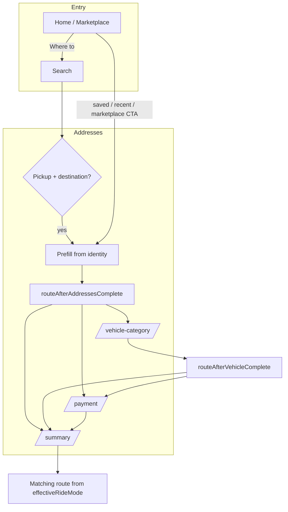

# Booking mode checklist (Rider)

Use this when changing routing, `BookingState.mode`, `effectiveRideMode`, or matching screens.

## Profile completion (rider)

**100%** = **booking name** (settings `user_name` or identity `booking_name`) **and** **email** on `riderIdentity` (`identity.email`). Each is worth **50%**. Shown on **Account** (`riderProfileCompletenessProvider` + meter) and as an optional **home sheet nudge** (`RiderProfileHomeNudge`) until complete or dismissed for the session.

## First launch welcome (home)

After splash, the rider lands on **home** (no separate onboarding screen). About **3 seconds** later, if `rider_welcome_profile_flow_done` is not set in `SharedPreferences` and there is no saved **user name** / **booking name** yet, a modal offers **Set up now** (→ `/account?fromOnboarding=true`) or **Later** (→ second modal: driver call name, **Save** or **Not now**; stays on home). **Account** with `fromOnboarding=true` shows a banner, autofocus on the booking name field, **Save & continue** → `context.go('/home')`, plus a hint to add email when missing. Completing any path sets the welcome pref so the sequence does not repeat. Implementation: `widgets/welcome_profile_modals.dart`, `account_screen.dart`, scheduled from `HomeScreen`.

## Modes

- **Instant** — immediate pickup, default matching (`/searching`).
- **Scheduled** — `scheduledAt` set; use scheduled matching route and queued copy where applicable.
- **Marketplace** — `BookingMode.marketplace`; marketplace matching route and pricing UI.

## Flow diagram (high level)

## Router guards

`GoRouter` is provided by `appRouterProvider` (`router.dart`) with `refreshListenable` tied to `bookingProvider` so redirects re-run when booking changes.

- **`/confirm`** and **`/booking-options`** — **legacy paths** (no screens). Each redirects to `/search` if addresses are missing, otherwise to `BookingFlowNavigation.routeAfterAddressesComplete` (same smart skip as after search). **Favourites-only** and an **editable pickup contact name** (with identity prefill) live on **vehicle category**; mode (instant / marketplace / scheduled) is set from **search** (When row), **home**, or **marketplace** as before.
- **`/summary`** — redirect to `/search` if pickup or destination is missing (deep links / bad state).
- **`/payment`** — redirect to `/search` if addresses missing; redirect to `/vehicle-category` if vehicle category is missing. We **do not** redirect away from `/payment` when `paymentMethods` is already non-empty, so the user can still open payment from the stack to edit methods.

## Scenarios to verify

1. **Cold start** — open app, complete search → vehicle → payment → summary → matching; no stale `ride_request` or wrong route.
2. **Restore draft** — save-for-later card resumes addresses/options; confirm vehicle/payment still make sense.
3. **Returning user** — identity prefill on search, marketplace CTA, home saved/recent: empty fields filled; `routeAfterAddressesComplete` may skip vehicle and/or payment.
4. **Deep links / back** — back from search, vehicle, payment preserves booking; cancel clears booking and matching state as today.
5. **Guest / progressive identity** — prefill must not assume session; legal/consent screens stay mandatory where required by product.

## Routing reference

- `BookingFlowNavigation.prefillBookingFromIdentity` — call before `routeAfterAddressesComplete` when entering the stack from marketplace or home shortcuts.
- `BookingFlowNavigation.routeAfterAddressesComplete` — after pickup + destination (search, marketplace submit, home shortcuts).
- `BookingFlowNavigation.routeAfterVehicleComplete` — after vehicle + driver choice saved.
- `rideMatchingVariantForBookingMode(booking.effectiveRideMode)` — summary → matching path.
