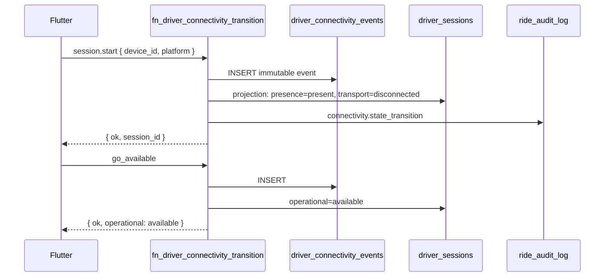
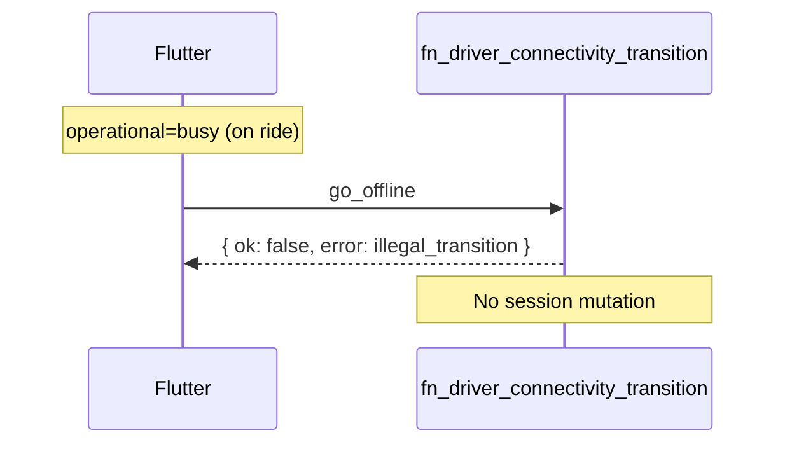
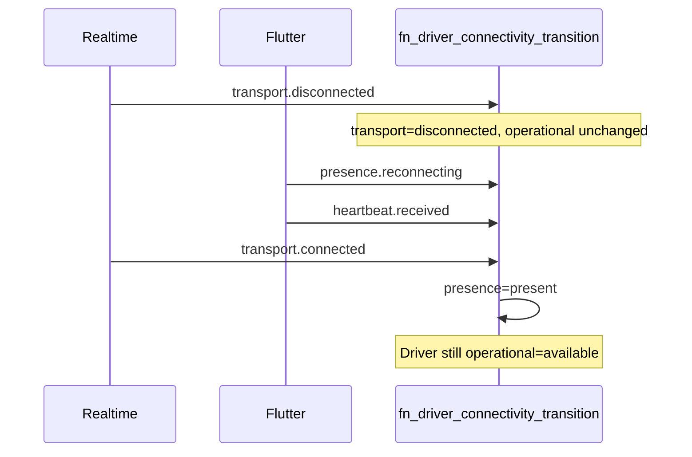

# Phase 4 — M14 Design (Presence Foundation)

**Status:** ✅ **Design approved — migrations in repo (NOT production)**  
**Date:** 2026-06-25  
**Migration:** M14 — Presence Foundation (Expose mode)  
**Prerequisite:** [PROGRAM-2-M14-ARCHITECTURE-GATES.md](./PROGRAM-2-M14-ARCHITECTURE-GATES.md) ✅ frozen

| Governance | Link |
|------------|------|
| Program 2 | [PROGRAM-2-DRIVER-CONNECTIVITY-DESIGN.md](./PROGRAM-2-DRIVER-CONNECTIVITY-DESIGN.md) |
| Engineering Bible | [ENGINEERING-BIBLE.md](../ENGINEERING-BIBLE.md) |

**CTO rule:** Design ✅ approved 2026-06-25. Migrations in repo only — production ⛔ blocked.

## Repo migrations (M14A–M14E)

| Part | File | Contents |
|------|------|----------|
| M14A | `20260625120000_v1_phase4_m14a_driver_sessions.sql` | `driver_sessions` |
| M14B | `20260625120100_v1_phase4_m14b_driver_connectivity_events.sql` | Events + `event_id` + versioning |
| M14C | `20260625120200_v1_phase4_m14c_connectivity_transition_rpc.sql` | `fn_driver_connectivity_transition` |
| M14D | `20260625120300_v1_phase4_m14d_connectivity_observability.sql` | Views + `platform_health` |
| M14E | `scripts/sql/smoke_phase4_m14_presence_foundation.sql` | Smoke (ROLLBACK) |

Rollback: `scripts/sql/rollback_phase4_m14_presence_foundation.sql`

---

## M14 objective

Introduce **driver_sessions**, the **event model**, and **read-only observability** of the four-layer state model — without changing dispatch behaviour.

**Success:** Ops can answer *"What is the truth about this driver right now?"* and see the gap between legacy `drivers.status` and derived session state.

---

## Scope

| In scope (M14) | Out of scope (later migrations) |
|----------------|----------------------------------|
| `driver_sessions` DDL proposal | Heartbeat interval enforcement (M15) |
| `driver_connectivity_events` append-only log | Reconnect automation (M16) |
| `fn_driver_connectivity_transition()` — legal transitions only | Session supersede logic (M17) |
| Read RPCs + platform_health `connectivity` section | Stale dispatch filter (M18) |
| Session observability views/metrics | Go strangler cutover |
| `connectivity.*` audit events | Billing / business logic in writer |

---

# 1. Event model

## Principles

> **Events are immutable. State is derived.**

> **Truth is derived from events, never assumed from absence.**

Every state change is preceded by an append-only event. Current state on `driver_sessions` is a **materialized projection** of the latest legal transitions — not authoritative over the event log for disputes.

## Event catalog (M14 subset)

Full catalog grows in M15–M18. M14 implements **session lifecycle + explicit operational intent** only.

| Event type | Layer | Description |
|------------|-------|-------------|
| `connectivity.session.start` | Session | New session row; device binds |
| `connectivity.session.end` | Session | Session closed with reason |
| `connectivity.transport.connected` | Transport | Realtime channel up (M15 wires emitter) |
| `connectivity.transport.disconnected` | Transport | Realtime channel down (M15) |
| `connectivity.heartbeat.received` | Transport/Presence | App health ping (M15) |
| `connectivity.presence.reconnecting` | Presence | Client declares reconnect in progress (M16) |
| `connectivity.operational.go_available` | Operational | Driver intent: accept dispatch |
| `connectivity.operational.go_offline` | Operational | Driver intent: stop accepting |
| `connectivity.operational.go_paused` | Operational | Driver intent: online but not accepting |
| `connectivity.operational.ride_accepted` | Operational | Busy (from accept RPC — future wire) |
| `connectivity.operational.trip_completed` | Operational | Available (from trip complete — future wire) |
| `connectivity.presence.stale` | Presence | Server timeout (M18 cron) |
| `connectivity.session.superseded` | Session | New device wins (M17) |

## Event payload (canonical shape)

All events passed to `fn_driver_connectivity_transition`:

```json
{
  "event_id": "uuid — globally unique, required for dedup",
  "event_version": 1,
  "state_machine_version": 1,
  "event_type": "connectivity.session.start",
  "session_id": "uuid | null",
  "driver_id": "uuid",
  "device_id": "string",
  "layer": "transport | presence | operational | session",
  "metadata": {
    "app_version": "1.2.3",
    "platform": "ios",
    "push_token": "...",
    "reason": "user_action | timeout | supersede | admin",
    "client_reported_at": "ignored for authority — audit only"
  }
}
```

**Gate 6 — Time authority:** `client_reported_at` is stored in metadata for debugging only. All expiry, staleness, and ordering use **`timezone('utc', now())`** in PostgreSQL. Never trust device clock for transitions.

---

# 2. Who emits, consumes, owns

## 2.1 Who emits events?

| Emitter | Events (M14+) | Notes |
|---------|---------------|-------|
| **Flutter (driver app)** | `session.start`, `go_available`, `go_offline`, `go_paused`, `heartbeat.received` (M15) | Calls transition RPC with JWT |
| **Supabase Realtime** | `transport.connected`, `transport.disconnected` | Edge relay or client callback → transition RPC (M15) |
| **Accept / trip RPCs** | `ride_accepted`, `trip_completed` | Existing ride RPCs call transition as side effect (wire in M14 expose or M15) |
| **Scheduled job (M18)** | `presence.stale`, `session.end` | Emits timeout events — never raw UPDATE |
| **Go (strangler)** | Forwards equivalent payloads to transition RPC | Never writes `driver_sessions` directly |
| **Admin / support** | Override transitions | Same RPC, `actor_type: admin` in audit |

## 2.2 Who consumes state?

| Consumer | Reads | M14 behaviour |
|----------|-------|---------------|
| **`fn_driver_platform_health()`** | Authoritative session + layers | New `connectivity` JSON section |
| **Dispatch (`fn_seed_ride_matching_batch`)** | Unchanged in M14 | Still uses legacy signals; gap visible in metrics |
| **Flutter** | Session + operational state | Display only; no enforcement change |
| **Session observability views** | Aggregates on events + sessions | New — see §8 |
| **`ride_audit_log` / support** | `connectivity.state_transition` mirror | Dual-write for ride-correlated transitions |
| **Future dashboards (P5)** | Observability views | Design-only hooks in M14 |

## 2.3 Who owns the truth?

**Single writer:** `fn_driver_connectivity_transition(p_event jsonb) → jsonb`

- Validates event against transition table
- Appends to `driver_connectivity_events`
- Updates `driver_sessions` projection
- Writes `connectivity.state_transition` to audit
- Returns `{ ok, session_id, states: { transport, presence, operational } }` or `{ ok: false, error, illegal_transition }`

No other function, trigger, or client may UPDATE `driver_sessions` state columns.

---

# 3. DDL proposal (not a migration)

## 3.1 `driver_sessions`

```sql
-- PROPOSAL ONLY — do not apply until M14 approved

CREATE TABLE public.driver_sessions (
  id                    uuid PRIMARY KEY DEFAULT gen_random_uuid(),
  driver_id             uuid NOT NULL REFERENCES public.drivers(id) ON DELETE CASCADE,
  device_id             text NOT NULL,

  -- Layer states (materialized projection)
  transport_state       text NOT NULL DEFAULT 'disconnected',
  presence_state        text NOT NULL DEFAULT 'unknown',
  operational_state     text NOT NULL DEFAULT 'offline',

  -- Server-authoritative timestamps (Gate 6)
  connected_at          timestamptz,
  ended_at              timestamptz,
  end_reason            text,
  last_heartbeat_at     timestamptz,
  last_realtime_at      timestamptz,
  last_transition_at    timestamptz NOT NULL DEFAULT timezone('utc', now()),

  -- Device context
  app_version           text,
  platform              text CHECK (platform IN ('ios', 'android')),
  push_token            text,

  -- Authority (M17 fully implements supersede; M14 schema-ready)
  is_authoritative      boolean NOT NULL DEFAULT true,
  superseded_by_session_id uuid REFERENCES public.driver_sessions(id),
  superseded_at         timestamptz,

  created_at            timestamptz NOT NULL DEFAULT timezone('utc', now()),

  CONSTRAINT driver_sessions_transport_state_check
    CHECK (transport_state IN ('disconnected', 'connected')),
  CONSTRAINT driver_sessions_presence_state_check
    CHECK (presence_state IN ('unknown', 'present', 'stale', 'reconnecting', 'ended')),
  CONSTRAINT driver_sessions_operational_state_check
    CHECK (operational_state IN ('offline', 'available', 'busy', 'paused'))
);

-- One open authoritative session per driver
CREATE UNIQUE INDEX uq_driver_sessions_authoritative_open
  ON public.driver_sessions (driver_id)
  WHERE is_authoritative = true AND ended_at IS NULL;

CREATE INDEX idx_driver_sessions_driver_created
  ON public.driver_sessions (driver_id, created_at DESC);

CREATE INDEX idx_driver_sessions_presence_active
  ON public.driver_sessions (presence_state, last_heartbeat_at DESC)
  WHERE ended_at IS NULL;
```

## 3.2 `driver_connectivity_events` (immutable)

```sql
-- PROPOSAL ONLY

CREATE TABLE public.driver_connectivity_events (
  id              uuid PRIMARY KEY DEFAULT gen_random_uuid(),
  session_id      uuid REFERENCES public.driver_sessions(id) ON DELETE SET NULL,
  driver_id       uuid NOT NULL REFERENCES public.drivers(id) ON DELETE CASCADE,
  event_type      text NOT NULL,
  layer           text NOT NULL,
  from_state      jsonb,          -- { transport, presence, operational }
  to_state        jsonb NOT NULL,
  metadata        jsonb NOT NULL DEFAULT '{}'::jsonb,
  occurred_at     timestamptz NOT NULL DEFAULT timezone('utc', now()),
  correlation_id  uuid,

  CONSTRAINT driver_connectivity_events_type_check
    CHECK (event_type LIKE 'connectivity.%')
);

CREATE INDEX idx_connectivity_events_driver_time
  ON public.driver_connectivity_events (driver_id, occurred_at DESC);

CREATE INDEX idx_connectivity_events_session_time
  ON public.driver_connectivity_events (session_id, occurred_at DESC)
  WHERE session_id IS NOT NULL;
```

## 3.3 Legacy coexistence

| Legacy | M14 behaviour |
|--------|---------------|
| `drivers.status` | Read-only mirror for `operational_state` (best-effort trigger or app sync) — **deprecated** after 7-day observation |
| `mark_idle_drivers_offline` cron | **Unchanged** — runs parallel; gap measured in observability |
| `driver_locations` | Unchanged; location not session authority |

---

# 4. State transition table (contract)

Illegal transitions return `{ ok: false, error: 'illegal_transition' }` and optionally log `connectivity.transition_rejected` audit.

## 4.1 Transport layer

| From | Event | To | M14 |
|------|-------|-----|-----|
| `disconnected` | `transport.connected` | `connected` | M15 |
| `connected` | `transport.disconnected` | `disconnected` | M15 |
| `connected` | `transport.disconnected` | `disconnected` | ✅ (if emitted) |
| `disconnected` | `transport.connected` | `connected` | ✅ (if emitted) |

## 4.2 Presence layer

| From | Event | To | M14 |
|------|-------|-----|-----|
| `unknown` | `session.start` | `present` | ✅ |
| `present` | `heartbeat.received` | `present` | M15 |
| `present` | `presence.reconnecting` | `reconnecting` | M16 |
| `reconnecting` | `heartbeat.received` | `present` | M16 |
| `reconnecting` | `transport.connected` | `present` | M16 |
| `present` | `presence.stale` | `stale` | M18 |
| `stale` | `heartbeat.received` | `present` | M18 |
| `*` | `session.end` | `ended` | ✅ |
| `*` | `session.superseded` | `ended` | M17 |

## 4.3 Operational layer

| From | Event | To | Allowed | M14 |
|------|-------|-----|---------|-----|
| `offline` | `go_available` | `available` | ✅ | ✅ |
| `available` | `go_offline` | `offline` | ✅ | ✅ |
| `available` | `go_paused` | `paused` | ✅ | ✅ |
| `paused` | `go_available` | `available` | ✅ | ✅ |
| `paused` | `go_offline` | `offline` | ✅ | ✅ |
| `available` | `ride_accepted` | `busy` | ✅ | Expose wire |
| `busy` | `trip_completed` | `available` | ✅ | Expose wire |
| `busy` | `go_offline` | `offline` | ❌ | Must complete/cancel ride first |
| `offline` | `trip_completed` | `available` | ❌ | Illegal |
| `busy` | `go_available` | `available` | ❌ | Illegal |
| `available` | `session.end` | `offline` | ✅ | Implicit on session close |

**Contract rule:** Flutter, Supabase, future Go replacements, and admin tools **must** use this table — no ad-hoc state writes.

---

# 5. RPC signatures (proposal)

## 5.1 Single writer

```sql
-- PROPOSAL ONLY

fn_driver_connectivity_transition(p_event jsonb)
  RETURNS jsonb
  -- SECURITY DEFINER, authenticated (+ service_role for cron/admin)
  -- 1. Resolve driver_id from auth.uid() if not in payload
  -- 2. Load authoritative open session (or create on session.start)
  -- 3. Validate (from_state, event_type) → to_state per transition table
  -- 4. INSERT driver_connectivity_events
  -- 5. UPDATE driver_sessions projection + last_transition_at = now()
  -- 6. fn_billing_audit_append or connectivity audit (state_transition)
  -- 7. Return new state snapshot
```

## 5.2 Read paths (M14)

```sql
fn_driver_session_current(p_driver_id uuid DEFAULT NULL)
  RETURNS jsonb
  -- Authoritative open session or null

fn_driver_connectivity_summary(p_driver_id uuid DEFAULT NULL)
  RETURNS jsonb
  -- Layers + timestamps + legacy drivers.status for gap analysis
```

## 5.3 Platform health extension

`fn_driver_platform_health()` gains:

```json
"connectivity": {
  "session_id": "...",
  "transport": "connected",
  "presence": "present",
  "operational": "available",
  "last_heartbeat_at": "...",
  "last_realtime_at": "...",
  "legacy_status": "available",
  "layers_aligned": true
}
```

M14: `layers_aligned` exposes mirror drift — observe only.

---

# 6. Sequence diagrams

## 6.1 Session start + go available (M14)



## 6.2 Illegal transition rejected



## 6.3 Future: tunnel recovery (M16 — design reference)



---

# 7. Failure and recovery matrix (M14 relevant rows)

| Failure | Immediate behaviour | Recovery | Migration |
|---------|---------------------|----------|-----------|
| Tunnel | `transport.disconnected` | Heartbeat + transport.connected → present | M15–M16 |
| App killed | Session orphaned | New `session.start` on next launch | M14 start |
| Duplicate login | — | Old superseded, new authoritative (M17) | M17 |
| Device reboot | Session orphaned | Fresh `session.start` | M14 |
| Push token rotated | — | `session.start` or metadata update event | M15 |
| Clock drift | Client time ignored | Server `now()` only | Gate 6 |
| No heartbeat | **No assumption** | Timeout → `presence.stale` event (M18) | M18 |

---

# 8. Session observability (M14)

Not production enforcement — **metrics and views** for threshold tuning before Program 3.

## 8.1 Metrics to track

| Metric | Source |
|--------|--------|
| Active sessions | `COUNT(*) WHERE ended_at IS NULL` |
| Average session duration | `ended_at - connected_at` |
| Unexpected disconnects | `transport.disconnected` without following reconnect within N min |
| Duplicate logins | `session.superseded` count |
| Reconnect success rate | M16 events |
| Average reconnect time | `reconnecting` → `present` delta |
| Presence transitions / min | Event rate on `driver_connectivity_events` |
| Legacy vs session drift | `layers_aligned = false` in health RPC |

## 8.2 Proposed views (read-only)

```sql
-- PROPOSAL ONLY

v_connectivity_active_sessions
v_connectivity_session_duration_daily
v_connectivity_legacy_drift   -- drivers.status vs session.operational_state
v_connectivity_event_rates    -- transitions per hour by type
```

## 8.3 Observation queries (post-deploy)

```sql
-- Gap between legacy and new model (M14 success metric)
SELECT d.id, d.status AS legacy, s.operational_state, s.presence_state
FROM drivers d
LEFT JOIN driver_sessions s ON s.driver_id = d.id AND s.is_authoritative AND s.ended_at IS NULL
WHERE d.status IS DISTINCT FROM s.operational_state;
```

---

# 9. Smoke test plan (M14)

Script: `scripts/sql/smoke_phase4_m14_presence_foundation.sql` (to be written **after** design approval)

| # | Test | Expected |
|---|------|----------|
| 1 | `session.start` | Row in sessions + events; presence=present |
| 2 | `go_available` | operational=available |
| 3 | `go_offline` | operational=offline |
| 4 | Illegal: busy → go_offline | Rejected; state unchanged |
| 5 | `session.end` | ended_at set; presence=ended |
| 6 | Dual audit | `connectivity.state_transition` in audit log |
| 7 | `fn_driver_platform_health` | connectivity section populated |
| 8 | Time authority | Client timestamp in metadata does not affect `occurred_at` |
| 9 | ROLLBACK | Entire script in transaction; no prod residue |

---

# 10. Rollback strategy

| Level | Action |
|-------|--------|
| **Config** | N/A in M14 (no enforcement flags yet) |
| **Code** | Flutter stops calling transition RPC; legacy path unchanged |
| **Database** | `scripts/sql/rollback_phase4_m14_presence_foundation.sql` — drop views, RPCs, tables (events + sessions) |
| **Risk** | Low — M14 expose-only; dispatch unchanged |

---

# 11. Production observation plan (M14)

| Window | Duration | Focus |
|--------|----------|-------|
| M14 sub-window | **48 hours minimum** | Session creation rate, drift query, illegal transition rate |
| Program 2 cumulative | **7 days** before M18 enforce | Rush hour, weekend, night patterns |

### CTO checklist (M14)

- [ ] Active sessions correlate with drivers who believe they are online
- [ ] `layers_aligned` drift < 5% or explained
- [ ] Zero dispatch regressions (dispatch unchanged)
- [ ] Illegal transition rate near zero (except expected busy guards)
- [ ] RPC p95 latency < 100ms (heartbeat path prep for M15)

---

# 12. `market_config` keys (M14 seed — proposal)

| Key | Default | Purpose |
|-----|---------|---------|
| `connectivity_m14_enabled` | `false` | Expose RPCs without requiring clients (rollout) |
| `connectivity_realtime_stale_seconds` | `120` | M15+ |
| `connectivity_heartbeat_stale_seconds` | `90` | M15+ |
| `connectivity_stale_enforcement` | `false` | M18 only |

M14 ships with `connectivity_m14_enabled=false` — opt-in per market before Flutter wires.

---

# 13. Flutter impact (design only)

| Change | M14 |
|--------|-----|
| Call `fn_driver_connectivity_transition` on go-online/offline | Opt-in behind feature flag |
| Stop writing `drivers.status` directly | Phased — observe drift first |
| Heartbeat interval | M15 |
| Realtime presence callbacks | M15 |

**Backward compatibility:** Legacy path unchanged if flag off.

---

# 14. Approval gates

| Gate | Status |
|------|--------|
| Architecture gates 1–6 | ✅ Frozen |
| Design document | ✅ Approved |
| Repo migrations M14A–E | ✅ **M14 RC1** — TRB approved |
| PRR-M14-RC1 | ✅ Complete |
| M14 RC2 (smoke) | ☐ Pending |
| Production deploy | ⛔ Pending TRB approval |

### Reviewer sign-off

| Role | Approve M14 implementation? |
|------|----------------------------|
| CTO | ☐ |
| Engineering | ☐ |

---

# 15. Document index (after M14)

| Artifact | When |
|----------|------|
| `supabase/migrations/YYYYMMDD_v1_phase4_m14_presence_foundation.sql` | After approval only |
| `scripts/sql/smoke_phase4_m14_presence_foundation.sql` | With migration |
| `docs/post-migrations/PHASE-4-M14-POST-MIGRATION-REPORT.md` | After prod deploy |

---

*Design approved 2026-06-25. Repo migrations written. Production blocked until explicit approval.*
